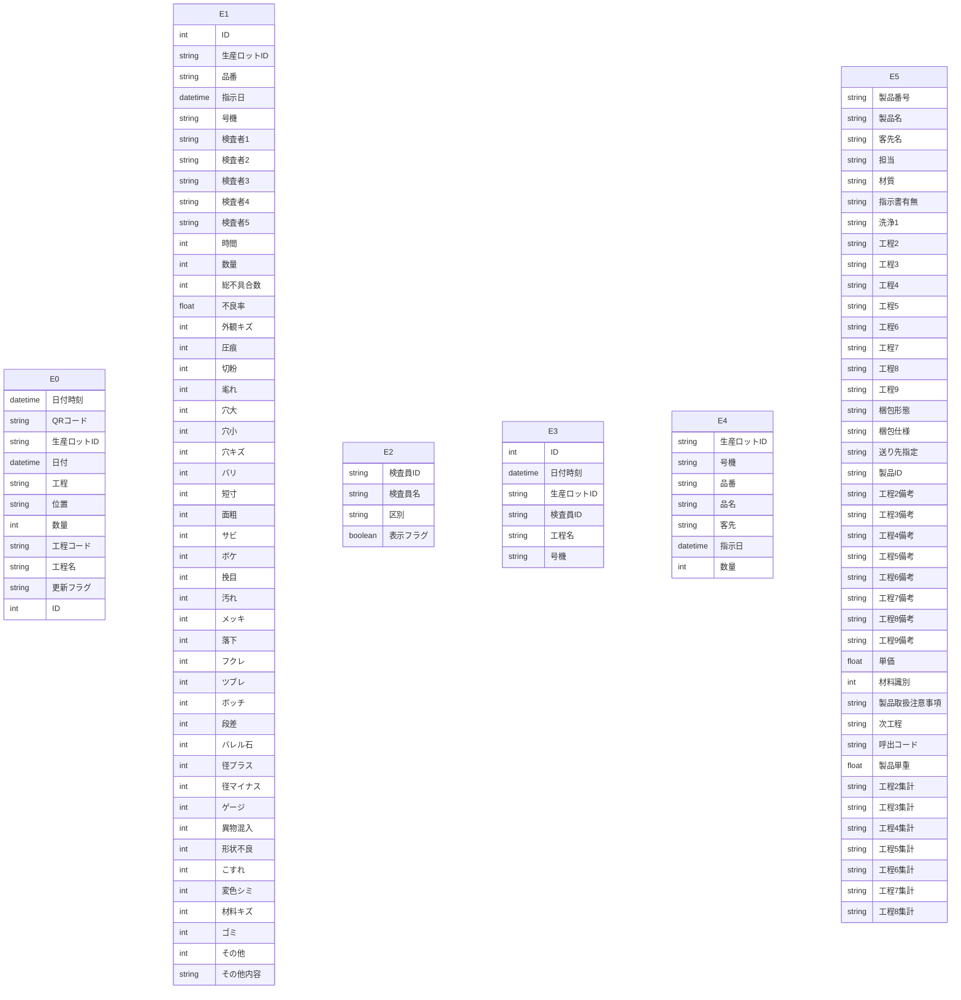

# Access データベース・スキーマ抽出レポート

このファイルは **Access の ODBC メタデータ**から自動生成しました。
LLM に渡す場合は **「スキーマ JSON」セクション**と **「PostgreSQL DDL 草案」**をあわせて指示に含めると、目的の RDB に近い定義を再現しやすくなります。

## LLM / AI 向け: このドキュメントの使い方

以下をプロンプトにコピーして、目的の SQL ダイアレクト（例: PostgreSQL）向け **CREATE TABLE・INDEX・FK** を生成させてください。

```text
あなたはデータベース設計者です。添付 Markdown の次を根拠に、一貫したリレーショナルスキーマを設計してください。
1) YAML フロントマターと「サマリー」の数値
2) 「スキーマ JSON（機械可読・全量）」の tables / relationships / warnings
3) 「PostgreSQL DDL 草案」は参考用。型・NULL・FK・インデックスを JSON・列定義と突き合わせて修正すること。
4) ODBC が SYNONYM としたテーブルはリンク元の実体が別にある場合がある。移行時はデータ取得元を明示すること。
5) relationships が空のときは、列名・サンプルデータから FK を推論してよいが、推論はコメントで区別すること。
出力: (a) 最終 DDL (b) 設計上の想定・未確定事項の箇条書き
```

> ⚠ FK 取得スキップ: t_QR履歴 — ('IM001', '[IM001] [Microsoft][ODBC Driver Manager] ドライバーはこの関数をサポートしていません。 (0) (SQLForeignKeys)')
> ⚠ FK 取得スキップ: t_不具合情報 — ('IM001', '[IM001] [Microsoft][ODBC Driver Manager] ドライバーはこの関数をサポートしていません。 (0) (SQLForeignKeys)')
> ⚠ FK 取得スキップ: t_数値検査員マスタ — ('IM001', '[IM001] [Microsoft][ODBC Driver Manager] ドライバーはこの関数をサポートしていません。 (0) (SQLForeignKeys)')
> ⚠ FK 取得スキップ: t_数値検査記録 — ('IM001', '[IM001] [Microsoft][ODBC Driver Manager] ドライバーはこの関数をサポートしていません。 (0) (SQLForeignKeys)')
> ⚠ FK 取得スキップ: t_現品票検索用 — ('IM001', '[IM001] [Microsoft][ODBC Driver Manager] ドライバーはこの関数をサポートしていません。 (0) (SQLForeignKeys)')
> ⚠ FK 取得スキップ: t_製品マスタ — ('IM001', '[IM001] [Microsoft][ODBC Driver Manager] ドライバーはこの関数をサポートしていません。 (0) (SQLForeignKeys)')

## サマリー

| 項目 | 値 |
|---|---|
| Access ファイル | `\\192.168.1.200\共有\品質保証課\外観検査記録\不具合情報検索.accdb` |
| ODBC ドライバ | `Microsoft Access Driver (*.mdb, *.accdb)` |
| テーブル数 | 6 |
| 行数合計（取得できたテーブルのみ） | 458,146 |
| リンクテーブル相当（ODBC: SYNONYM） | 6 |
| 外部キー（検出分） | 0 |
| ビュー / クエリ名 | 5 |
| 警告 | 6 |

## ER 図（Mermaid・参考）

Mermaid 内のエンティティは `E0`, `E1`, … です。実テーブル名は次の対応表を参照してください。

| 記号 | テーブル名 | ODBC 型 | 行数 |
|---|---|---:|---:|
| E0 | `t_QR履歴` | SYNONYM | 108,168 |
| E1 | `t_不具合情報` | SYNONYM | 154,834 |
| E2 | `t_数値検査員マスタ` | SYNONYM | 14 |
| E3 | `t_数値検査記録` | SYNONYM | 24,846 |
| E4 | `t_現品票検索用` | SYNONYM | 168,782 |
| E5 | `t_製品マスタ` | SYNONYM | 1,502 |



## PostgreSQL DDL 草案（全文・自動生成）

```sql
-- PostgreSQL DDL 草案（Access メタデータから自動生成）
-- ※ 型・制約は必ず手動で確認・修正してください

CREATE TABLE "t_QR履歴" (
    "日付時刻" TIMESTAMP,
    "QRコード" VARCHAR(22),
    "生産ロットID" VARCHAR(7),
    "日付" TIMESTAMP,
    "工程" VARCHAR(2),
    "位置" VARCHAR(2),
    "数量" INTEGER,
    "工程コード" VARCHAR(2),
    "工程名" VARCHAR(30),
    "更新フラグ" VARCHAR(1),
    "ID" BIGSERIAL
);


CREATE TABLE "t_不具合情報" (
    "ID" BIGSERIAL,
    "生産ロットID" VARCHAR(7),
    "品番" VARCHAR(30),
    "指示日" TIMESTAMP,
    "号機" VARCHAR(5),
    "検査者1" VARCHAR(6),
    "検査者2" VARCHAR(6),
    "検査者3" VARCHAR(6),
    "検査者4" VARCHAR(6),
    "検査者5" VARCHAR(20),
    "時間" INTEGER,
    "数量" INTEGER,
    "総不具合数" INTEGER,
    "不良率" DOUBLE PRECISION,
    "外観キズ" INTEGER,
    "圧痕" INTEGER,
    "切粉" INTEGER,
    "毟れ" INTEGER,
    "穴大" INTEGER,
    "穴小" INTEGER,
    "穴キズ" INTEGER,
    "バリ" INTEGER,
    "短寸" INTEGER,
    "面粗" INTEGER,
    "サビ" INTEGER,
    "ボケ" INTEGER,
    "挽目" INTEGER,
    "汚れ" INTEGER,
    "メッキ" INTEGER,
    "落下" INTEGER,
    "フクレ" INTEGER,
    "ツブレ" INTEGER,
    "ボッチ" INTEGER,
    "段差" INTEGER,
    "バレル石" INTEGER,
    "径プラス" INTEGER,
    "径マイナス" INTEGER,
    "ゲージ" INTEGER,
    "異物混入" INTEGER,
    "形状不良" INTEGER,
    "こすれ" INTEGER,
    "変色シミ" INTEGER,
    "材料キズ" INTEGER,
    "ゴミ" INTEGER,
    "その他" INTEGER,
    "その他内容" VARCHAR(10)
);


CREATE TABLE "t_数値検査員マスタ" (
    "検査員ID" VARCHAR(4),
    "検査員名" VARCHAR(5),
    "区別" VARCHAR(5),
    "表示フラグ" BOOLEAN NOT NULL
);


CREATE TABLE "t_数値検査記録" (
    "ID" BIGSERIAL,
    "日付時刻" TIMESTAMP,
    "生産ロットID" VARCHAR(7),
    "検査員ID" VARCHAR(4),
    "工程名" VARCHAR(30),
    "号機" VARCHAR(5)
);


CREATE TABLE "t_現品票検索用" (
    "生産ロットID" VARCHAR(7),
    "号機" VARCHAR(5),
    "品番" VARCHAR(30),
    "品名" VARCHAR(30),
    "客先" VARCHAR(30),
    "指示日" TIMESTAMP,
    "数量" INTEGER
);


CREATE TABLE "t_製品マスタ" (
    "製品番号" VARCHAR(30),
    "製品名" VARCHAR(30),
    "客先名" VARCHAR(30),
    "担当" VARCHAR(6),
    "材質" VARCHAR(255),
    "指示書有無" VARCHAR(1),
    "洗浄1" VARCHAR(10),
    "工程2" VARCHAR(30),
    "工程3" VARCHAR(30),
    "工程4" VARCHAR(30),
    "工程5" VARCHAR(30),
    "工程6" VARCHAR(30),
    "工程7" VARCHAR(30),
    "工程8" VARCHAR(30),
    "工程9" VARCHAR(30),
    "梱包形態" VARCHAR(30),
    "梱包仕様" VARCHAR(30),
    "送り先指定" VARCHAR(30),
    "製品ID" VARCHAR(6),
    "工程2備考" VARCHAR(20),
    "工程3備考" VARCHAR(20),
    "工程4備考" VARCHAR(20),
    "工程5備考" VARCHAR(20),
    "工程6備考" VARCHAR(20),
    "工程7備考" VARCHAR(20),
    "工程8備考" VARCHAR(20),
    "工程9備考" VARCHAR(20),
    "単価" DOUBLE PRECISION,
    "材料識別" INTEGER,
    "製品取扱注意事項" VARCHAR(20),
    "次工程" VARCHAR(10),
    "呼出コード" VARCHAR(8),
    "製品単重" DOUBLE PRECISION,
    "工程2集計" VARCHAR(2),
    "工程3集計" VARCHAR(2),
    "工程4集計" VARCHAR(2),
    "工程5集計" VARCHAR(2),
    "工程6集計" VARCHAR(2),
    "工程7集計" VARCHAR(2),
    "工程8集計" VARCHAR(2)
);
```

## スキーマ JSON（機械可読・全量）

以下をパースすれば、テーブル・列・PK・インデックス・サンプル・統計・FK・ビュー名を一括で渡せます。

```json
{
  "export_spec": "access-inspector/schema-export/v1",
  "generated_at": "2026-05-26T09:15:34.184703+00:00",
  "source": {
    "database_path": "\\\\192.168.1.200\\共有\\品質保証課\\外観検査記録\\不具合情報検索.accdb",
    "driver_used": "Microsoft Access Driver (*.mdb, *.accdb)"
  },
  "summary": {
    "table_count": 6,
    "sum_row_count_where_known": 458146,
    "tables_with_row_count": 6,
    "linked_table_odbc_synonym_count": 6,
    "relationship_count": 0,
    "view_count": 5,
    "warning_count": 6
  },
  "notes_for_consumer": [
    "ODBC の table_type が SYNONYM のテーブルは Access のリンクテーブルであることが多い。",
    "PostgreSQL 型ヒントは参考。最終 DDL は業務要件とデータ実態で確認すること。",
    "relationships が空でも、命名規則やサンプル行から推定された FK があり得る。"
  ],
  "tables": [
    {
      "name": "t_QR履歴",
      "table_type": "SYNONYM",
      "row_count": 108168,
      "row_count_error": null,
      "primary_key": [],
      "columns": [
        {
          "name": "日付時刻",
          "access_type": "DATETIME",
          "sql_data_type": 9,
          "column_size": 19,
          "decimal_digits": 0,
          "nullable": true,
          "postgres_type_hint": "TIMESTAMP"
        },
        {
          "name": "QRコード",
          "access_type": "VARCHAR",
          "sql_data_type": -9,
          "column_size": 22,
          "decimal_digits": null,
          "nullable": true,
          "postgres_type_hint": "VARCHAR(22)"
        },
        {
          "name": "生産ロットID",
          "access_type": "VARCHAR",
          "sql_data_type": -9,
          "column_size": 7,
          "decimal_digits": null,
          "nullable": true,
          "postgres_type_hint": "VARCHAR(7)"
        },
        {
          "name": "日付",
          "access_type": "DATETIME",
          "sql_data_type": 9,
          "column_size": 19,
          "decimal_digits": 0,
          "nullable": true,
          "postgres_type_hint": "TIMESTAMP"
        },
        {
          "name": "工程",
          "access_type": "VARCHAR",
          "sql_data_type": -9,
          "column_size": 2,
          "decimal_digits": null,
          "nullable": true,
          "postgres_type_hint": "VARCHAR(2)"
        },
        {
          "name": "位置",
          "access_type": "VARCHAR",
          "sql_data_type": -9,
          "column_size": 2,
          "decimal_digits": null,
          "nullable": true,
          "postgres_type_hint": "VARCHAR(2)"
        },
        {
          "name": "数量",
          "access_type": "INTEGER",
          "sql_data_type": 4,
          "column_size": 10,
          "decimal_digits": 0,
          "nullable": true,
          "postgres_type_hint": "INTEGER"
        },
        {
          "name": "工程コード",
          "access_type": "VARCHAR",
          "sql_data_type": -9,
          "column_size": 2,
          "decimal_digits": null,
          "nullable": true,
          "postgres_type_hint": "VARCHAR(2)"
        },
        {
          "name": "工程名",
          "access_type": "VARCHAR",
          "sql_data_type": -9,
          "column_size": 30,
          "decimal_digits": null,
          "nullable": true,
          "postgres_type_hint": "VARCHAR(30)"
        },
        {
          "name": "更新フラグ",
          "access_type": "VARCHAR",
          "sql_data_type": -9,
          "column_size": 1,
          "decimal_digits": null,
          "nullable": true,
          "postgres_type_hint": "VARCHAR(1)"
        },
        {
          "name": "ID",
          "access_type": "COUNTER",
          "sql_data_type": 4,
          "column_size": 10,
          "decimal_digits": 0,
          "nullable": false,
          "postgres_type_hint": "BIGSERIAL"
        }
      ],
      "indexes": [],
      "sample_headers": [
        "日付時刻",
        "QRコード",
        "生産ロットID",
        "日付",
        "工程",
        "位置",
        "数量",
        "工程コード",
        "工程名",
        "更新フラグ",
        "ID"
      ],
      "sample_rows": [
        [
          "2026-05-22T08:40:22",
          "P153419260519076A06003",
          "P153419",
          "2026-05-22T00:00:00",
          "1",
          "1",
          1534,
          "01",
          "洗浄",
          "1",
          107074
        ],
        [
          "2026-05-22T08:41:23",
          "P153479260520035A06003",
          "P153479",
          "2026-05-22T00:00:00",
          "1",
          "1",
          1857,
          "01",
          "洗浄",
          "1",
          107075
        ],
        [
          "2026-05-22T08:49:51",
          "P152694260428041A00414",
          "P152694",
          "2026-05-22T00:00:00",
          "3",
          "0",
          1715,
          "03",
          "外観検査",
          "1",
          107076
        ],
        [
          "2026-05-22T09:04:02",
          "P153281260516058A04549",
          "P153281",
          "2026-05-22T00:00:00",
          "1",
          "1",
          1882,
          "01",
          "洗浄",
          "1",
          107077
        ],
        [
          "2026-05-22T09:05:00",
          "P153336260516058A04549",
          "P153336",
          "2026-05-22T00:00:00",
          "1",
          "1",
          1487,
          "01",
          "洗浄",
          "1",
          107078
        ]
      ],
      "column_stats": [
        {
          "column": "日付時刻",
          "null_count": 0,
          "null_rate_pct": 0.0,
          "unique_count": null,
          "unique_rate_pct": null
        },
        {
          "column": "QRコード",
          "null_count": 0,
          "null_rate_pct": 0.0,
          "unique_count": null,
          "unique_rate_pct": null
        },
        {
          "column": "生産ロットID",
          "null_count": 0,
          "null_rate_pct": 0.0,
          "unique_count": null,
          "unique_rate_pct": null
        },
        {
          "column": "日付",
          "null_count": 0,
          "null_rate_pct": 0.0,
          "unique_count": null,
          "unique_rate_pct": null
        },
        {
          "column": "工程",
          "null_count": 0,
          "null_rate_pct": 0.0,
          "unique_count": null,
          "unique_rate_pct": null
        },
        {
          "column": "位置",
          "null_count": 0,
          "null_rate_pct": 0.0,
          "unique_count": null,
          "unique_rate_pct": null
        },
        {
          "column": "数量",
          "null_count": 0,
          "null_rate_pct": 0.0,
          "unique_count": null,
          "unique_rate_pct": null
        },
        {
          "column": "工程コード",
          "null_count": 10,
          "null_rate_pct": 0.0,
          "unique_count": null,
          "unique_rate_pct": null
        },
        {
          "column": "工程名",
          "null_count": 10,
          "null_rate_pct": 0.0,
          "unique_count": null,
          "unique_rate_pct": null
        },
        {
          "column": "更新フラグ",
          "null_count": 0,
          "null_rate_pct": 0.0,
          "unique_count": null,
          "unique_rate_pct": null
        },
        {
          "column": "ID",
          "null_count": 0,
          "null_rate_pct": 0.0,
          "unique_count": null,
          "unique_rate_pct": null
        }
      ]
    },
    {
      "name": "t_不具合情報",
      "table_type": "SYNONYM",
      "row_count": 154834,
      "row_count_error": null,
      "primary_key": [],
      "columns": [
        {
          "name": "ID",
          "access_type": "COUNTER",
          "sql_data_type": 4,
          "column_size": 10,
          "decimal_digits": 0,
          "nullable": false,
          "postgres_type_hint": "BIGSERIAL"
        },
        {
          "name": "生産ロットID",
          "access_type": "VARCHAR",
          "sql_data_type": -9,
          "column_size": 7,
          "decimal_digits": null,
          "nullable": true,
          "postgres_type_hint": "VARCHAR(7)"
        },
        {
          "name": "品番",
          "access_type": "VARCHAR",
          "sql_data_type": -9,
          "column_size": 30,
          "decimal_digits": null,
          "nullable": true,
          "postgres_type_hint": "VARCHAR(30)"
        },
        {
          "name": "指示日",
          "access_type": "DATETIME",
          "sql_data_type": 9,
          "column_size": 19,
          "decimal_digits": 0,
          "nullable": true,
          "postgres_type_hint": "TIMESTAMP"
        },
        {
          "name": "号機",
          "access_type": "VARCHAR",
          "sql_data_type": -9,
          "column_size": 5,
          "decimal_digits": null,
          "nullable": true,
          "postgres_type_hint": "VARCHAR(5)"
        },
        {
          "name": "検査者1",
          "access_type": "VARCHAR",
          "sql_data_type": -9,
          "column_size": 6,
          "decimal_digits": null,
          "nullable": true,
          "postgres_type_hint": "VARCHAR(6)"
        },
        {
          "name": "検査者2",
          "access_type": "VARCHAR",
          "sql_data_type": -9,
          "column_size": 6,
          "decimal_digits": null,
          "nullable": true,
          "postgres_type_hint": "VARCHAR(6)"
        },
        {
          "name": "検査者3",
          "access_type": "VARCHAR",
          "sql_data_type": -9,
          "column_size": 6,
          "decimal_digits": null,
          "nullable": true,
          "postgres_type_hint": "VARCHAR(6)"
        },
        {
          "name": "検査者4",
          "access_type": "VARCHAR",
          "sql_data_type": -9,
          "column_size": 6,
          "decimal_digits": null,
          "nullable": true,
          "postgres_type_hint": "VARCHAR(6)"
        },
        {
          "name": "検査者5",
          "access_type": "VARCHAR",
          "sql_data_type": -9,
          "column_size": 20,
          "decimal_digits": null,
          "nullable": true,
          "postgres_type_hint": "VARCHAR(20)"
        },
        {
          "name": "時間",
          "access_type": "INTEGER",
          "sql_data_type": 4,
          "column_size": 10,
          "decimal_digits": 0,
          "nullable": true,
          "postgres_type_hint": "INTEGER"
        },
        {
          "name": "数量",
          "access_type": "INTEGER",
          "sql_data_type": 4,
          "column_size": 10,
          "decimal_digits": 0,
          "nullable": true,
          "postgres_type_hint": "INTEGER"
        },
        {
          "name": "総不具合数",
          "access_type": "INTEGER",
          "sql_data_type": 4,
          "column_size": 10,
          "decimal_digits": 0,
          "nullable": true,
          "postgres_type_hint": "INTEGER"
        },
        {
          "name": "不良率",
          "access_type": "DOUBLE",
          "sql_data_type": 8,
          "column_size": 53,
          "decimal_digits": null,
          "nullable": true,
          "postgres_type_hint": "DOUBLE PRECISION"
        },
        {
          "name": "外観キズ",
          "access_type": "INTEGER",
          "sql_data_type": 4,
          "column_size": 10,
          "decimal_digits": 0,
          "nullable": true,
          "postgres_type_hint": "INTEGER"
        },
        {
          "name": "圧痕",
          "access_type": "INTEGER",
          "sql_data_type": 4,
          "column_size": 10,
          "decimal_digits": 0,
          "nullable": true,
          "postgres_type_hint": "INTEGER"
        },
        {
          "name": "切粉",
          "access_type": "INTEGER",
          "sql_data_type": 4,
          "column_size": 10,
          "decimal_digits": 0,
          "nullable": true,
          "postgres_type_hint": "INTEGER"
        },
        {
          "name": "毟れ",
          "access_type": "INTEGER",
          "sql_data_type": 4,
          "column_size": 10,
          "decimal_digits": 0,
          "nullable": true,
          "postgres_type_hint": "INTEGER"
        },
        {
          "name": "穴大",
          "access_type": "INTEGER",
          "sql_data_type": 4,
          "column_size": 10,
          "decimal_digits": 0,
          "nullable": true,
          "postgres_type_hint": "INTEGER"
        },
        {
          "name": "穴小",
          "access_type": "INTEGER",
          "sql_data_type": 4,
          "column_size": 10,
          "decimal_digits": 0,
          "nullable": true,
          "postgres_type_hint": "INTEGER"
        },
        {
          "name": "穴キズ",
          "access_type": "INTEGER",
          "sql_data_type": 4,
          "column_size": 10,
          "decimal_digits": 0,
          "nullable": true,
          "postgres_type_hint": "INTEGER"
        },
        {
          "name": "バリ",
          "access_type": "INTEGER",
          "sql_data_type": 4,
          "column_size": 10,
          "decimal_digits": 0,
          "nullable": true,
          "postgres_type_hint": "INTEGER"
        },
        {
          "name": "短寸",
          "access_type": "INTEGER",
          "sql_data_type": 4,
          "column_size": 10,
          "decimal_digits": 0,
          "nullable": true,
          "postgres_type_hint": "INTEGER"
        },
        {
          "name": "面粗",
          "access_type": "INTEGER",
          "sql_data_type": 4,
          "column_size": 10,
          "decimal_digits": 0,
          "nullable": true,
          "postgres_type_hint": "INTEGER"
        },
        {
          "name": "サビ",
          "access_type": "INTEGER",
          "sql_data_type": 4,
          "column_size": 10,
          "decimal_digits": 0,
          "nullable": true,
          "postgres_type_hint": "INTEGER"
        },
        {
          "name": "ボケ",
          "access_type": "INTEGER",
          "sql_data_type": 4,
          "column_size": 10,
          "decimal_digits": 0,
          "nullable": true,
          "postgres_type_hint": "INTEGER"
        },
        {
          "name": "挽目",
          "access_type": "INTEGER",
          "sql_data_type": 4,
          "column_size": 10,
          "decimal_digits": 0,
          "nullable": true,
          "postgres_type_hint": "INTEGER"
        },
        {
          "name": "汚れ",
          "access_type": "INTEGER",
          "sql_data_type": 4,
          "column_size": 10,
          "decimal_digits": 0,
          "nullable": true,
          "postgres_type_hint": "INTEGER"
        },
        {
          "name": "メッキ",
          "access_type": "INTEGER",
          "sql_data_type": 4,
          "column_size": 10,
          "decimal_digits": 0,
          "nullable": true,
          "postgres_type_hint": "INTEGER"
        },
        {
          "name": "落下",
          "access_type": "INTEGER",
          "sql_data_type": 4,
          "column_size": 10,
          "decimal_digits": 0,
          "nullable": true,
          "postgres_type_hint": "INTEGER"
        },
        {
          "name": "フクレ",
          "access_type": "INTEGER",
          "sql_data_type": 4,
          "column_size": 10,
          "decimal_digits": 0,
          "nullable": true,
          "postgres_type_hint": "INTEGER"
        },
        {
          "name": "ツブレ",
          "access_type": "INTEGER",
          "sql_data_type": 4,
          "column_size": 10,
          "decimal_digits": 0,
          "nullable": true,
          "postgres_type_hint": "INTEGER"
        },
        {
          "name": "ボッチ",
          "access_type": "INTEGER",
          "sql_data_type": 4,
          "column_size": 10,
          "decimal_digits": 0,
          "nullable": true,
          "postgres_type_hint": "INTEGER"
        },
        {
          "name": "段差",
          "access_type": "INTEGER",
          "sql_data_type": 4,
          "column_size": 10,
          "decimal_digits": 0,
          "nullable": true,
          "postgres_type_hint": "INTEGER"
        },
        {
          "name": "バレル石",
          "access_type": "INTEGER",
          "sql_data_type": 4,
          "column_size": 10,
          "decimal_digits": 0,
          "nullable": true,
          "postgres_type_hint": "INTEGER"
        },
        {
          "name": "径プラス",
          "access_type": "INTEGER",
          "sql_data_type": 4,
          "column_size": 10,
          "decimal_digits": 0,
          "nullable": true,
          "postgres_type_hint": "INTEGER"
        },
        {
          "name": "径マイナス",
          "access_type": "INTEGER",
          "sql_data_type": 4,
          "column_size": 10,
          "decimal_digits": 0,
          "nullable": true,
          "postgres_type_hint": "INTEGER"
        },
        {
          "name": "ゲージ",
          "access_type": "INTEGER",
          "sql_data_type": 4,
          "column_size": 10,
          "decimal_digits": 0,
          "nullable": true,
          "postgres_type_hint": "INTEGER"
        },
        {
          "name": "異物混入",
          "access_type": "INTEGER",
          "sql_data_type": 4,
          "column_size": 10,
          "decimal_digits": 0,
          "nullable": true,
          "postgres_type_hint": "INTEGER"
        },
        {
          "name": "形状不良",
          "access_type": "INTEGER",
          "sql_data_type": 4,
          "column_size": 10,
          "decimal_digits": 0,
          "nullable": true,
          "postgres_type_hint": "INTEGER"
        },
        {
          "name": "こすれ",
          "access_type": "INTEGER",
          "sql_data_type": 4,
          "column_size": 10,
          "decimal_digits": 0,
          "nullable": true,
          "postgres_type_hint": "INTEGER"
        },
        {
          "name": "変色シミ",
          "access_type": "INTEGER",
          "sql_data_type": 4,
          "column_size": 10,
          "decimal_digits": 0,
          "nullable": true,
          "postgres_type_hint": "INTEGER"
        },
        {
          "name": "材料キズ",
          "access_type": "INTEGER",
          "sql_data_type": 4,
          "column_size": 10,
          "decimal_digits": 0,
          "nullable": true,
          "postgres_type_hint": "INTEGER"
        },
        {
          "name": "ゴミ",
          "access_type": "INTEGER",
          "sql_data_type": 4,
          "column_size": 10,
          "decimal_digits": 0,
          "nullable": true,
          "postgres_type_hint": "INTEGER"
        },
        {
          "name": "その他",
          "access_type": "INTEGER",
          "sql_data_type": 4,
          "column_size": 10,
          "decimal_digits": 0,
          "nullable": true,
          "postgres_type_hint": "INTEGER"
        },
        {
          "name": "その他内容",
          "access_type": "VARCHAR",
          "sql_data_type": -9,
          "column_size": 10,
          "decimal_digits": null,
          "nullable": true,
          "postgres_type_hint": "VARCHAR(10)"
        }
      ],
      "indexes": [],
      "sample_headers": [
        "ID",
        "生産ロットID",
        "品番",
        "指示日",
        "号機",
        "検査者1",
        "検査者2",
        "検査者3",
        "検査者4",
        "検査者5",
        "時間",
        "数量",
        "総不具合数",
        "不良率",
        "外観キズ",
        "圧痕",
        "切粉",
        "毟れ",
        "穴大",
        "穴小",
        "穴キズ",
        "バリ",
        "短寸",
        "面粗",
        "サビ",
        "ボケ",
        "挽目",
        "汚れ",
        "メッキ",
        "落下",
        "フクレ",
        "ツブレ",
        "ボッチ",
        "段差",
        "バレル石",
        "径プラス",
        "径マイナス",
        "ゲージ",
        "異物混入",
        "形状不良",
        "こすれ",
        "変色シミ",
        "材料キズ",
        "ゴミ",
        "その他",
        "その他内容"
      ],
      "sample_rows": [
        [
          1,
          "P009869",
          "CC02120-0103",
          "2010-11-08T00:00:00",
          "旧機番",
          "関根り",
          "野口",
          null,
          null,
          null,
          255,
          2129,
          496,
          0.23297322686707375,
          null,
          null,
          493,
          null,
          null,
          null,
          null,
          null,
          null,
          null,
          null,
          null,
          null,
          3,
          null,
          null,
          null,
          null,
          null,
          null,
          null,
          null,
          null,
          null,
          null,
          null,
          null,
          null,
          null,
          null,
          null,
          null
        ],
        [
          2,
          "P009868",
          "CC02180-0103",
          "2010-11-09T00:00:00",
          "旧機番",
          "関田",
          null,
          null,
          null,
          null,
          80,
          660,
          104,
          0.15757575757575756,
          1,
          null,
          103,
          null,
          null,
          null,
          null,
          null,
          null,
          null,
          null,
          null,
          null,
          null,
          null,
          null,
          null,
          null,
          null,
          null,
          null,
          null,
          null,
          null,
          null,
          null,
          null,
          null,
          null,
          null,
          null,
          null
        ],
        [
          3,
          "P009867",
          "CC02200-0103",
          "2010-11-10T00:00:00",
          "旧機番",
          "村田",
          "久保",
          null,
          null,
          null,
          75,
          441,
          58,
          0.13151927437641722,
          null,
          3,
          55,
          null,
          null,
          null,
          null,
          null,
          null,
          null,
          null,
          null,
          null,
          null,
          null,
          null,
          null,
          null,
          null,
          null,
          null,
          null,
          null,
          null,
          null,
          null,
          null,
          null,
          null,
          null,
          null,
          null
        ],
        [
          4,
          "P008499",
          "A-61112-01-03",
          "2011-10-08T00:00:00",
          "旧機番",
          "黒澤",
          null,
          null,
          null,
          null,
          30,
          175,
          34,
          0.19428571428571428,
          null,
          null,
          34,
          null,
          null,
          null,
          null,
          null,
          null,
          null,
          null,
          null,
          null,
          null,
          null,
          null,
          null,
          null,
          null,
          null,
          null,
          null,
          null,
          null,
          null,
          null,
          null,
          null,
          null,
          null,
          null,
          null
        ],
        [
          5,
          "P007592",
          "A27906-E22MT0044.SH",
          "2012-02-10T00:00:00",
          "旧機番",
          "中",
          null,
          null,
          null,
          null,
          30,
          220,
          2,
          0.00909090909090909,
          null,
          2,
          null,
          null,
          null,
          null,
          null,
          null,
          null,
          null,
          null,
          null,
          null,
          null,
          null,
          null,
          null,
          null,
          null,
          null,
          null,
          null,
          null,
          null,
          null,
          null,
          null,
          null,
          null,
          null,
          null,
          null
        ]
      ],
      "column_stats": [
        {
          "column": "ID",
          "null_count": 0,
          "null_rate_pct": 0.0,
          "unique_count": null,
          "unique_rate_pct": null
        },
        {
          "column": "生産ロットID",
          "null_count": 3,
          "null_rate_pct": 0.0,
          "unique_count": null,
          "unique_rate_pct": null
        },
        {
          "column": "品番",
          "null_count": 3,
          "null_rate_pct": 0.0,
          "unique_count": null,
          "unique_rate_pct": null
        },
        {
          "column": "指示日",
          "null_count": 3,
          "null_rate_pct": 0.0,
          "unique_count": null,
          "unique_rate_pct": null
        },
        {
          "column": "号機",
          "null_count": 3,
          "null_rate_pct": 0.0,
          "unique_count": null,
          "unique_rate_pct": null
        },
        {
          "column": "検査者1",
          "null_count": 235,
          "null_rate_pct": 0.2,
          "unique_count": null,
          "unique_rate_pct": null
        },
        {
          "column": "検査者2",
          "null_count": 22869,
          "null_rate_pct": 14.8,
          "unique_count": null,
          "unique_rate_pct": null
        },
        {
          "column": "検査者3",
          "null_count": 35467,
          "null_rate_pct": 22.9,
          "unique_count": null,
          "unique_rate_pct": null
        },
        {
          "column": "検査者4",
          "null_count": 38160,
          "null_rate_pct": 24.6,
          "unique_count": null,
          "unique_rate_pct": null
        },
        {
          "column": "検査者5",
          "null_count": 38983,
          "null_rate_pct": 25.2,
          "unique_count": null,
          "unique_rate_pct": null
        },
        {
          "column": "時間",
          "null_count": 3420,
          "null_rate_pct": 2.2,
          "unique_count": null,
          "unique_rate_pct": null
        },
        {
          "column": "数量",
          "null_count": 1,
          "null_rate_pct": 0.0,
          "unique_count": null,
          "unique_rate_pct": null
        },
        {
          "column": "総不具合数",
          "null_count": 0,
          "null_rate_pct": 0.0,
          "unique_count": null,
          "unique_rate_pct": null
        },
        {
          "column": "不良率",
          "null_count": 28,
          "null_rate_pct": 0.0,
          "unique_count": null,
          "unique_rate_pct": null
        },
        {
          "column": "外観キズ",
          "null_count": 28538,
          "null_rate_pct": 18.4,
          "unique_count": null,
          "unique_rate_pct": null
        },
        {
          "column": "圧痕",
          "null_count": 31177,
          "null_rate_pct": 20.1,
          "unique_count": null,
          "unique_rate_pct": null
        },
        {
          "column": "切粉",
          "null_count": 24560,
          "null_rate_pct": 15.9,
          "unique_count": null,
          "unique_rate_pct": null
        },
        {
          "column": "毟れ",
          "null_count": 38239,
          "null_rate_pct": 24.7,
          "unique_count": null,
          "unique_rate_pct": null
        },
        {
          "column": "穴大",
          "null_count": 38774,
          "null_rate_pct": 25.0,
          "unique_count": null,
          "unique_rate_pct": null
        },
        {
          "column": "穴小",
          "null_count": 37227,
          "null_rate_pct": 24.0,
          "unique_count": null,
          "unique_rate_pct": null
        },
        {
          "column": "穴キズ",
          "null_count": 38987,
          "null_rate_pct": 25.2,
          "unique_count": null,
          "unique_rate_pct": null
        },
        {
          "column": "バリ",
          "null_count": 36174,
          "null_rate_pct": 23.4,
          "unique_count": null,
          "unique_rate_pct": null
        },
        {
          "column": "短寸",
          "null_count": 38715,
          "null_rate_pct": 25.0,
          "unique_count": null,
          "unique_rate_pct": null
        },
        {
          "column": "面粗",
          "null_count": 38999,
          "null_rate_pct": 25.2,
          "unique_count": null,
          "unique_rate_pct": null
        },
        {
          "column": "サビ",
          "null_count": 36936,
          "null_rate_pct": 23.9,
          "unique_count": null,
          "unique_rate_pct": null
        },
        {
          "column": "ボケ",
          "null_count": 38461,
          "null_rate_pct": 24.8,
          "unique_count": null,
          "unique_rate_pct": null
        },
        {
          "column": "挽目",
          "null_count": 36274,
          "null_rate_pct": 23.4,
          "unique_count": null,
          "unique_rate_pct": null
        },
        {
          "column": "汚れ",
          "null_count": 38306,
          "null_rate_pct": 24.7,
          "unique_count": null,
          "unique_rate_pct": null
        },
        {
          "column": "メッキ",
          "null_count": 37410,
          "null_rate_pct": 24.2,
          "unique_count": null,
          "unique_rate_pct": null
        },
        {
          "column": "落下",
          "null_count": 38845,
          "null_rate_pct": 25.1,
          "unique_count": null,
          "unique_rate_pct": null
        },
        {
          "column": "フクレ",
          "null_count": 38372,
          "null_rate_pct": 24.8,
          "unique_count": null,
          "unique_rate_pct": null
        },
        {
          "column": "ツブレ",
          "null_count": 38773,
          "null_rate_pct": 25.0,
          "unique_count": null,
          "unique_rate_pct": null
        },
        {
          "column": "ボッチ",
          "null_count": 38778,
          "null_rate_pct": 25.0,
          "unique_count": null,
          "unique_rate_pct": null
        },
        {
          "column": "段差",
          "null_count": 38582,
          "null_rate_pct": 24.9,
          "unique_count": null,
          "unique_rate_pct": null
        },
        {
          "column": "バレル石",
          "null_count": 38914,
          "null_rate_pct": 25.1,
          "unique_count": null,
          "unique_rate_pct": null
        },
        {
          "column": "径プラス",
          "null_count": 38370,
          "null_rate_pct": 24.8,
          "unique_count": null,
          "unique_rate_pct": null
        },
        {
          "column": "径マイナス",
          "null_count": 38919,
          "null_rate_pct": 25.1,
          "unique_count": null,
          "unique_rate_pct": null
        },
        {
          "column": "ゲージ",
          "null_count": 38811,
          "null_rate_pct": 25.1,
          "unique_count": null,
          "unique_rate_pct": null
        },
        {
          "column": "異物混入",
          "null_count": 38760,
          "null_rate_pct": 25.0,
          "unique_count": null,
          "unique_rate_pct": null
        },
        {
          "column": "形状不良",
          "null_count": 38857,
          "null_rate_pct": 25.1,
          "unique_count": null,
          "unique_rate_pct": null
        },
        {
          "column": "こすれ",
          "null_count": 38960,
          "null_rate_pct": 25.2,
          "unique_count": null,
          "unique_rate_pct": null
        },
        {
          "column": "変色シミ",
          "null_count": 38850,
          "null_rate_pct": 25.1,
          "unique_count": null,
          "unique_rate_pct": null
        },
        {
          "column": "材料キズ",
          "null_count": 38811,
          "null_rate_pct": 25.1,
          "unique_count": null,
          "unique_rate_pct": null
        },
        {
          "column": "ゴミ",
          "null_count": 38944,
          "null_rate_pct": 25.2,
          "unique_count": null,
          "unique_rate_pct": null
        },
        {
          "column": "その他",
          "null_count": 37270,
          "null_rate_pct": 24.1,
          "unique_count": null,
          "unique_rate_pct": null
        },
        {
          "column": "その他内容",
          "null_count": 37424,
          "null_rate_pct": 24.2,
          "unique_count": null,
          "unique_rate_pct": null
        }
      ]
    },
    {
      "name": "t_数値検査員マスタ",
      "table_type": "SYNONYM",
      "row_count": 14,
      "row_count_error": null,
      "primary_key": [],
      "columns": [
        {
          "name": "検査員ID",
          "access_type": "VARCHAR",
          "sql_data_type": -9,
          "column_size": 4,
          "decimal_digits": null,
          "nullable": true,
          "postgres_type_hint": "VARCHAR(4)"
        },
        {
          "name": "検査員名",
          "access_type": "VARCHAR",
          "sql_data_type": -9,
          "column_size": 5,
          "decimal_digits": null,
          "nullable": true,
          "postgres_type_hint": "VARCHAR(5)"
        },
        {
          "name": "区別",
          "access_type": "VARCHAR",
          "sql_data_type": -9,
          "column_size": 5,
          "decimal_digits": null,
          "nullable": true,
          "postgres_type_hint": "VARCHAR(5)"
        },
        {
          "name": "表示フラグ",
          "access_type": "BIT",
          "sql_data_type": -7,
          "column_size": 1,
          "decimal_digits": 0,
          "nullable": false,
          "postgres_type_hint": "BOOLEAN"
        }
      ],
      "indexes": [],
      "sample_headers": [
        "検査員ID",
        "検査員名",
        "区別",
        "表示フラグ"
      ],
      "sample_rows": [
        [
          "0",
          "旧０",
          null,
          false
        ],
        [
          "1",
          "旧１",
          null,
          false
        ],
        [
          "11",
          "千葉かおる",
          "担当",
          true
        ],
        [
          "12",
          "山中かおり",
          "担当",
          true
        ],
        [
          "13",
          "新井春香",
          "担当",
          true
        ]
      ],
      "column_stats": [
        {
          "column": "検査員ID",
          "null_count": 0,
          "null_rate_pct": 0.0,
          "unique_count": null,
          "unique_rate_pct": null
        },
        {
          "column": "検査員名",
          "null_count": 0,
          "null_rate_pct": 0.0,
          "unique_count": null,
          "unique_rate_pct": null
        },
        {
          "column": "区別",
          "null_count": 3,
          "null_rate_pct": 21.4,
          "unique_count": null,
          "unique_rate_pct": null
        },
        {
          "column": "表示フラグ",
          "null_count": 0,
          "null_rate_pct": 0.0,
          "unique_count": null,
          "unique_rate_pct": null
        }
      ]
    },
    {
      "name": "t_数値検査記録",
      "table_type": "SYNONYM",
      "row_count": 24846,
      "row_count_error": null,
      "primary_key": [],
      "columns": [
        {
          "name": "ID",
          "access_type": "COUNTER",
          "sql_data_type": 4,
          "column_size": 10,
          "decimal_digits": 0,
          "nullable": false,
          "postgres_type_hint": "BIGSERIAL"
        },
        {
          "name": "日付時刻",
          "access_type": "DATETIME",
          "sql_data_type": 9,
          "column_size": 19,
          "decimal_digits": 0,
          "nullable": true,
          "postgres_type_hint": "TIMESTAMP"
        },
        {
          "name": "生産ロットID",
          "access_type": "VARCHAR",
          "sql_data_type": -9,
          "column_size": 7,
          "decimal_digits": null,
          "nullable": true,
          "postgres_type_hint": "VARCHAR(7)"
        },
        {
          "name": "検査員ID",
          "access_type": "VARCHAR",
          "sql_data_type": -9,
          "column_size": 4,
          "decimal_digits": null,
          "nullable": true,
          "postgres_type_hint": "VARCHAR(4)"
        },
        {
          "name": "工程名",
          "access_type": "VARCHAR",
          "sql_data_type": -9,
          "column_size": 30,
          "decimal_digits": null,
          "nullable": true,
          "postgres_type_hint": "VARCHAR(30)"
        },
        {
          "name": "号機",
          "access_type": "VARCHAR",
          "sql_data_type": -9,
          "column_size": 5,
          "decimal_digits": null,
          "nullable": true,
          "postgres_type_hint": "VARCHAR(5)"
        }
      ],
      "indexes": [],
      "sample_headers": [
        "ID",
        "日付時刻",
        "生産ロットID",
        "検査員ID",
        "工程名",
        "号機"
      ],
      "sample_rows": [
        [
          117,
          "2024-10-10T10:47:28",
          "P126569",
          "16",
          "数値検査",
          "F-6"
        ],
        [
          118,
          "2024-10-10T10:47:44",
          "P126610",
          "16",
          "数値検査",
          "F-6"
        ],
        [
          119,
          "2024-10-10T10:48:01",
          "P126654",
          "16",
          "数値検査",
          "F-6"
        ],
        [
          120,
          "2024-10-10T10:48:16",
          "P126697",
          "16",
          "数値検査",
          "F-6"
        ],
        [
          121,
          "2024-10-10T10:48:34",
          "P126444",
          "16",
          "数値検査",
          "F-6"
        ]
      ],
      "column_stats": [
        {
          "column": "ID",
          "null_count": 0,
          "null_rate_pct": 0.0,
          "unique_count": null,
          "unique_rate_pct": null
        },
        {
          "column": "日付時刻",
          "null_count": 0,
          "null_rate_pct": 0.0,
          "unique_count": null,
          "unique_rate_pct": null
        },
        {
          "column": "生産ロットID",
          "null_count": 0,
          "null_rate_pct": 0.0,
          "unique_count": null,
          "unique_rate_pct": null
        },
        {
          "column": "検査員ID",
          "null_count": 0,
          "null_rate_pct": 0.0,
          "unique_count": null,
          "unique_rate_pct": null
        },
        {
          "column": "工程名",
          "null_count": 0,
          "null_rate_pct": 0.0,
          "unique_count": null,
          "unique_rate_pct": null
        },
        {
          "column": "号機",
          "null_count": 10,
          "null_rate_pct": 0.0,
          "unique_count": null,
          "unique_rate_pct": null
        }
      ]
    },
    {
      "name": "t_現品票検索用",
      "table_type": "SYNONYM",
      "row_count": 168782,
      "row_count_error": null,
      "primary_key": [],
      "columns": [
        {
          "name": "生産ロットID",
          "access_type": "VARCHAR",
          "sql_data_type": -9,
          "column_size": 7,
          "decimal_digits": null,
          "nullable": true,
          "postgres_type_hint": "VARCHAR(7)"
        },
        {
          "name": "号機",
          "access_type": "VARCHAR",
          "sql_data_type": -9,
          "column_size": 5,
          "decimal_digits": null,
          "nullable": true,
          "postgres_type_hint": "VARCHAR(5)"
        },
        {
          "name": "品番",
          "access_type": "VARCHAR",
          "sql_data_type": -9,
          "column_size": 30,
          "decimal_digits": null,
          "nullable": true,
          "postgres_type_hint": "VARCHAR(30)"
        },
        {
          "name": "品名",
          "access_type": "VARCHAR",
          "sql_data_type": -9,
          "column_size": 30,
          "decimal_digits": null,
          "nullable": true,
          "postgres_type_hint": "VARCHAR(30)"
        },
        {
          "name": "客先",
          "access_type": "VARCHAR",
          "sql_data_type": -9,
          "column_size": 30,
          "decimal_digits": null,
          "nullable": true,
          "postgres_type_hint": "VARCHAR(30)"
        },
        {
          "name": "指示日",
          "access_type": "DATETIME",
          "sql_data_type": 9,
          "column_size": 19,
          "decimal_digits": 0,
          "nullable": true,
          "postgres_type_hint": "TIMESTAMP"
        },
        {
          "name": "数量",
          "access_type": "INTEGER",
          "sql_data_type": 4,
          "column_size": 10,
          "decimal_digits": 0,
          "nullable": true,
          "postgres_type_hint": "INTEGER"
        }
      ],
      "indexes": [],
      "sample_headers": [
        "生産ロットID",
        "号機",
        "品番",
        "品名",
        "客先",
        "指示日",
        "数量"
      ],
      "sample_rows": [
        [
          "E000001",
          "AN",
          "00575532-01",
          "カラー 8×8.16",
          "東京鋲兼",
          "2017-10-12T00:00:00",
          3730
        ],
        [
          "E000002",
          "AN",
          "00575532-01",
          "カラー 8×8.16",
          "東京鋲兼",
          "2017-10-14T00:00:00",
          1370
        ],
        [
          "E000003",
          "AN",
          "00575532-05",
          "カラー 8×8.14",
          "東京鋲兼",
          "2017-10-14T00:00:00",
          2700
        ],
        [
          "E000004",
          "AN-1",
          "FA用リベット",
          "FA用リベット",
          "イワタボルト",
          "2017-10-14T00:00:00",
          10000
        ],
        [
          "E000005",
          "AN-2",
          "FA用リベット",
          "FA用リベット",
          "イワタボルト",
          "2017-10-14T00:00:00",
          10000
        ]
      ],
      "column_stats": [
        {
          "column": "生産ロットID",
          "null_count": 0,
          "null_rate_pct": 0.0,
          "unique_count": null,
          "unique_rate_pct": null
        },
        {
          "column": "号機",
          "null_count": 0,
          "null_rate_pct": 0.0,
          "unique_count": null,
          "unique_rate_pct": null
        },
        {
          "column": "品番",
          "null_count": 0,
          "null_rate_pct": 0.0,
          "unique_count": null,
          "unique_rate_pct": null
        },
        {
          "column": "品名",
          "null_count": 0,
          "null_rate_pct": 0.0,
          "unique_count": null,
          "unique_rate_pct": null
        },
        {
          "column": "客先",
          "null_count": 0,
          "null_rate_pct": 0.0,
          "unique_count": null,
          "unique_rate_pct": null
        },
        {
          "column": "指示日",
          "null_count": 0,
          "null_rate_pct": 0.0,
          "unique_count": null,
          "unique_rate_pct": null
        },
        {
          "column": "数量",
          "null_count": 2,
          "null_rate_pct": 0.0,
          "unique_count": null,
          "unique_rate_pct": null
        }
      ]
    },
    {
      "name": "t_製品マスタ",
      "table_type": "SYNONYM",
      "row_count": 1502,
      "row_count_error": null,
      "primary_key": [],
      "columns": [
        {
          "name": "製品番号",
          "access_type": "VARCHAR",
          "sql_data_type": -9,
          "column_size": 30,
          "decimal_digits": null,
          "nullable": true,
          "postgres_type_hint": "VARCHAR(30)"
        },
        {
          "name": "製品名",
          "access_type": "VARCHAR",
          "sql_data_type": -9,
          "column_size": 30,
          "decimal_digits": null,
          "nullable": true,
          "postgres_type_hint": "VARCHAR(30)"
        },
        {
          "name": "客先名",
          "access_type": "VARCHAR",
          "sql_data_type": -9,
          "column_size": 30,
          "decimal_digits": null,
          "nullable": true,
          "postgres_type_hint": "VARCHAR(30)"
        },
        {
          "name": "担当",
          "access_type": "VARCHAR",
          "sql_data_type": -9,
          "column_size": 6,
          "decimal_digits": null,
          "nullable": true,
          "postgres_type_hint": "VARCHAR(6)"
        },
        {
          "name": "材質",
          "access_type": "VARCHAR",
          "sql_data_type": -9,
          "column_size": 255,
          "decimal_digits": null,
          "nullable": true,
          "postgres_type_hint": "VARCHAR(255)"
        },
        {
          "name": "指示書有無",
          "access_type": "VARCHAR",
          "sql_data_type": -9,
          "column_size": 1,
          "decimal_digits": null,
          "nullable": true,
          "postgres_type_hint": "VARCHAR(1)"
        },
        {
          "name": "洗浄1",
          "access_type": "VARCHAR",
          "sql_data_type": -9,
          "column_size": 10,
          "decimal_digits": null,
          "nullable": true,
          "postgres_type_hint": "VARCHAR(10)"
        },
        {
          "name": "工程2",
          "access_type": "VARCHAR",
          "sql_data_type": -9,
          "column_size": 30,
          "decimal_digits": null,
          "nullable": true,
          "postgres_type_hint": "VARCHAR(30)"
        },
        {
          "name": "工程3",
          "access_type": "VARCHAR",
          "sql_data_type": -9,
          "column_size": 30,
          "decimal_digits": null,
          "nullable": true,
          "postgres_type_hint": "VARCHAR(30)"
        },
        {
          "name": "工程4",
          "access_type": "VARCHAR",
          "sql_data_type": -9,
          "column_size": 30,
          "decimal_digits": null,
          "nullable": true,
          "postgres_type_hint": "VARCHAR(30)"
        },
        {
          "name": "工程5",
          "access_type": "VARCHAR",
          "sql_data_type": -9,
          "column_size": 30,
          "decimal_digits": null,
          "nullable": true,
          "postgres_type_hint": "VARCHAR(30)"
        },
        {
          "name": "工程6",
          "access_type": "VARCHAR",
          "sql_data_type": -9,
          "column_size": 30,
          "decimal_digits": null,
          "nullable": true,
          "postgres_type_hint": "VARCHAR(30)"
        },
        {
          "name": "工程7",
          "access_type": "VARCHAR",
          "sql_data_type": -9,
          "column_size": 30,
          "decimal_digits": null,
          "nullable": true,
          "postgres_type_hint": "VARCHAR(30)"
        },
        {
          "name": "工程8",
          "access_type": "VARCHAR",
          "sql_data_type": -9,
          "column_size": 30,
          "decimal_digits": null,
          "nullable": true,
          "postgres_type_hint": "VARCHAR(30)"
        },
        {
          "name": "工程9",
          "access_type": "VARCHAR",
          "sql_data_type": -9,
          "column_size": 30,
          "decimal_digits": null,
          "nullable": true,
          "postgres_type_hint": "VARCHAR(30)"
        },
        {
          "name": "梱包形態",
          "access_type": "VARCHAR",
          "sql_data_type": -9,
          "column_size": 30,
          "decimal_digits": null,
          "nullable": true,
          "postgres_type_hint": "VARCHAR(30)"
        },
        {
          "name": "梱包仕様",
          "access_type": "VARCHAR",
          "sql_data_type": -9,
          "column_size": 30,
          "decimal_digits": null,
          "nullable": true,
          "postgres_type_hint": "VARCHAR(30)"
        },
        {
          "name": "送り先指定",
          "access_type": "VARCHAR",
          "sql_data_type": -9,
          "column_size": 30,
          "decimal_digits": null,
          "nullable": true,
          "postgres_type_hint": "VARCHAR(30)"
        },
        {
          "name": "製品ID",
          "access_type": "VARCHAR",
          "sql_data_type": -9,
          "column_size": 6,
          "decimal_digits": null,
          "nullable": true,
          "postgres_type_hint": "VARCHAR(6)"
        },
        {
          "name": "工程2備考",
          "access_type": "VARCHAR",
          "sql_data_type": -9,
          "column_size": 20,
          "decimal_digits": null,
          "nullable": true,
          "postgres_type_hint": "VARCHAR(20)"
        },
        {
          "name": "工程3備考",
          "access_type": "VARCHAR",
          "sql_data_type": -9,
          "column_size": 20,
          "decimal_digits": null,
          "nullable": true,
          "postgres_type_hint": "VARCHAR(20)"
        },
        {
          "name": "工程4備考",
          "access_type": "VARCHAR",
          "sql_data_type": -9,
          "column_size": 20,
          "decimal_digits": null,
          "nullable": true,
          "postgres_type_hint": "VARCHAR(20)"
        },
        {
          "name": "工程5備考",
          "access_type": "VARCHAR",
          "sql_data_type": -9,
          "column_size": 20,
          "decimal_digits": null,
          "nullable": true,
          "postgres_type_hint": "VARCHAR(20)"
        },
        {
          "name": "工程6備考",
          "access_type": "VARCHAR",
          "sql_data_type": -9,
          "column_size": 20,
          "decimal_digits": null,
          "nullable": true,
          "postgres_type_hint": "VARCHAR(20)"
        },
        {
          "name": "工程7備考",
          "access_type": "VARCHAR",
          "sql_data_type": -9,
          "column_size": 20,
          "decimal_digits": null,
          "nullable": true,
          "postgres_type_hint": "VARCHAR(20)"
        },
        {
          "name": "工程8備考",
          "access_type": "VARCHAR",
          "sql_data_type": -9,
          "column_size": 20,
          "decimal_digits": null,
          "nullable": true,
          "postgres_type_hint": "VARCHAR(20)"
        },
        {
          "name": "工程9備考",
          "access_type": "VARCHAR",
          "sql_data_type": -9,
          "column_size": 20,
          "decimal_digits": null,
          "nullable": true,
          "postgres_type_hint": "VARCHAR(20)"
        },
        {
          "name": "単価",
          "access_type": "DOUBLE",
          "sql_data_type": 8,
          "column_size": 53,
          "decimal_digits": null,
          "nullable": true,
          "postgres_type_hint": "DOUBLE PRECISION"
        },
        {
          "name": "材料識別",
          "access_type": "INTEGER",
          "sql_data_type": 4,
          "column_size": 10,
          "decimal_digits": 0,
          "nullable": true,
          "postgres_type_hint": "INTEGER"
        },
        {
          "name": "製品取扱注意事項",
          "access_type": "VARCHAR",
          "sql_data_type": -9,
          "column_size": 20,
          "decimal_digits": null,
          "nullable": true,
          "postgres_type_hint": "VARCHAR(20)"
        },
        {
          "name": "次工程",
          "access_type": "VARCHAR",
          "sql_data_type": -9,
          "column_size": 10,
          "decimal_digits": null,
          "nullable": true,
          "postgres_type_hint": "VARCHAR(10)"
        },
        {
          "name": "呼出コード",
          "access_type": "VARCHAR",
          "sql_data_type": -9,
          "column_size": 8,
          "decimal_digits": null,
          "nullable": true,
          "postgres_type_hint": "VARCHAR(8)"
        },
        {
          "name": "製品単重",
          "access_type": "DOUBLE",
          "sql_data_type": 8,
          "column_size": 53,
          "decimal_digits": null,
          "nullable": true,
          "postgres_type_hint": "DOUBLE PRECISION"
        },
        {
          "name": "工程2集計",
          "access_type": "VARCHAR",
          "sql_data_type": -9,
          "column_size": 2,
          "decimal_digits": null,
          "nullable": true,
          "postgres_type_hint": "VARCHAR(2)"
        },
        {
          "name": "工程3集計",
          "access_type": "VARCHAR",
          "sql_data_type": -9,
          "column_size": 2,
          "decimal_digits": null,
          "nullable": true,
          "postgres_type_hint": "VARCHAR(2)"
        },
        {
          "name": "工程4集計",
          "access_type": "VARCHAR",
          "sql_data_type": -9,
          "column_size": 2,
          "decimal_digits": null,
          "nullable": true,
          "postgres_type_hint": "VARCHAR(2)"
        },
        {
          "name": "工程5集計",
          "access_type": "VARCHAR",
          "sql_data_type": -9,
          "column_size": 2,
          "decimal_digits": null,
          "nullable": true,
          "postgres_type_hint": "VARCHAR(2)"
        },
        {
          "name": "工程6集計",
          "access_type": "VARCHAR",
          "sql_data_type": -9,
          "column_size": 2,
          "decimal_digits": null,
          "nullable": true,
          "postgres_type_hint": "VARCHAR(2)"
        },
        {
          "name": "工程7集計",
          "access_type": "VARCHAR",
          "sql_data_type": -9,
          "column_size": 2,
          "decimal_digits": null,
          "nullable": true,
          "postgres_type_hint": "VARCHAR(2)"
        },
        {
          "name": "工程8集計",
          "access_type": "VARCHAR",
          "sql_data_type": -9,
          "column_size": 2,
          "decimal_digits": null,
          "nullable": true,
          "postgres_type_hint": "VARCHAR(2)"
        }
      ],
      "indexes": [],
      "sample_headers": [
        "製品番号",
        "製品名",
        "客先名",
        "担当",
        "材質",
        "指示書有無",
        "洗浄1",
        "工程2",
        "工程3",
        "工程4",
        "工程5",
        "工程6",
        "工程7",
        "工程8",
        "工程9",
        "梱包形態",
        "梱包仕様",
        "送り先指定",
        "製品ID",
        "工程2備考",
        "工程3備考",
        "工程4備考",
        "工程5備考",
        "工程6備考",
        "工程7備考",
        "工程8備考",
        "工程9備考",
        "単価",
        "材料識別",
        "製品取扱注意事項",
        "次工程",
        "呼出コード",
        "製品単重",
        "工程2集計",
        "工程3集計",
        "工程4集計",
        "工程5集計",
        "工程6集計",
        "工程7集計",
        "工程8集計"
      ],
      "sample_rows": [
        [
          "#70(ﾉｽﾞﾙ)",
          "#70(ﾉｽﾞﾙ)",
          "東京鋲兼",
          "小泉",
          "C3604Lcd φ6.0 平目 22山",
          null,
          "洗浄ASK2番",
          "数値検査",
          "外観検査",
          null,
          null,
          null,
          null,
          null,
          null,
          null,
          null,
          null,
          "A00008",
          null,
          " ",
          " ",
          null,
          null,
          null,
          null,
          null,
          16.3,
          1,
          null,
          " ",
          "*A00008*",
          0.0,
          "02",
          "03",
          null,
          null,
          null,
          null,
          null
        ],
        [
          "#71(ﾉｽﾞﾙ)",
          "ノズル",
          "東京鋲兼",
          "小泉",
          "C3604Lcd φ5.0 ﾀﾃﾒR 15山",
          null,
          "洗浄ASK2番",
          "数値検査",
          "外観検査",
          null,
          null,
          null,
          null,
          null,
          null,
          null,
          null,
          null,
          "A00010",
          null,
          " ",
          " ",
          null,
          null,
          null,
          null,
          null,
          13.0,
          1,
          null,
          " ",
          "*A00010*",
          0.0,
          "02",
          "03",
          null,
          null,
          null,
          null,
          null
        ],
        [
          "#71(ﾉｽﾞﾙﾎﾞﾃﾞｨ)",
          "ノズルボディ",
          "東京鋲兼",
          "小泉",
          "C3604Lcd φ6.5",
          null,
          "洗浄ASK2番",
          "数値検査",
          "外観検査",
          null,
          null,
          null,
          null,
          null,
          null,
          null,
          null,
          null,
          "A00011",
          null,
          " ",
          " ",
          null,
          null,
          null,
          null,
          null,
          13.0,
          1,
          null,
          " ",
          "*A00011*",
          0.0,
          "02",
          "03",
          null,
          null,
          null,
          null,
          null
        ],
        [
          "#80（ﾉｽﾞﾙ)",
          "#80（ﾉｽﾞﾙ)",
          "東京鋲兼",
          "小泉",
          "C3604Lcd φ6.0 平目 22山",
          null,
          "洗浄ASK2番",
          "数値検査",
          "外観検査",
          null,
          null,
          null,
          null,
          null,
          null,
          null,
          null,
          null,
          "A00013",
          null,
          " ",
          " ",
          null,
          null,
          null,
          null,
          null,
          13.6,
          1,
          null,
          " ",
          "*A432*",
          1.33,
          "02",
          "03",
          null,
          null,
          null,
          null,
          null
        ],
        [
          "000-6510-4211",
          "鉄芯",
          "東京鋲兼",
          "小泉",
          "ASK2600S φ10.0CM",
          null,
          "4槽1　ASK8",
          "数値検査",
          "外観検査",
          null,
          null,
          null,
          null,
          null,
          null,
          "防錆油塗布",
          null,
          "本社",
          "A00023",
          " ",
          " ",
          " ",
          null,
          null,
          null,
          null,
          null,
          15.0,
          5,
          null,
          " ",
          "*A1278*",
          4.41,
          "02",
          "03",
          null,
          null,
          null,
          null,
          null
        ]
      ],
      "column_stats": [
        {
          "column": "製品番号",
          "null_count": 0,
          "null_rate_pct": 0.0,
          "unique_count": null,
          "unique_rate_pct": null
        },
        {
          "column": "製品名",
          "null_count": 0,
          "null_rate_pct": 0.0,
          "unique_count": null,
          "unique_rate_pct": null
        },
        {
          "column": "客先名",
          "null_count": 0,
          "null_rate_pct": 0.0,
          "unique_count": null,
          "unique_rate_pct": null
        },
        {
          "column": "担当",
          "null_count": 0,
          "null_rate_pct": 0.0,
          "unique_count": null,
          "unique_rate_pct": null
        },
        {
          "column": "材質",
          "null_count": 3,
          "null_rate_pct": 0.2,
          "unique_count": null,
          "unique_rate_pct": null
        },
        {
          "column": "指示書有無",
          "null_count": 1484,
          "null_rate_pct": 98.8,
          "unique_count": null,
          "unique_rate_pct": null
        },
        {
          "column": "洗浄1",
          "null_count": 738,
          "null_rate_pct": 49.1,
          "unique_count": null,
          "unique_rate_pct": null
        },
        {
          "column": "工程2",
          "null_count": 0,
          "null_rate_pct": 0.0,
          "unique_count": null,
          "unique_rate_pct": null
        },
        {
          "column": "工程3",
          "null_count": 0,
          "null_rate_pct": 0.0,
          "unique_count": null,
          "unique_rate_pct": null
        },
        {
          "column": "工程4",
          "null_count": 956,
          "null_rate_pct": 63.6,
          "unique_count": null,
          "unique_rate_pct": null
        },
        {
          "column": "工程5",
          "null_count": 1100,
          "null_rate_pct": 73.2,
          "unique_count": null,
          "unique_rate_pct": null
        },
        {
          "column": "工程6",
          "null_count": 1120,
          "null_rate_pct": 74.6,
          "unique_count": null,
          "unique_rate_pct": null
        },
        {
          "column": "工程7",
          "null_count": 1192,
          "null_rate_pct": 79.4,
          "unique_count": null,
          "unique_rate_pct": null
        },
        {
          "column": "工程8",
          "null_count": 1464,
          "null_rate_pct": 97.5,
          "unique_count": null,
          "unique_rate_pct": null
        },
        {
          "column": "工程9",
          "null_count": 1500,
          "null_rate_pct": 99.9,
          "unique_count": null,
          "unique_rate_pct": null
        },
        {
          "column": "梱包形態",
          "null_count": 1072,
          "null_rate_pct": 71.4,
          "unique_count": null,
          "unique_rate_pct": null
        },
        {
          "column": "梱包仕様",
          "null_count": 647,
          "null_rate_pct": 43.1,
          "unique_count": null,
          "unique_rate_pct": null
        },
        {
          "column": "送り先指定",
          "null_count": 1199,
          "null_rate_pct": 79.8,
          "unique_count": null,
          "unique_rate_pct": null
        },
        {
          "column": "製品ID",
          "null_count": 1,
          "null_rate_pct": 0.1,
          "unique_count": null,
          "unique_rate_pct": null
        },
        {
          "column": "工程2備考",
          "null_count": 275,
          "null_rate_pct": 18.3,
          "unique_count": null,
          "unique_rate_pct": null
        },
        {
          "column": "工程3備考",
          "null_count": 796,
          "null_rate_pct": 53.0,
          "unique_count": null,
          "unique_rate_pct": null
        },
        {
          "column": "工程4備考",
          "null_count": 611,
          "null_rate_pct": 40.7,
          "unique_count": null,
          "unique_rate_pct": null
        },
        {
          "column": "工程5備考",
          "null_count": 1182,
          "null_rate_pct": 78.7,
          "unique_count": null,
          "unique_rate_pct": null
        },
        {
          "column": "工程6備考",
          "null_count": 1472,
          "null_rate_pct": 98.0,
          "unique_count": null,
          "unique_rate_pct": null
        },
        {
          "column": "工程7備考",
          "null_count": 1500,
          "null_rate_pct": 99.9,
          "unique_count": null,
          "unique_rate_pct": null
        },
        {
          "column": "工程8備考",
          "null_count": 1501,
          "null_rate_pct": 99.9,
          "unique_count": null,
          "unique_rate_pct": null
        },
        {
          "column": "工程9備考",
          "null_count": 1484,
          "null_rate_pct": 98.8,
          "unique_count": null,
          "unique_rate_pct": null
        },
        {
          "column": "単価",
          "null_count": 270,
          "null_rate_pct": 18.0,
          "unique_count": null,
          "unique_rate_pct": null
        },
        {
          "column": "材料識別",
          "null_count": 0,
          "null_rate_pct": 0.0,
          "unique_count": null,
          "unique_rate_pct": null
        },
        {
          "column": "製品取扱注意事項",
          "null_count": 1327,
          "null_rate_pct": 88.3,
          "unique_count": null,
          "unique_rate_pct": null
        },
        {
          "column": "次工程",
          "null_count": 56,
          "null_rate_pct": 3.7,
          "unique_count": null,
          "unique_rate_pct": null
        },
        {
          "column": "呼出コード",
          "null_count": 1,
          "null_rate_pct": 0.1,
          "unique_count": null,
          "unique_rate_pct": null
        },
        {
          "column": "製品単重",
          "null_count": 493,
          "null_rate_pct": 32.8,
          "unique_count": null,
          "unique_rate_pct": null
        },
        {
          "column": "工程2集計",
          "null_count": 0,
          "null_rate_pct": 0.0,
          "unique_count": null,
          "unique_rate_pct": null
        },
        {
          "column": "工程3集計",
          "null_count": 147,
          "null_rate_pct": 9.8,
          "unique_count": null,
          "unique_rate_pct": null
        },
        {
          "column": "工程4集計",
          "null_count": 1356,
          "null_rate_pct": 90.3,
          "unique_count": null,
          "unique_rate_pct": null
        },
        {
          "column": "工程5集計",
          "null_count": 1481,
          "null_rate_pct": 98.6,
          "unique_count": null,
          "unique_rate_pct": null
        },
        {
          "column": "工程6集計",
          "null_count": 1424,
          "null_rate_pct": 94.8,
          "unique_count": null,
          "unique_rate_pct": null
        },
        {
          "column": "工程7集計",
          "null_count": 1454,
          "null_rate_pct": 96.8,
          "unique_count": null,
          "unique_rate_pct": null
        },
        {
          "column": "工程8集計",
          "null_count": 1500,
          "null_rate_pct": 99.9,
          "unique_count": null,
          "unique_rate_pct": null
        }
      ]
    }
  ],
  "relationships": [],
  "views_and_queries": [
    {
      "name": "クエリ1",
      "type": "VIEW"
    },
    {
      "name": "クエリ2",
      "type": "VIEW"
    },
    {
      "name": "対象ID",
      "type": "VIEW"
    },
    {
      "name": "廃棄重量2",
      "type": "VIEW"
    },
    {
      "name": "廃棄重量合計",
      "type": "VIEW"
    }
  ],
  "vba_modules": [
    {
      "name": "Form_f_Mainのサブフォーム1",
      "type": "レポートモジュール",
      "line_count": 11
    },
    {
      "name": "Form_f_Main",
      "type": "レポートモジュール",
      "line_count": 623
    }
  ],
  "warnings": [
    "FK 取得スキップ: t_QR履歴 — ('IM001', '[IM001] [Microsoft][ODBC Driver Manager] ドライバーはこの関数をサポートしていません。 (0) (SQLForeignKeys)')",
    "FK 取得スキップ: t_不具合情報 — ('IM001', '[IM001] [Microsoft][ODBC Driver Manager] ドライバーはこの関数をサポートしていません。 (0) (SQLForeignKeys)')",
    "FK 取得スキップ: t_数値検査員マスタ — ('IM001', '[IM001] [Microsoft][ODBC Driver Manager] ドライバーはこの関数をサポートしていません。 (0) (SQLForeignKeys)')",
    "FK 取得スキップ: t_数値検査記録 — ('IM001', '[IM001] [Microsoft][ODBC Driver Manager] ドライバーはこの関数をサポートしていません。 (0) (SQLForeignKeys)')",
    "FK 取得スキップ: t_現品票検索用 — ('IM001', '[IM001] [Microsoft][ODBC Driver Manager] ドライバーはこの関数をサポートしていません。 (0) (SQLForeignKeys)')",
    "FK 取得スキップ: t_製品マスタ — ('IM001', '[IM001] [Microsoft][ODBC Driver Manager] ドライバーはこの関数をサポートしていません。 (0) (SQLForeignKeys)')"
  ]
}
```

## テーブル一覧

| テーブル | ODBC 型 | 行数 | PK | インデックス数 |
|---|---|---:|---|---:|
| `t_QR履歴` | SYNONYM | 108,168 | — | 0 |
| `t_不具合情報` | SYNONYM | 154,834 | — | 0 |
| `t_数値検査員マスタ` | SYNONYM | 14 | — | 0 |
| `t_数値検査記録` | SYNONYM | 24,846 | — | 0 |
| `t_現品票検索用` | SYNONYM | 168,782 | — | 0 |
| `t_製品マスタ` | SYNONYM | 1,502 | — | 0 |

## カラム詳細

### `t_QR履歴`

- **ODBC テーブル種別**: SYNONYM
- **行数**: 108,168

| 列 | Access 型 | PG 型ヒント | sql_data_type | サイズ | 小数 | NULL | PK |
|---|---|---|---:|---:|---:|:---:|:---:|
| 日付時刻 | DATETIME | TIMESTAMP | 9 | 19 | 0 | ○ |  |
| QRコード | VARCHAR | VARCHAR(22) | -9 | 22 |  | ○ |  |
| 生産ロットID | VARCHAR | VARCHAR(7) | -9 | 7 |  | ○ |  |
| 日付 | DATETIME | TIMESTAMP | 9 | 19 | 0 | ○ |  |
| 工程 | VARCHAR | VARCHAR(2) | -9 | 2 |  | ○ |  |
| 位置 | VARCHAR | VARCHAR(2) | -9 | 2 |  | ○ |  |
| 数量 | INTEGER | INTEGER | 4 | 10 | 0 | ○ |  |
| 工程コード | VARCHAR | VARCHAR(2) | -9 | 2 |  | ○ |  |
| 工程名 | VARCHAR | VARCHAR(30) | -9 | 30 |  | ○ |  |
| 更新フラグ | VARCHAR | VARCHAR(1) | -9 | 1 |  | ○ |  |
| ID | COUNTER | BIGSERIAL | 4 | 10 | 0 | × |  |

**カラム統計**

| 列 | NULL件数 | NULL率% | ユニーク件数 | ユニーク率% |
|---|---:|---:|---:|---:|
| 日付時刻 | 0 | 0.0 | None | None |
| QRコード | 0 | 0.0 | None | None |
| 生産ロットID | 0 | 0.0 | None | None |
| 日付 | 0 | 0.0 | None | None |
| 工程 | 0 | 0.0 | None | None |
| 位置 | 0 | 0.0 | None | None |
| 数量 | 0 | 0.0 | None | None |
| 工程コード | 10 | 0.0 | None | None |
| 工程名 | 10 | 0.0 | None | None |
| 更新フラグ | 0 | 0.0 | None | None |
| ID | 0 | 0.0 | None | None |

**サンプルデータ（先頭数行）**

| 日付時刻 | QRコード | 生産ロットID | 日付 | 工程 | 位置 | 数量 | 工程コード | 工程名 | 更新フラグ | ID |
|---|---|---|---|---|---|---|---|---|---|---|
| 2026-05-22T08:40:22 | P153419260519076A06003 | P153419 | 2026-05-22T00:00:00 | 1 | 1 | 1534 | 01 | 洗浄 | 1 | 107074 |
| 2026-05-22T08:41:23 | P153479260520035A06003 | P153479 | 2026-05-22T00:00:00 | 1 | 1 | 1857 | 01 | 洗浄 | 1 | 107075 |
| 2026-05-22T08:49:51 | P152694260428041A00414 | P152694 | 2026-05-22T00:00:00 | 3 | 0 | 1715 | 03 | 外観検査 | 1 | 107076 |
| 2026-05-22T09:04:02 | P153281260516058A04549 | P153281 | 2026-05-22T00:00:00 | 1 | 1 | 1882 | 01 | 洗浄 | 1 | 107077 |
| 2026-05-22T09:05:00 | P153336260516058A04549 | P153336 | 2026-05-22T00:00:00 | 1 | 1 | 1487 | 01 | 洗浄 | 1 | 107078 |

### `t_不具合情報`

- **ODBC テーブル種別**: SYNONYM
- **行数**: 154,834

| 列 | Access 型 | PG 型ヒント | sql_data_type | サイズ | 小数 | NULL | PK |
|---|---|---|---:|---:|---:|:---:|:---:|
| ID | COUNTER | BIGSERIAL | 4 | 10 | 0 | × |  |
| 生産ロットID | VARCHAR | VARCHAR(7) | -9 | 7 |  | ○ |  |
| 品番 | VARCHAR | VARCHAR(30) | -9 | 30 |  | ○ |  |
| 指示日 | DATETIME | TIMESTAMP | 9 | 19 | 0 | ○ |  |
| 号機 | VARCHAR | VARCHAR(5) | -9 | 5 |  | ○ |  |
| 検査者1 | VARCHAR | VARCHAR(6) | -9 | 6 |  | ○ |  |
| 検査者2 | VARCHAR | VARCHAR(6) | -9 | 6 |  | ○ |  |
| 検査者3 | VARCHAR | VARCHAR(6) | -9 | 6 |  | ○ |  |
| 検査者4 | VARCHAR | VARCHAR(6) | -9 | 6 |  | ○ |  |
| 検査者5 | VARCHAR | VARCHAR(20) | -9 | 20 |  | ○ |  |
| 時間 | INTEGER | INTEGER | 4 | 10 | 0 | ○ |  |
| 数量 | INTEGER | INTEGER | 4 | 10 | 0 | ○ |  |
| 総不具合数 | INTEGER | INTEGER | 4 | 10 | 0 | ○ |  |
| 不良率 | DOUBLE | DOUBLE PRECISION | 8 | 53 |  | ○ |  |
| 外観キズ | INTEGER | INTEGER | 4 | 10 | 0 | ○ |  |
| 圧痕 | INTEGER | INTEGER | 4 | 10 | 0 | ○ |  |
| 切粉 | INTEGER | INTEGER | 4 | 10 | 0 | ○ |  |
| 毟れ | INTEGER | INTEGER | 4 | 10 | 0 | ○ |  |
| 穴大 | INTEGER | INTEGER | 4 | 10 | 0 | ○ |  |
| 穴小 | INTEGER | INTEGER | 4 | 10 | 0 | ○ |  |
| 穴キズ | INTEGER | INTEGER | 4 | 10 | 0 | ○ |  |
| バリ | INTEGER | INTEGER | 4 | 10 | 0 | ○ |  |
| 短寸 | INTEGER | INTEGER | 4 | 10 | 0 | ○ |  |
| 面粗 | INTEGER | INTEGER | 4 | 10 | 0 | ○ |  |
| サビ | INTEGER | INTEGER | 4 | 10 | 0 | ○ |  |
| ボケ | INTEGER | INTEGER | 4 | 10 | 0 | ○ |  |
| 挽目 | INTEGER | INTEGER | 4 | 10 | 0 | ○ |  |
| 汚れ | INTEGER | INTEGER | 4 | 10 | 0 | ○ |  |
| メッキ | INTEGER | INTEGER | 4 | 10 | 0 | ○ |  |
| 落下 | INTEGER | INTEGER | 4 | 10 | 0 | ○ |  |
| フクレ | INTEGER | INTEGER | 4 | 10 | 0 | ○ |  |
| ツブレ | INTEGER | INTEGER | 4 | 10 | 0 | ○ |  |
| ボッチ | INTEGER | INTEGER | 4 | 10 | 0 | ○ |  |
| 段差 | INTEGER | INTEGER | 4 | 10 | 0 | ○ |  |
| バレル石 | INTEGER | INTEGER | 4 | 10 | 0 | ○ |  |
| 径プラス | INTEGER | INTEGER | 4 | 10 | 0 | ○ |  |
| 径マイナス | INTEGER | INTEGER | 4 | 10 | 0 | ○ |  |
| ゲージ | INTEGER | INTEGER | 4 | 10 | 0 | ○ |  |
| 異物混入 | INTEGER | INTEGER | 4 | 10 | 0 | ○ |  |
| 形状不良 | INTEGER | INTEGER | 4 | 10 | 0 | ○ |  |
| こすれ | INTEGER | INTEGER | 4 | 10 | 0 | ○ |  |
| 変色シミ | INTEGER | INTEGER | 4 | 10 | 0 | ○ |  |
| 材料キズ | INTEGER | INTEGER | 4 | 10 | 0 | ○ |  |
| ゴミ | INTEGER | INTEGER | 4 | 10 | 0 | ○ |  |
| その他 | INTEGER | INTEGER | 4 | 10 | 0 | ○ |  |
| その他内容 | VARCHAR | VARCHAR(10) | -9 | 10 |  | ○ |  |

**カラム統計**

| 列 | NULL件数 | NULL率% | ユニーク件数 | ユニーク率% |
|---|---:|---:|---:|---:|
| ID | 0 | 0.0 | None | None |
| 生産ロットID | 3 | 0.0 | None | None |
| 品番 | 3 | 0.0 | None | None |
| 指示日 | 3 | 0.0 | None | None |
| 号機 | 3 | 0.0 | None | None |
| 検査者1 | 235 | 0.2 | None | None |
| 検査者2 | 22869 | 14.8 | None | None |
| 検査者3 | 35467 | 22.9 | None | None |
| 検査者4 | 38160 | 24.6 | None | None |
| 検査者5 | 38983 | 25.2 | None | None |
| 時間 | 3420 | 2.2 | None | None |
| 数量 | 1 | 0.0 | None | None |
| 総不具合数 | 0 | 0.0 | None | None |
| 不良率 | 28 | 0.0 | None | None |
| 外観キズ | 28538 | 18.4 | None | None |
| 圧痕 | 31177 | 20.1 | None | None |
| 切粉 | 24560 | 15.9 | None | None |
| 毟れ | 38239 | 24.7 | None | None |
| 穴大 | 38774 | 25.0 | None | None |
| 穴小 | 37227 | 24.0 | None | None |
| 穴キズ | 38987 | 25.2 | None | None |
| バリ | 36174 | 23.4 | None | None |
| 短寸 | 38715 | 25.0 | None | None |
| 面粗 | 38999 | 25.2 | None | None |
| サビ | 36936 | 23.9 | None | None |
| ボケ | 38461 | 24.8 | None | None |
| 挽目 | 36274 | 23.4 | None | None |
| 汚れ | 38306 | 24.7 | None | None |
| メッキ | 37410 | 24.2 | None | None |
| 落下 | 38845 | 25.1 | None | None |
| フクレ | 38372 | 24.8 | None | None |
| ツブレ | 38773 | 25.0 | None | None |
| ボッチ | 38778 | 25.0 | None | None |
| 段差 | 38582 | 24.9 | None | None |
| バレル石 | 38914 | 25.1 | None | None |
| 径プラス | 38370 | 24.8 | None | None |
| 径マイナス | 38919 | 25.1 | None | None |
| ゲージ | 38811 | 25.1 | None | None |
| 異物混入 | 38760 | 25.0 | None | None |
| 形状不良 | 38857 | 25.1 | None | None |
| こすれ | 38960 | 25.2 | None | None |
| 変色シミ | 38850 | 25.1 | None | None |
| 材料キズ | 38811 | 25.1 | None | None |
| ゴミ | 38944 | 25.2 | None | None |
| その他 | 37270 | 24.1 | None | None |
| その他内容 | 37424 | 24.2 | None | None |

**サンプルデータ（先頭数行）**

| ID | 生産ロットID | 品番 | 指示日 | 号機 | 検査者1 | 検査者2 | 検査者3 | 検査者4 | 検査者5 | 時間 | 数量 | 総不具合数 | 不良率 | 外観キズ | 圧痕 | 切粉 | 毟れ | 穴大 | 穴小 | 穴キズ | バリ | 短寸 | 面粗 | サビ | ボケ | 挽目 | 汚れ | メッキ | 落下 | フクレ | ツブレ | ボッチ | 段差 | バレル石 | 径プラス | 径マイナス | ゲージ | 異物混入 | 形状不良 | こすれ | 変色シミ | 材料キズ | ゴミ | その他 | その他内容 |
|---|---|---|---|---|---|---|---|---|---|---|---|---|---|---|---|---|---|---|---|---|---|---|---|---|---|---|---|---|---|---|---|---|---|---|---|---|---|---|---|---|---|---|---|---|---|
| 1 | P009869 | CC02120-0103 | 2010-11-08T00:00:00 | 旧機番 | 関根り | 野口 | NULL | NULL | NULL | 255 | 2129 | 496 | 0.23297322686707375 | NULL | NULL | 493 | NULL | NULL | NULL | NULL | NULL | NULL | NULL | NULL | NULL | NULL | 3 | NULL | NULL | NULL | NULL | NULL | NULL | NULL | NULL | NULL | NULL | NULL | NULL | NULL | NULL | NULL | NULL | NULL | NULL |
| 2 | P009868 | CC02180-0103 | 2010-11-09T00:00:00 | 旧機番 | 関田 | NULL | NULL | NULL | NULL | 80 | 660 | 104 | 0.15757575757575756 | 1 | NULL | 103 | NULL | NULL | NULL | NULL | NULL | NULL | NULL | NULL | NULL | NULL | NULL | NULL | NULL | NULL | NULL | NULL | NULL | NULL | NULL | NULL | NULL | NULL | NULL | NULL | NULL | NULL | NULL | NULL | NULL |
| 3 | P009867 | CC02200-0103 | 2010-11-10T00:00:00 | 旧機番 | 村田 | 久保 | NULL | NULL | NULL | 75 | 441 | 58 | 0.13151927437641722 | NULL | 3 | 55 | NULL | NULL | NULL | NULL | NULL | NULL | NULL | NULL | NULL | NULL | NULL | NULL | NULL | NULL | NULL | NULL | NULL | NULL | NULL | NULL | NULL | NULL | NULL | NULL | NULL | NULL | NULL | NULL | NULL |
| 4 | P008499 | A-61112-01-03 | 2011-10-08T00:00:00 | 旧機番 | 黒澤 | NULL | NULL | NULL | NULL | 30 | 175 | 34 | 0.19428571428571428 | NULL | NULL | 34 | NULL | NULL | NULL | NULL | NULL | NULL | NULL | NULL | NULL | NULL | NULL | NULL | NULL | NULL | NULL | NULL | NULL | NULL | NULL | NULL | NULL | NULL | NULL | NULL | NULL | NULL | NULL | NULL | NULL |
| 5 | P007592 | A27906-E22MT0044.SH | 2012-02-10T00:00:00 | 旧機番 | 中 | NULL | NULL | NULL | NULL | 30 | 220 | 2 | 0.00909090909090909 | NULL | 2 | NULL | NULL | NULL | NULL | NULL | NULL | NULL | NULL | NULL | NULL | NULL | NULL | NULL | NULL | NULL | NULL | NULL | NULL | NULL | NULL | NULL | NULL | NULL | NULL | NULL | NULL | NULL | NULL | NULL | NULL |

### `t_数値検査員マスタ`

- **ODBC テーブル種別**: SYNONYM
- **行数**: 14

| 列 | Access 型 | PG 型ヒント | sql_data_type | サイズ | 小数 | NULL | PK |
|---|---|---|---:|---:|---:|:---:|:---:|
| 検査員ID | VARCHAR | VARCHAR(4) | -9 | 4 |  | ○ |  |
| 検査員名 | VARCHAR | VARCHAR(5) | -9 | 5 |  | ○ |  |
| 区別 | VARCHAR | VARCHAR(5) | -9 | 5 |  | ○ |  |
| 表示フラグ | BIT | BOOLEAN | -7 | 1 | 0 | × |  |

**カラム統計**

| 列 | NULL件数 | NULL率% | ユニーク件数 | ユニーク率% |
|---|---:|---:|---:|---:|
| 検査員ID | 0 | 0.0 | None | None |
| 検査員名 | 0 | 0.0 | None | None |
| 区別 | 3 | 21.4 | None | None |
| 表示フラグ | 0 | 0.0 | None | None |

**サンプルデータ（先頭数行）**

| 検査員ID | 検査員名 | 区別 | 表示フラグ |
|---|---|---|---|
| 0 | 旧０ | NULL | False |
| 1 | 旧１ | NULL | False |
| 11 | 千葉かおる | 担当 | True |
| 12 | 山中かおり | 担当 | True |
| 13 | 新井春香 | 担当 | True |

### `t_数値検査記録`

- **ODBC テーブル種別**: SYNONYM
- **行数**: 24,846

| 列 | Access 型 | PG 型ヒント | sql_data_type | サイズ | 小数 | NULL | PK |
|---|---|---|---:|---:|---:|:---:|:---:|
| ID | COUNTER | BIGSERIAL | 4 | 10 | 0 | × |  |
| 日付時刻 | DATETIME | TIMESTAMP | 9 | 19 | 0 | ○ |  |
| 生産ロットID | VARCHAR | VARCHAR(7) | -9 | 7 |  | ○ |  |
| 検査員ID | VARCHAR | VARCHAR(4) | -9 | 4 |  | ○ |  |
| 工程名 | VARCHAR | VARCHAR(30) | -9 | 30 |  | ○ |  |
| 号機 | VARCHAR | VARCHAR(5) | -9 | 5 |  | ○ |  |

**カラム統計**

| 列 | NULL件数 | NULL率% | ユニーク件数 | ユニーク率% |
|---|---:|---:|---:|---:|
| ID | 0 | 0.0 | None | None |
| 日付時刻 | 0 | 0.0 | None | None |
| 生産ロットID | 0 | 0.0 | None | None |
| 検査員ID | 0 | 0.0 | None | None |
| 工程名 | 0 | 0.0 | None | None |
| 号機 | 10 | 0.0 | None | None |

**サンプルデータ（先頭数行）**

| ID | 日付時刻 | 生産ロットID | 検査員ID | 工程名 | 号機 |
|---|---|---|---|---|---|
| 117 | 2024-10-10T10:47:28 | P126569 | 16 | 数値検査 | F-6 |
| 118 | 2024-10-10T10:47:44 | P126610 | 16 | 数値検査 | F-6 |
| 119 | 2024-10-10T10:48:01 | P126654 | 16 | 数値検査 | F-6 |
| 120 | 2024-10-10T10:48:16 | P126697 | 16 | 数値検査 | F-6 |
| 121 | 2024-10-10T10:48:34 | P126444 | 16 | 数値検査 | F-6 |

### `t_現品票検索用`

- **ODBC テーブル種別**: SYNONYM
- **行数**: 168,782

| 列 | Access 型 | PG 型ヒント | sql_data_type | サイズ | 小数 | NULL | PK |
|---|---|---|---:|---:|---:|:---:|:---:|
| 生産ロットID | VARCHAR | VARCHAR(7) | -9 | 7 |  | ○ |  |
| 号機 | VARCHAR | VARCHAR(5) | -9 | 5 |  | ○ |  |
| 品番 | VARCHAR | VARCHAR(30) | -9 | 30 |  | ○ |  |
| 品名 | VARCHAR | VARCHAR(30) | -9 | 30 |  | ○ |  |
| 客先 | VARCHAR | VARCHAR(30) | -9 | 30 |  | ○ |  |
| 指示日 | DATETIME | TIMESTAMP | 9 | 19 | 0 | ○ |  |
| 数量 | INTEGER | INTEGER | 4 | 10 | 0 | ○ |  |

**カラム統計**

| 列 | NULL件数 | NULL率% | ユニーク件数 | ユニーク率% |
|---|---:|---:|---:|---:|
| 生産ロットID | 0 | 0.0 | None | None |
| 号機 | 0 | 0.0 | None | None |
| 品番 | 0 | 0.0 | None | None |
| 品名 | 0 | 0.0 | None | None |
| 客先 | 0 | 0.0 | None | None |
| 指示日 | 0 | 0.0 | None | None |
| 数量 | 2 | 0.0 | None | None |

**サンプルデータ（先頭数行）**

| 生産ロットID | 号機 | 品番 | 品名 | 客先 | 指示日 | 数量 |
|---|---|---|---|---|---|---|
| E000001 | AN | 00575532-01 | カラー 8×8.16 | 東京鋲兼 | 2017-10-12T00:00:00 | 3730 |
| E000002 | AN | 00575532-01 | カラー 8×8.16 | 東京鋲兼 | 2017-10-14T00:00:00 | 1370 |
| E000003 | AN | 00575532-05 | カラー 8×8.14 | 東京鋲兼 | 2017-10-14T00:00:00 | 2700 |
| E000004 | AN-1 | FA用リベット | FA用リベット | イワタボルト | 2017-10-14T00:00:00 | 10000 |
| E000005 | AN-2 | FA用リベット | FA用リベット | イワタボルト | 2017-10-14T00:00:00 | 10000 |

### `t_製品マスタ`

- **ODBC テーブル種別**: SYNONYM
- **行数**: 1,502

| 列 | Access 型 | PG 型ヒント | sql_data_type | サイズ | 小数 | NULL | PK |
|---|---|---|---:|---:|---:|:---:|:---:|
| 製品番号 | VARCHAR | VARCHAR(30) | -9 | 30 |  | ○ |  |
| 製品名 | VARCHAR | VARCHAR(30) | -9 | 30 |  | ○ |  |
| 客先名 | VARCHAR | VARCHAR(30) | -9 | 30 |  | ○ |  |
| 担当 | VARCHAR | VARCHAR(6) | -9 | 6 |  | ○ |  |
| 材質 | VARCHAR | VARCHAR(255) | -9 | 255 |  | ○ |  |
| 指示書有無 | VARCHAR | VARCHAR(1) | -9 | 1 |  | ○ |  |
| 洗浄1 | VARCHAR | VARCHAR(10) | -9 | 10 |  | ○ |  |
| 工程2 | VARCHAR | VARCHAR(30) | -9 | 30 |  | ○ |  |
| 工程3 | VARCHAR | VARCHAR(30) | -9 | 30 |  | ○ |  |
| 工程4 | VARCHAR | VARCHAR(30) | -9 | 30 |  | ○ |  |
| 工程5 | VARCHAR | VARCHAR(30) | -9 | 30 |  | ○ |  |
| 工程6 | VARCHAR | VARCHAR(30) | -9 | 30 |  | ○ |  |
| 工程7 | VARCHAR | VARCHAR(30) | -9 | 30 |  | ○ |  |
| 工程8 | VARCHAR | VARCHAR(30) | -9 | 30 |  | ○ |  |
| 工程9 | VARCHAR | VARCHAR(30) | -9 | 30 |  | ○ |  |
| 梱包形態 | VARCHAR | VARCHAR(30) | -9 | 30 |  | ○ |  |
| 梱包仕様 | VARCHAR | VARCHAR(30) | -9 | 30 |  | ○ |  |
| 送り先指定 | VARCHAR | VARCHAR(30) | -9 | 30 |  | ○ |  |
| 製品ID | VARCHAR | VARCHAR(6) | -9 | 6 |  | ○ |  |
| 工程2備考 | VARCHAR | VARCHAR(20) | -9 | 20 |  | ○ |  |
| 工程3備考 | VARCHAR | VARCHAR(20) | -9 | 20 |  | ○ |  |
| 工程4備考 | VARCHAR | VARCHAR(20) | -9 | 20 |  | ○ |  |
| 工程5備考 | VARCHAR | VARCHAR(20) | -9 | 20 |  | ○ |  |
| 工程6備考 | VARCHAR | VARCHAR(20) | -9 | 20 |  | ○ |  |
| 工程7備考 | VARCHAR | VARCHAR(20) | -9 | 20 |  | ○ |  |
| 工程8備考 | VARCHAR | VARCHAR(20) | -9 | 20 |  | ○ |  |
| 工程9備考 | VARCHAR | VARCHAR(20) | -9 | 20 |  | ○ |  |
| 単価 | DOUBLE | DOUBLE PRECISION | 8 | 53 |  | ○ |  |
| 材料識別 | INTEGER | INTEGER | 4 | 10 | 0 | ○ |  |
| 製品取扱注意事項 | VARCHAR | VARCHAR(20) | -9 | 20 |  | ○ |  |
| 次工程 | VARCHAR | VARCHAR(10) | -9 | 10 |  | ○ |  |
| 呼出コード | VARCHAR | VARCHAR(8) | -9 | 8 |  | ○ |  |
| 製品単重 | DOUBLE | DOUBLE PRECISION | 8 | 53 |  | ○ |  |
| 工程2集計 | VARCHAR | VARCHAR(2) | -9 | 2 |  | ○ |  |
| 工程3集計 | VARCHAR | VARCHAR(2) | -9 | 2 |  | ○ |  |
| 工程4集計 | VARCHAR | VARCHAR(2) | -9 | 2 |  | ○ |  |
| 工程5集計 | VARCHAR | VARCHAR(2) | -9 | 2 |  | ○ |  |
| 工程6集計 | VARCHAR | VARCHAR(2) | -9 | 2 |  | ○ |  |
| 工程7集計 | VARCHAR | VARCHAR(2) | -9 | 2 |  | ○ |  |
| 工程8集計 | VARCHAR | VARCHAR(2) | -9 | 2 |  | ○ |  |

**カラム統計**

| 列 | NULL件数 | NULL率% | ユニーク件数 | ユニーク率% |
|---|---:|---:|---:|---:|
| 製品番号 | 0 | 0.0 | None | None |
| 製品名 | 0 | 0.0 | None | None |
| 客先名 | 0 | 0.0 | None | None |
| 担当 | 0 | 0.0 | None | None |
| 材質 | 3 | 0.2 | None | None |
| 指示書有無 | 1484 | 98.8 | None | None |
| 洗浄1 | 738 | 49.1 | None | None |
| 工程2 | 0 | 0.0 | None | None |
| 工程3 | 0 | 0.0 | None | None |
| 工程4 | 956 | 63.6 | None | None |
| 工程5 | 1100 | 73.2 | None | None |
| 工程6 | 1120 | 74.6 | None | None |
| 工程7 | 1192 | 79.4 | None | None |
| 工程8 | 1464 | 97.5 | None | None |
| 工程9 | 1500 | 99.9 | None | None |
| 梱包形態 | 1072 | 71.4 | None | None |
| 梱包仕様 | 647 | 43.1 | None | None |
| 送り先指定 | 1199 | 79.8 | None | None |
| 製品ID | 1 | 0.1 | None | None |
| 工程2備考 | 275 | 18.3 | None | None |
| 工程3備考 | 796 | 53.0 | None | None |
| 工程4備考 | 611 | 40.7 | None | None |
| 工程5備考 | 1182 | 78.7 | None | None |
| 工程6備考 | 1472 | 98.0 | None | None |
| 工程7備考 | 1500 | 99.9 | None | None |
| 工程8備考 | 1501 | 99.9 | None | None |
| 工程9備考 | 1484 | 98.8 | None | None |
| 単価 | 270 | 18.0 | None | None |
| 材料識別 | 0 | 0.0 | None | None |
| 製品取扱注意事項 | 1327 | 88.3 | None | None |
| 次工程 | 56 | 3.7 | None | None |
| 呼出コード | 1 | 0.1 | None | None |
| 製品単重 | 493 | 32.8 | None | None |
| 工程2集計 | 0 | 0.0 | None | None |
| 工程3集計 | 147 | 9.8 | None | None |
| 工程4集計 | 1356 | 90.3 | None | None |
| 工程5集計 | 1481 | 98.6 | None | None |
| 工程6集計 | 1424 | 94.8 | None | None |
| 工程7集計 | 1454 | 96.8 | None | None |
| 工程8集計 | 1500 | 99.9 | None | None |

**サンプルデータ（先頭数行）**

| 製品番号 | 製品名 | 客先名 | 担当 | 材質 | 指示書有無 | 洗浄1 | 工程2 | 工程3 | 工程4 | 工程5 | 工程6 | 工程7 | 工程8 | 工程9 | 梱包形態 | 梱包仕様 | 送り先指定 | 製品ID | 工程2備考 | 工程3備考 | 工程4備考 | 工程5備考 | 工程6備考 | 工程7備考 | 工程8備考 | 工程9備考 | 単価 | 材料識別 | 製品取扱注意事項 | 次工程 | 呼出コード | 製品単重 | 工程2集計 | 工程3集計 | 工程4集計 | 工程5集計 | 工程6集計 | 工程7集計 | 工程8集計 |
|---|---|---|---|---|---|---|---|---|---|---|---|---|---|---|---|---|---|---|---|---|---|---|---|---|---|---|---|---|---|---|---|---|---|---|---|---|---|---|---|
| #70(ﾉｽﾞﾙ) | #70(ﾉｽﾞﾙ) | 東京鋲兼 | 小泉 | C3604Lcd φ6.0 平目 22山 | NULL | 洗浄ASK2番 | 数値検査 | 外観検査 | NULL | NULL | NULL | NULL | NULL | NULL | NULL | NULL | NULL | A00008 | NULL |   |   | NULL | NULL | NULL | NULL | NULL | 16.3 | 1 | NULL |   | *A00008* | 0.0 | 02 | 03 | NULL | NULL | NULL | NULL | NULL |
| #71(ﾉｽﾞﾙ) | ノズル | 東京鋲兼 | 小泉 | C3604Lcd φ5.0 ﾀﾃﾒR 15山 | NULL | 洗浄ASK2番 | 数値検査 | 外観検査 | NULL | NULL | NULL | NULL | NULL | NULL | NULL | NULL | NULL | A00010 | NULL |   |   | NULL | NULL | NULL | NULL | NULL | 13.0 | 1 | NULL |   | *A00010* | 0.0 | 02 | 03 | NULL | NULL | NULL | NULL | NULL |
| #71(ﾉｽﾞﾙﾎﾞﾃﾞｨ) | ノズルボディ | 東京鋲兼 | 小泉 | C3604Lcd φ6.5 | NULL | 洗浄ASK2番 | 数値検査 | 外観検査 | NULL | NULL | NULL | NULL | NULL | NULL | NULL | NULL | NULL | A00011 | NULL |   |   | NULL | NULL | NULL | NULL | NULL | 13.0 | 1 | NULL |   | *A00011* | 0.0 | 02 | 03 | NULL | NULL | NULL | NULL | NULL |
| #80（ﾉｽﾞﾙ) | #80（ﾉｽﾞﾙ) | 東京鋲兼 | 小泉 | C3604Lcd φ6.0 平目 22山 | NULL | 洗浄ASK2番 | 数値検査 | 外観検査 | NULL | NULL | NULL | NULL | NULL | NULL | NULL | NULL | NULL | A00013 | NULL |   |   | NULL | NULL | NULL | NULL | NULL | 13.6 | 1 | NULL |   | *A432* | 1.33 | 02 | 03 | NULL | NULL | NULL | NULL | NULL |
| 000-6510-4211 | 鉄芯 | 東京鋲兼 | 小泉 | ASK2600S φ10.0CM | NULL | 4槽1　ASK8 | 数値検査 | 外観検査 | NULL | NULL | NULL | NULL | NULL | NULL | 防錆油塗布 | NULL | 本社 | A00023 |   |   |   | NULL | NULL | NULL | NULL | NULL | 15.0 | 5 | NULL |   | *A1278* | 4.41 | 02 | 03 | NULL | NULL | NULL | NULL | NULL |

## リレーション（外部キー）

（検出なし、またはドライバが FK メタデータを返しませんでした）

## ビュー / クエリ

- `クエリ1` （VIEW）
- `クエリ2` （VIEW）
- `対象ID` （VIEW）
- `廃棄重量2` （VIEW）
- `廃棄重量合計` （VIEW）

## VBA モジュール

### `Form_f_Main` （レポートモジュール / 623 行）

```vba
Option Compare Database
Option Explicit

'エクスポートボタン
Private Sub btnExport_Click()
    Dim xls As Object
    Dim wkb As Object
    Dim rst As DAO.Recordset
    Dim idx As Long
    Dim sPath As String
    
    'レコードが存在しない場合処理を中止
    If Me.f_mainのサブフォーム2.Form.Recordset.RecordCount = 0 Then
        MsgBox "出力出来るデータがありません。", vbOKOnly + vbExclamation, "確認"
        Me.txtHinban.SetFocus
        Exit Sub
    End If
    
    If MsgBox("Excelデータへのエクスポートを行います。実行しますか？", vbQuestion + vbYesNo, "確認") <> vbYes Then
        Me.txtHinban.SetFocus
        Exit Sub
    End If

    On Error GoTo Err_btnExport_Click
    
    DoCmd.SetWarnings False

    Set rst = Me.f_mainのサブフォーム2.Form.RecordsetClone
    rst.MoveFirst                                           'レコードセットの先頭に移動
    
    Set xls = CreateObject("Excel.Application")             'Excelオブジェクトを作成
    Set wkb = xls.Workbooks.Add()                           '作成されたExcelファイルにワークブックを追加

    '追加されたワークブックに、レコードセットのデータをコピー
    With wkb.Worksheets(1)
        For idx = 1 To rst.Fields.Count                     'Excel側のヘッダ部
            .Cells(1, idx).Value = rst.Fields(idx - 1).Name
        Next
        .Range("A2").CopyFromRecordset Data:=rst            'データ部分
    End With

    'Excelを保存
    sPath = Application.CurrentProject.Path                                         'Accressと同じフォルダ
    xls.Application.DisplayAlerts = False                                           '上書き確認メッセージを出さない
    wkb.Close SaveChanges:=True, FileName:=sPath & "\" & "部品別不具合情報.xlsx"    '保存
    
    MsgBox "Excelファイルへ保存しました(部品別不具合情報.xlsx)", vbInformation + vbOKOnly, "確認"

Exit_btnExport_Click:
    On Error Resume Next
    
    rst.Close
    Set rst = Nothing
    Set wkb = Nothing
    Set xls = Nothing

    DoCmd.SetWarnings True
    Me.txtHinban.SetFocus
    
    Exit Sub
Err_btnExport_Click:
    MsgBox Err.Description
    Resume Exit_btnExport_Click

End Sub

'不具合情報（全品番）エクスポートボタン
Private Sub btnExportAll_Click()
    Dim xls As Object
    Dim wkb As Object
    Dim rst As DAO.Recordset
    Dim idx As Long
    Dim sPath As String
    Dim strSQL As String
    
    If IsNull(Me.txtKaisibi) Or IsNull(Me.txtShuuryoubi) Then
        MsgBox "開始日と終了日は必ず指定してください", vbCritical + vbOKOnly, "確認"
        Me.txtKaisibi.SetFocus
        Exit Sub
    End If
    
    On Error GoTo Err_btnExportAll_Click
    
    If MsgBox("Excelへのデータエクスポートを行いますか？", vbQuestion + vbYesNo, "確認") <> vbYes Then Exit Sub
    
    Me.lblShorichuu.Visible = True
    DoEvents

    DoCmd.SetWarnings False

    strSQL = "SELECT * FROM t_不具合情報 "
    strSQL = strSQL & "WHERE 指示日 Between #" & Me.txtKaisibi & "# AND #" & Me.txtShuuryoubi & "# "
    strSQL = strSQL & "ORDER BY 品番, 指示日;"
    
    Set rst = CurrentDb.OpenRecordset(strSQL)   'レコードセットを開く

    'レコードが存在しない場合処理を中止
    If rst.RecordCount = 0 Then
        MsgBox "対象期間のデータがありません。", vbOKOnly + vbExclamation, "確認"
        GoTo Exit_btnExportAll_Click
    End If

    rst.MoveFirst                                           'レコードセットの先頭に移動
    
    Set xls = CreateObject("Excel.Application")             'Excelオブジェクトを作成
    Set wkb = xls.Workbooks.Add()                           '作成されたExcelファイルにワークブックを追加

    '追加されたワークブックに、レコードセットのデータをコピー
    With wkb.Worksheets(1)
        For idx = 1 To rst.Fields.Count                     'Excel側のヘッダ部
            .Cells(1, idx).Value = rst.Fields(idx - 1).Name
        Next
        .Range("A2").CopyFromRecordset Data:=rst            'データ部分
    End With

    'Excelを保存
    sPath = Application.CurrentProject.Path                                         'Accressと同じフォルダ
    xls.Application.DisplayAlerts = False                                           '上書き確認メッセージを出さない
    wkb.Close SaveChanges:=True, FileName:=sPath & "\" & "不具合情報一覧.xlsx"  '保存
    
    MsgBox "Excelファイルへ保存しました(不具合情報一覧.xlsx)", vbInformation + vbOKOnly, "確認"
    
Exit_btnExportAll_Click:
    On Error Resume Next
    
    rst.Close               'レコードセットを閉じる
    Set rst = Nothing
    Set wkb = Nothing
    Set xls = Nothing

    DoCmd.SetWarnings True
    Me.lblShorichuu.Visible = False
    
    Me.txtHinban.SetFocus
    Exit Sub
Err_btnExportAll_Click:
    MsgBox Err.Description
    Resume Exit_btnExportAll_Click
End Sub

'不具合情報（全品番）エクスポートボタン
Private Sub btnExportAgg_Click()
    Dim xls As Object
    Dim wkb As Object
    Dim rst As DAO.Recordset
    Dim idx As Long
    Dim sPath As String
    Dim strSQL As String
    
    If IsNull(Me.txtKaisibi) Or IsNull(Me.txtShuuryoubi) Then
        MsgBox "開始日と終了日は必ず指定してください", vbCritical + vbOKOnly, "確認"
        Me.txtKaisibi.SetFocus
        Exit Sub
    End If
    
    On Error GoTo Err_btnExportAll_Click
    
    If MsgBox("Excelへのデータエクスポートを行いますか？", vbQuestion + vbYesNo, "確認") <> vbYes Then Exit Sub
    
    Me.lblShorichuu.Visible = True
    DoEvents

    DoCmd.SetWarnings False

    strSQL = "SELECT DISTINCT 生産ロットID, 品番, 指示日, 号機, 検査者1, 検査者2, 検査者3, 検査者4, 検査者5, "
    strSQL = strSQL & "時間, 数量, t_製品マスタ.製品単重 AS 単重, t_製品マスタ.材質, t_製品マスタ.単価, "
    strSQL = strSQL & "[廃棄不具合数]*[単重] AS 廃棄量, [廃棄不具合数]*[単価] AS 廃棄金額, [総不具合数]-[切粉] AS 廃棄不具合数, "
    strSQL = strSQL & "総不具合数, 不良率, 外観キズ, 圧痕, 切粉, 毟れ, 穴大, 穴小, 穴キズ, バリ, 短寸, 面粗, サビ, ボケ, 挽目, "
    strSQL = strSQL & "汚れ, メッキ, 落下, フクレ, ツブレ, ボッチ, 段差, バレル石, 径プラス, 径マイナス, ゲージ, 異物混入, "
    strSQL = strSQL & "形状不良, こすれ, 変色シミ, 材料キズ, ゴミ, その他, その他内容 "
    strSQL = strSQL & "FROM t_不具合情報 LEFT JOIN t_製品マスタ ON t_不具合情報.品番 = t_製品マスタ.製品番号 "
    strSQL = strSQL & "WHERE ([総不具合数]-[切粉])>0 "
    strSQL = strSQL & "AND (指示日 BETWEEN #" & Me.txtKaisibi & "# AND #" & Me.txtShuuryoubi & "#) "
    strSQL = strSQL & "AND (LEFT(生産ロットID,1))='P' "
    strSQL = strSQL & "AND ([総不具合数]-[切粉])*[単価]>0 "
    strSQL = strSQL & "ORDER BY 品番, 指示日;"
    
    Set rst = CurrentDb.OpenRecordset(strSQL)   'レコードセットを開く

    'レコードが存在しない場合処理を中止
    If rst.RecordCount = 0 Then
        MsgBox "対象期間のデータがありません。", vbOKOnly + vbExclamation, "確認"
        GoTo Exit_btnExportAll_Click
    End If

    rst.MoveFirst                                           'レコードセットの先頭に移動
    
    Set xls = CreateObject("Excel.Application")             'Excelオブジェクトを作成
    Set wkb = xls.Workbooks.Add()                           '作成されたExcelファイルにワークブックを追加

    '追加されたワークブックに、レコードセットのデータをコピー
    With wkb.Worksheets(1)
        For idx = 1 To rst.Fields.Count                     'Excel側のヘッダ部
            .Cells(1, idx).Value = rst.Fields(idx - 1).Name
        Next
        .Range("A2").CopyFromRecordset Data:=rst            'データ部分
        
        '書式等設定
        .Range("A1").AutoFilter 'フィルター
        .Columns("A:L").EntireColumn.AutoFit  '列の幅
        .Columns("E:I").Hidden = True '検査者1~5 非表示
        .Columns("O").Interior.Color = RGB(218, 242, 208) '廃棄量 薄緑
        .Columns("P").Interior.Color = RGB(251, 226, 213) '廃棄金額 薄橙
        .Columns("S").NumberFormatLocal = "0.00%" '不良率 書式変更
        .Range("A2").SELECT
        xls.ActiveWindow.FreezePanes = True '先頭行を固定
        .Range("A1").SELECT
    End With

    'Excelを保存
    sPath = Application.CurrentProject.Path                                         'Accressと同じフォルダ
    xls.Application.DisplayAlerts = False                                           '上書き確認メッセージを出さない
    wkb.Close SaveChanges:=True, FileName:=sPath & "\" & Format(Me.txtKaisibi, "yymmdd") & "~" & Format(Me.txtShuuryoubi, "yymmdd") & "集計データ.xlsx" '保存
    
    MsgBox "Excelファイルへ保存しました(" & Format(Me.txtKaisibi, "yymmdd") & "~" & Format(Me.txtShuuryoubi, "yymmdd") & "集計データ.xlsx)", vbInformation + vbOKOnly, "確認"
    
Exit_btnExportAll_Click:
    On Error Resume Next
    
    rst.Close               'レコードセットを閉じる
    Set rst = Nothing
    Set wkb = Nothing
    Set xls = Nothing

    DoCmd.SetWarnings True
    Me.lblShorichuu.Visible = False
    
    Me.txtHinban.SetFocus
    Exit Sub
Err_btnExportAll_Click:
    MsgBox Err.Description
    Resume Exit_btnExportAll_Click
End Sub

'廃棄重量データエクスポートボタン
Private Sub btnHaikiExp_Click()
    Dim xls As Object
    Dim wkb As Object
    Dim rst As DAO.Recordset
    Dim idx As Long
    Dim sPath As String
    Dim strSQL As String
    
    If IsNull(Me.txtKaisibi) Or IsNull(Me.txtShuuryoubi) Then
        MsgBox "開始日と終了日は必ず指定してください", vbCritical + vbOKOnly, "確認"
        Me.txtKaisibi.SetFocus
        Exit Sub
    End If
    
    On Error GoTo Err_btnHaikiExp_Click
    
    If MsgBox("廃棄データのExcelへのデータエクスポートを行いますか？", vbQuestion + vbYesNo, "確認") <> vbYes Then Exit Sub
    
    Me.lblShorichuu.Visible = True
    DoEvents

    DoCmd.SetWarnings False

    strSQL = "SELECT DISTINCT t_不具合情報.品番, t_不具合情報.生産ロットID, [総不具合数]-[切粉] AS 廃棄数, "
    strSQL = strSQL & "t_製品マスタ.製品単重, [廃棄数]*[製品単重] AS 廃棄量, t_製品マスタ.材料識別, "
    strSQL = strSQL & "t_製品マスタ.単価, [廃棄数]*[単価] AS 廃棄金額, t_製品マスタ.客先名 "
    strSQL = strSQL & "FROM (t_不具合情報 LEFT JOIN t_QR履歴 ON t_不具合情報.生産ロットID = t_QR履歴.生産ロットID) "
    strSQL = strSQL & "LEFT JOIN t_製品マスタ ON t_不具合情報.品番 = t_製品マスタ.製品番号 "
    strSQL = strSQL & "WHERE ( [総不具合数]-[切粉] ) > 0 "
    strSQL = strSQL & "AND (t_QR履歴.日付 Between #" & Me.txtKaisibi & "# AND #" & Me.txtShuuryoubi & "#) "
    strSQL = strSQL & "AND t_QR履歴.工程コード='03' AND LEFT(t_不具合情報.生産ロットID, 1) = 'P' "
    strSQL = strSQL & "ORDER BY t_不具合情報.品番, t_不具合情報.生産ロットID;"
    
'これは、現品票の指示日を集計期間としたSQL--検査日基準との差異を確認するためのSQL(使用しない)
'    strSQL = "SELECT DISTINCT t_不具合情報.品番, t_不具合情報.生産ロットID, [総不具合数]-[切粉] AS 廃棄数, "
'    strSQL = strSQL & "t_製品マスタ.製品単重, [廃棄数]*[製品単重] AS 廃棄量, t_製品マスタ.材料識別 "
'    strSQL = strSQL & "FROM (t_不具合情報 LEFT JOIN t_QR履歴 ON t_不具合情報.生産ロットID = t_QR履歴.生産ロットID) "
'    strSQL = strSQL & "LEFT JOIN t_製品マスタ ON t_不具合情報.品番 = t_製品マスタ.製品番号 "
'    strSQL = strSQL & "WHERE ( [総不具合数]-[切粉] ) > 0 "
'    strSQL = strSQL & "AND (t_不具合情報.指示日 Between #" & Me.txtKaisibi & "# AND #" & Me.txtShuuryoubi & "#) "
'    strSQL = strSQL & "ORDER BY t_不具合情報.品番, t_不具合情報.生産ロットID;"
    
    Set rst = CurrentDb.OpenRecordset(strSQL)   'レコードセットを開く

    'レコードが存在しない場合処理を中止
    If rst.RecordCount = 0 Then
        MsgBox "対象期間のデータがありません。", vbOKOnly + vbExclamation, "確認"
        GoTo Exit_btnHaikiExp_Click
    End If

    rst.MoveFirst                                           'レコードセットの先頭に移動
    
    Set xls = CreateObject("Excel.Application")             'Excelオブジェクトを作成
    Set wkb = xls.Workbooks.Add()                           '作成されたExcelファイルにワークブックを追加

    '追加されたワークブックに、レコードセットのデータをコピー
    With wkb.Worksheets(1)
        For idx = 1 To rst.Fields.Count                     'Excel側のヘッダ部
            .Cells(1, idx).Value = rst.Fields(idx - 1).Name
        Next
        .Range("A2").CopyFromRecordset Data:=rst            'データ部分
        .Columns("A:I").AutoFit                             '列幅の自動調整
    End With

    'Excelを保存
    sPath = Application.CurrentProject.Path                                             'Accressと同じフォルダ
    xls.Application.DisplayAlerts = False                                               '上書き確認メッセージを出さない
    wkb.Close SaveChanges:=True, FileName:=sPath & "\" & "廃棄重量・金額データ.xlsx"    '保存
    
    MsgBox "Excelファイルへ保存しました(廃棄重量・金額データ.xlsx)", vbInformation + vbOKOnly, "確認"
    
Exit_btnHaikiExp_Click:
    On Error Resume Next
    
    rst.Close               'レコードセットを閉じる
    Set rst = Nothing
    Set wkb = Nothing
    Set xls = Nothing

    DoCmd.SetWarnings True
    Me.lblShorichuu.Visible = False
    
    Me.txtHinban.SetFocus
    Exit Sub
Err_btnHaikiExp_Click:
    MsgBox Err.Description
    Resume Exit_btnHaikiExp_Click

End Sub

'検索ボタン
Private Sub btnKensaku_Click()
    Dim strSQL As String
    
    If IsNull(Me.txtDateFrom) Or IsNull(Me.txtDateTo) Then
        MsgBox "日付は必ず指定してください", vbCritical + vbOKOnly, "確認"
        Me.txtDateFrom.SetFocus
        Exit Sub
    End If
    
    If Not IsNull(Me.txtHinban) Then
        strSQL = "SELECT DISTINCT 品番, 品名, 客先 "
        strSQL = strSQL & "FROM t_現品票検索用 "
        strSQL = strSQL & "WHERE 品番 Like '*" & Me.txtHinban & "*' "
        
        Me.f_Mainのサブフォーム1.Form.RecordSource = strSQL
    
        ClearDisp   '画面消去(サブフォームも)
        
        If Me.f_Mainのサブフォーム1.Form.Recordset.RecordCount = 0 Then         '見つからない
            MsgBox "該当する品番はありません", vbCritical + vbOKOnly, "確認"
        ElseIf Me.f_Mainのサブフォーム1.Form.Recordset.RecordCount = 1 Then     '1件のみ該当
            Me.txtHinban = Me.f_Mainのサブフォーム1.Form.品番
            Me.txtHinmei = Me.f_Mainのサブフォーム1.Form.品名
            Me.txtKyaku = Me.f_Mainのサブフォーム1.Form.客先
            GoukeiDisp
        Else                                                                    '2件以上見つかった
        End If
    End If
    
    Me.cboGouki = "全て"        '号機選択のデフォルト値
    
    Me.Refresh
    Me.txtHinban.SetFocus
End Sub

'終了ボタン
Private Sub btnQuit_Click()
    DoCmd.Quit
End Sub

'号機が変わった
Private Sub cboGouki_AfterUpdate()
    If IsNull(Me.cboGouki) Then
        Me.cboGouki = "全て"
    Else
        GoukeiDisp
    End If
End Sub

'フォームを開く時
Private Sub Form_Open(Cancel As Integer)
    Dim strSQL As String
    
    Me.f_Mainのサブフォーム1.Form.品番.ColumnWidth = 567 * 5.5
    Me.f_Mainのサブフォーム1.Form.品名.ColumnWidth = 567 * 5
    Me.f_Mainのサブフォーム1.Form.客先.ColumnWidth = 567 * 4
    
    strSQL = "SELECT 品番, 品名, 客先 "
    strSQL = strSQL & "FROM t_現品票検索用 "
    strSQL = strSQL & "WHERE 品番 = 'ZZZZZZ';"
    Me.f_Mainのサブフォーム1.Form.RecordSource = strSQL
    
    strSQL = "SELECT t_不具合情報.ID, t_不具合情報.生産ロットID, t_不具合情報.品番, t_不具合情報.指示日, t_不具合情報.号機, "
    strSQL = strSQL & "t_不具合情報.検査者1, t_不具合情報.検査者2, t_不具合情報.検査者3, t_不具合情報.検査者4, t_不具合情報.検査者5, "
    strSQL = strSQL & "t_不具合情報.時間, t_不具合情報.数量, t_不具合情報.総不具合数, t_不具合情報.不良率, t_不具合情報.外観キズ, t_不具合情報.圧痕, "
    strSQL = strSQL & "t_不具合情報.切粉, t_不具合情報.毟れ, t_不具合情報.穴大, t_不具合情報.穴小, t_不具合情報.穴キズ, t_不具合情報.バリ, t_不具合情報.短寸, "
    strSQL = strSQL & "t_不具合情報.面粗, t_不具合情報.サビ, t_不具合情報.ボケ, t_不具合情報.挽目, t_不具合情報.汚れ, t_不具合情報.メッキ, t_不具合情報.落下, "
    strSQL = strSQL & "t_不具合情報.フクレ, t_不具合情報.ツブレ, t_不具合情報.ボッチ, t_不具合情報.段差, t_不具合情報.バレル石, t_不具合情報.径プラス, "
    strSQL = strSQL & "t_不具合情報.径マイナス, t_不具合情報.ゲージ, t_不具合情報.異物混入, t_不具合情報.形状不良, t_不具合情報.こすれ, t_不具合情報.変色シミ, "
    strSQL = strSQL & "t_不具合情報.材料キズ, t_不具合情報.ゴミ, t_不具合情報.その他, t_不具合情報.その他内容, t_数値検査員マスタ.検査員名 AS 数値検査員  "
    strSQL = strSQL & "FROM (t_不具合情報 LEFT JOIN t_数値検査記録 ON t_不具合情報.生産ロットID = t_数値検査記録.生産ロットID) "
    strSQL = strSQL & "LEFT JOIN t_数値検査員マスタ ON t_数値検査記録.検査員ID = t_数値検査員マスタ.検査員ID WHERE 品番 = 'ZZZZZZ';"
    Me.f_mainのサブフォーム2.Form.RecordSource = strSQL
    Me.f_mainのサブフォーム2.Form.号機.ColumnWidth = 567 * 1.5
    Me.f_mainのサブフォーム2.Form.品番.ColumnHidden = True
        
    Me.txtDateFrom = Format(DateAdd("yyyy", -3, Now()), "yyyy/mm/dd")
    Me.txtDateTo = Format(Now(), "yyyy/mm/dd")
    
End Sub

'品番が更新された
Private Sub txtHinban_AfterUpdate()
    Dim strSQL As String
    
    '品番が消されたら画面初期化
    If IsNull(Me.txtHinban) Then
        ClearDisp
        strSQL = "SELECT 品番, 品名, 客先 FROM t_現品票検索用 WHERE 品番 = 'ZZZZZZ';"
        Me.f_Mainのサブフォーム1.Form.RecordSource = strSQL
        Me.btnKensaku.SetFocus
        Me.txtHinban.SetFocus
    End If
        
End Sub

'画面消去
Public Sub ClearDisp()
    Dim strSQL As String
    
    Me.txtHinmei = Null
    Me.txtKyaku = Null
    Me.txtSuuryo = Null
    Me.txtHuguaisuu = Null
    Me.txtHuryouritu = Null
    Me.txtKizu = Null
    Me.txtAkkon = Null
    Me.txtKiriko = Null
    Me.txtMusire = Null
    Me.txtAnadai = Null
    Me.txtAnashou = Null
    Me.txtAnakizu = Null
    Me.txtBari = Null
    Me.txtTansun = Null
    Me.txtMenso = Null
    Me.txtSabi = Null
    Me.txtBoke = Null
    Me.txtHikime = Null
    Me.txtYogore = Null
    Me.txtMekki = Null
    Me.txtRakka = Null
    Me.txtHukure = Null
    Me.txtTubure = Null
    Me.txtBotti = Null
    Me.txtDansa = Null
    Me.txtBareru = Null
    Me.txtKeiPlus = Null
    Me.txtKeiMinus = Null
    Me.txtGeiji = Null
    Me.txtIbutu = Null
    Me.txtKeijou = Null
    Me.txtKosure = Null
    Me.txtHenshoku = Null
    Me.txtZairyo = Null
    Me.txtGomi = Null
    Me.txtSonota = Null
    
    strSQL = "SELECT * FROM t_不具合情報 "
    strSQL = strSQL & "WHERE 品番 = 'ZZZZZZ' "
    Me.f_mainのサブフォーム2.Form.RecordSource = strSQL
    
    Me.cboGouki.RowSource = "全て"      '号機選択の初期化
    Me.cboGouki = "全て"

    Me.Refresh
    
End Sub

'合計表示
Public Sub GoukeiDisp()
    Dim cnn As ADODB.Connection
    Dim rst As ADODB.Recordset
    Dim strSQL As String

    Set cnn = CurrentProject.Connection
    Set rst = New ADODB.Recordset
    
    strSQL = "SELECT 品番, Sum(数量) AS 数量合計, Sum(総不具合数) AS 総不具合数合計, "
    strSQL = strSQL & "Sum(外観キズ) AS 合計1, Sum(圧痕) AS 合計2, Sum(切粉) AS 合計3, "
    strSQL = strSQL & "Sum(毟れ) AS 合計4, Sum(穴大) AS 合計5, Sum(穴小) AS 合計6, "
    strSQL = strSQL & "Sum(穴キズ) AS 合計7, Sum(バリ) AS 合計8, Sum(短寸) AS 合計9, "
    strSQL = strSQL & "Sum(面粗) AS 合計10, Sum(サビ) AS 合計11, Sum(ボケ) AS 合計12, "
    strSQL = strSQL & "Sum(挽目) AS 合計13, Sum(汚れ) AS 合計14, Sum(メッキ) AS 合計15, "
    strSQL = strSQL & "Sum(落下) AS 合計16, Sum(フクレ) AS 合計17, Sum(ツブレ) AS 合計18, "
    strSQL = strSQL & "Sum(ボッチ) AS 合計19, Sum(段差) AS 合計20, Sum(バレル石) AS 合計21, "
    strSQL = strSQL & "Sum(径プラス) AS 合計22, Sum(径マイナス) AS 合計23, Sum(ゲージ) AS 合計24, "
    strSQL = strSQL & "Sum(異物混入) AS 合計25, Sum(形状不良) AS 合計26, Sum(こすれ) AS 合計27, "
    strSQL = strSQL & "Sum(変色シミ) AS 合計28, Sum(材料キズ) AS 合計29, Sum(ゴミ) AS 合計30, "
    strSQL = strSQL & "Sum(その他) AS 合計31 "
    strSQL = strSQL & "FROM t_不具合情報 "
    strSQL = strSQL & "WHERE 指示日 BETWEEN #" & Me.txtDateFrom & "# "
    strSQL = strSQL & "AND #" & Me.txtDateTo & "# "
    If Me.cboGouki <> "全て" Then
        strSQL = strSQL & "AND 号機 = '" & Me.cboGouki & "' "
    End If
    strSQL = strSQL & "GROUP BY 品番 "
    strSQL = strSQL & "HAVING 品番 = '" & Me.txtHinban & "';"
    rst.Open strSQL, cnn, adOpenKeyset, adLockPessimistic
    
    If rst.RecordCount > 0 Then
        With rst
            Me.txtSuuryo = .Fields("数量合計")
            Me.txtHuguaisuu = .Fields("総不具合数合計")
            If rst.Fields("数量合計") > 0 Then
                Me.txtHuryouritu = .Fields("総不具合数合計") / .Fields("数量合計")
            Else
                 Me.txtHuryouritu = Null
            End If
            If .Fields("合計1") > 0 Then Me.txtKizu = .Fields("合計1") Else Me.txtKizu = Null
            If .Fields("合計2") > 0 Then Me.txtAkkon = .Fields("合計2") Else Me.txtAkkon = Null
            If .Fields("合計3") > 0 Then Me.txtKiriko = .Fields("合計3") Else Me.txtKiriko = Null
            If .Fields("合計4") > 0 Then Me.txtMusire = .Fields("合計4") Else Me.txtMusire = Null
            If .Fields("合計5") > 0 Then Me.txtAnadai = .Fields("合計5") Else Me.txtAnadai = Null
            If .Fields("合計6") > 0 Then Me.txtAnashou = .Fields("合計6") Else Me.txtAnashou = Null
            If .Fields("合計7") > 0 Then Me.txtAnakizu = .Fields("合計7") Else Me.txtAnakizu = Null
            If .Fields("合計8") > 0 Then Me.txtBari = .Fields("合計8") Else Me.txtBari = Null
            If .Fields("合計9") > 0 Then Me.txtTansun = .Fields("合計9") Else Me.txtTansun = Null
            If .Fields("合計10") > 0 Then Me.txtMenso = .Fields("合計10") Else Me.txtMenso = Null
            If .Fields("合計11") > 0 Then Me.txtSabi = .Fields("合計11") Else Me.txtSabi = Null
            If .Fields("合計12") > 0 Then Me.txtBoke = .Fields("合計12") Else Me.txtBoke = Null
            If .Fields("合計13") > 0 Then Me.txtHikime = .Fields("合計13") Else Me.txtHikime = Null
            If .Fields("合計14") > 0 Then Me.txtYogore = .Fields("合計14") Else Me.txtYogore = Null
            If .Fields("合計15") > 0 Then Me.txtMekki = .Fields("合計15") Else Me.txtMekki = Null
            If .Fields("合計16") > 0 Then Me.txtRakka = .Fields("合計16") Else Me.txtRakka = Null
            If .Fields("合計17") > 0 Then Me.txtHukure = .Fields("合計17") Else Me.txtHukure = Null
            If .Fields("合計18") > 0 Then Me.txtTubure = .Fields("合計18") Else Me.txtTubure = Null
            If .Fields("合計19") > 0 Then Me.txtBotti = .Fields("合計19") Else Me.txtBotti = Null
            If .Fields("合計20") > 0 Then Me.txtDansa = .Fields("合計20") Else Me.txtDansa = Null
            If .Fields("合計21") > 0 Then Me.txtBareru = .Fields("合計21") Else Me.txtBareru = Null
            If .Fields("合計22") > 0 Then Me.txtKeiPlus = .Fields("合計22") Else Me.txtKeiPlus = Null
            If .Fields("合計23") > 0 Then Me.txtKeiMinus = .Fields("合計23") Else Me.txtKeiMinus = Null
            If .Fields("合計24") > 0 Then Me.txtGeiji = .Fields("合計24") Else Me.txtGeiji = Null
            If .Fields("合計25") > 0 Then Me.txtIbutu = .Fields("合計25") Else Me.txtIbutu = Null
            If .Fields("合計26") > 0 Then Me.txtKeijou = .Fields("合計26") Else Me.txtKeijou = Null
            If .Fields("合計27") > 0 Then Me.txtKosure = .Fields("合計27") Else Me.txtKosure = Null
            If .Fields("合計28") > 0 Then Me.txtHenshoku = .Fields("合計28") Else Me.txtHenshoku = Null
            If .Fields("合計29") > 0 Then Me.txtZairyo = .Fields("合計29") Else Me.txtZairyo = Null
            If .Fields("合計30") > 0 Then Me.txtGomi = .Fields("合計30") Else Me.txtGomi = Null
            If .Fields("合計31") > 0 Then Me.txtSonota = .Fields("合計31") Else Me.txtSonota = Null
        End With
        
        strSQL = "SELECT t_不具合情報.ID, t_不具合情報.生産ロットID, t_不具合情報.品番, t_不具合情報.指示日, t_不具合情報.号機, "
        strSQL = strSQL & "t_不具合情報.検査者1, t_不具合情報.検査者2, t_不具合情報.検査者3, t_不具合情報.検査者4, t_不具合情報.検査者5, "
        strSQL = strSQL & "t_不具合情報.時間, t_不具合情報.数量, t_不具合情報.総不具合数, t_不具合情報.不良率, t_不具合情報.外観キズ, t_不具合情報.圧痕, "
        strSQL = strSQL & "t_不具合情報.切粉, t_不具合情報.毟れ, t_不具合情報.穴大, t_不具合情報.穴小, t_不具合情報.穴キズ, t_不具合情報.バリ, t_不具合情報.短寸, "
        strSQL = strSQL & "t_不具合情報.面粗, t_不具合情報.サビ, t_不具合情報.ボケ, t_不具合情報.挽目, t_不具合情報.汚れ, t_不具合情報.メッキ, t_不具合情報.落下, "
        strSQL = strSQL & "t_不具合情報.フクレ, t_不具合情報.ツブレ, t_不具合情報.ボッチ, t_不具合情報.段差, t_不具合情報.バレル石, t_不具合情報.径プラス, "
        strSQL = strSQL & "t_不具合情報.径マイナス, t_不具合情報.ゲージ, t_不具合情報.異物混入, t_不具合情報.形状不良, t_不具合情報.こすれ, t_不具合情報.変色シミ, "
        strSQL = strSQL & "t_不具合情報.材料キズ, t_不具合情報.ゴミ, t_不具合情報.その他, t_不具合情報.その他内容, t_数値検査員マスタ.検査員名 AS 数値検査員 "
        strSQL = strSQL & "FROM (t_不具合情報 LEFT JOIN t_数値検査記録 ON t_不具合情報.生産ロットID = t_数値検査記録.生産ロットID) "
        strSQL = strSQL & "LEFT JOIN t_数値検査員マスタ ON t_数値検査記録.検査員ID = t_数値検査員マスタ.検査員ID "
        strSQL = strSQL & "WHERE 品番 = '" & Me.txtHinban & "' "
        strSQL = strSQL & "AND 指示日 BETWEEN #" & Me.txtDateFrom & "# "
        strSQL = strSQL & "AND #" & Me.txtDateTo & "# "
        If Me.cboGouki <> "全て" Then
            strSQL = strSQL & "AND 号機 = '" & Me.cboGouki & "' "
        End If
        strSQL = strSQL & "ORDER BY 指示日 DESC;"
        
        Me.f_mainのサブフォーム2.Form.RecordSource = strSQL
        
        SetComboList
    Else
        ClearDisp           '画面消去
        MsgBox "指定された期間に指定された品番の記録はありません", vbInformation + vbOKOnly, "確認"
    End If

    rst.Close
    Set rst = Nothing
    Set cnn = Nothing

End Sub

'コンボボックスの値設定
Private Sub SetComboList()
    Dim cnn As ADODB.Connection
    Dim rst As ADODB.Recordset
    Dim strSQL As String
    Dim sList As String

    Set cnn = CurrentProject.Connection
    Set rst = New ADODB.Recordset
    
    strSQL = "SELECT DISTINCT 号機 FROM t_不具合情報 "
    strSQL = strSQL & "WHERE t_不具合情報.品番 = '" & Me.txtHinban & "' "
    strSQL = strSQL & "AND t_不具合情報.指示日 BETWEEN #" & Me.txtDateFrom & "# "
    strSQL = strSQL & "AND #" & Me.txtDateTo & "#;"
    rst.Open strSQL, cnn, adOpenKeyset, adLockPessimistic
    
    sList = "全て"
    If rst.RecordCount > 1 Then     '号機が2台以上ある場合
        With rst
            .MoveFirst
            Do While Not .EOF()
                sList = sList & ";" & .Fields("号機")
                .MoveNext
            Loop
        End With
    End If
    Me.cboGouki.RowSource = sList

    rst.Close
    Set rst = Nothing
    Set cnn = Nothing
    
    Me.txtHinban.SetFocus
End Sub

'開始日が更新された
Private Sub txtKaisibi_AfterUpdate()
    Me.txtShuuryoubi.SetFocus
End Sub

'終了日が更新された
Private Sub txtShuuryoubi_AfterUpdate()
    Me.btnExportAll.SetFocus
End Sub
```

### `Form_f_Mainのサブフォーム1` （レポートモジュール / 11 行）

```vba
Option Compare Database
Option Explicit

'品番がクリックされた
Private Sub 品番_Click()
    If Not IsNull(Me.品番) Then
        Forms("f_Main").ClearDisp
        Forms("f_Main").txtHinban = Me.品番
        Forms("f_Main").GoukeiDisp              '合計表示
    End If
End Sub
```

