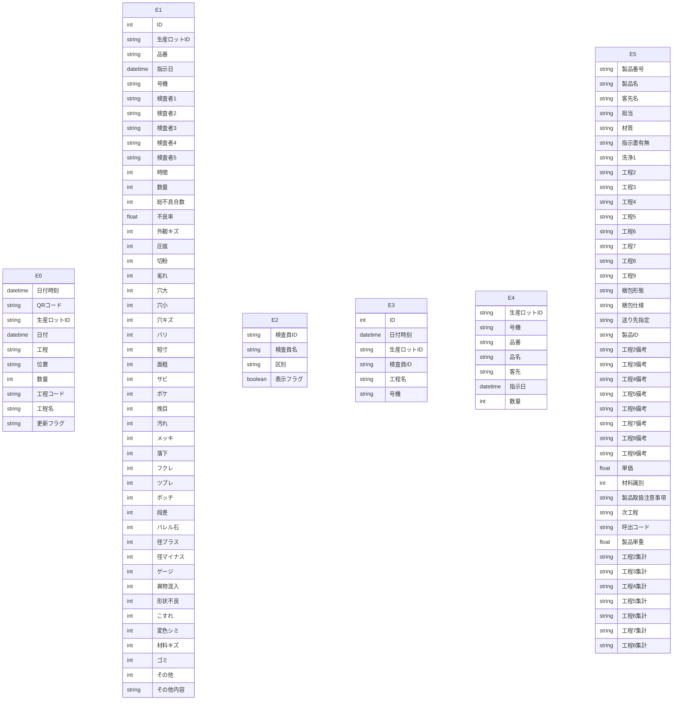

# Access データベース・スキーマ抽出レポート

このファイルは **Access の ODBC メタデータ**から自動生成しました。
LLM に渡す場合は **「スキーマ JSON」セクション**と **「PostgreSQL DDL 草案」**をあわせて指示に含めると、目的の RDB に近い定義を再現しやすくなります。

## LLM / AI 向け: このドキュメントの使い方

以下をプロンプトにコピーして、目的の SQL ダイアレクト（例: PostgreSQL）向け **CREATE TABLE・INDEX・FK** を生成させてください。

```text
あなたはデータベース設計者です。添付 Markdown の次を根拠に、一貫したリレーショナルスキーマを設計してください。
1) YAML フロントマターと「サマリー」の数値
2) 「スキーマ JSON（機械可読・全量）」の tables / relationships / warnings
3) 「PostgreSQL DDL 草案」は参考用。型・NULL・FK・インデックスを JSON・列定義と突き合わせて修正すること。
4) ODBC が SYNONYM としたテーブルはリンク元の実体が別にある場合がある。移行時はデータ取得元を明示すること。
5) relationships が空のときは、列名・サンプルデータから FK を推論してよいが、推論はコメントで区別すること。
出力: (a) 最終 DDL (b) 設計上の想定・未確定事項の箇条書き
```

> ⚠ FK 取得スキップ: t_QR履歴 — ('IM001', '[IM001] [Microsoft][ODBC Driver Manager] ドライバーはこの関数をサポートしていません。 (0) (SQLForeignKeys)')
> ⚠ FK 取得スキップ: t_不具合情報 — ('IM001', '[IM001] [Microsoft][ODBC Driver Manager] ドライバーはこの関数をサポートしていません。 (0) (SQLForeignKeys)')
> ⚠ FK 取得スキップ: t_数値検査員マスタ — ('IM001', '[IM001] [Microsoft][ODBC Driver Manager] ドライバーはこの関数をサポートしていません。 (0) (SQLForeignKeys)')
> ⚠ FK 取得スキップ: t_数値検査記録 — ('IM001', '[IM001] [Microsoft][ODBC Driver Manager] ドライバーはこの関数をサポートしていません。 (0) (SQLForeignKeys)')
> ⚠ FK 取得スキップ: t_現品票検索用 — ('IM001', '[IM001] [Microsoft][ODBC Driver Manager] ドライバーはこの関数をサポートしていません。 (0) (SQLForeignKeys)')
> ⚠ FK 取得スキップ: t_製品マスタ — ('IM001', '[IM001] [Microsoft][ODBC Driver Manager] ドライバーはこの関数をサポートしていません。 (0) (SQLForeignKeys)')

## サマリー

| 項目 | 値 |
|---|---|
| Access ファイル | `\\192.168.1.200\共有\品質保証課\外観検査記録\不具合情報検索.accdb` |
| ODBC ドライバ | `Microsoft Access Driver (*.mdb, *.accdb)` |
| テーブル数 | 6 |
| 行数合計（取得できたテーブルのみ） | 443,550 |
| リンクテーブル相当（ODBC: SYNONYM） | 6 |
| 外部キー（検出分） | 0 |
| ビュー / クエリ名 | 5 |
| 警告 | 6 |

## ER 図（Mermaid・参考）

Mermaid 内のエンティティは `E0`, `E1`, … です。実テーブル名は次の対応表を参照してください。

| 記号 | テーブル名 | ODBC 型 | 行数 |
|---|---|---:|---:|
| E0 | `t_QR履歴` | SYNONYM | 99,353 |
| E1 | `t_不具合情報` | SYNONYM | 152,969 |
| E2 | `t_数値検査員マスタ` | SYNONYM | 14 |
| E3 | `t_数値検査記録` | SYNONYM | 22,945 |
| E4 | `t_現品票検索用` | SYNONYM | 166,794 |
| E5 | `t_製品マスタ` | SYNONYM | 1,475 |



## PostgreSQL DDL 草案（全文・自動生成）

```sql
-- PostgreSQL DDL 草案（Access メタデータから自動生成）
-- ※ 型・制約は必ず手動で確認・修正してください

CREATE TABLE "t_QR履歴" (
    "日付時刻" TIMESTAMP,
    "QRコード" VARCHAR(22),
    "生産ロットID" VARCHAR(7),
    "日付" TIMESTAMP,
    "工程" VARCHAR(2),
    "位置" VARCHAR(2),
    "数量" INTEGER,
    "工程コード" VARCHAR(2),
    "工程名" VARCHAR(30),
    "更新フラグ" VARCHAR(1)
);


CREATE TABLE "t_不具合情報" (
    "ID" BIGSERIAL,
    "生産ロットID" VARCHAR(7),
    "品番" VARCHAR(30),
    "指示日" TIMESTAMP,
    "号機" VARCHAR(5),
    "検査者1" VARCHAR(6),
    "検査者2" VARCHAR(6),
    "検査者3" VARCHAR(6),
    "検査者4" VARCHAR(6),
    "検査者5" VARCHAR(20),
    "時間" INTEGER,
    "数量" INTEGER,
    "総不具合数" INTEGER,
    "不良率" DOUBLE PRECISION,
    "外観キズ" INTEGER,
    "圧痕" INTEGER,
    "切粉" INTEGER,
    "毟れ" INTEGER,
    "穴大" INTEGER,
    "穴小" INTEGER,
    "穴キズ" INTEGER,
    "バリ" INTEGER,
    "短寸" INTEGER,
    "面粗" INTEGER,
    "サビ" INTEGER,
    "ボケ" INTEGER,
    "挽目" INTEGER,
    "汚れ" INTEGER,
    "メッキ" INTEGER,
    "落下" INTEGER,
    "フクレ" INTEGER,
    "ツブレ" INTEGER,
    "ボッチ" INTEGER,
    "段差" INTEGER,
    "バレル石" INTEGER,
    "径プラス" INTEGER,
    "径マイナス" INTEGER,
    "ゲージ" INTEGER,
    "異物混入" INTEGER,
    "形状不良" INTEGER,
    "こすれ" INTEGER,
    "変色シミ" INTEGER,
    "材料キズ" INTEGER,
    "ゴミ" INTEGER,
    "その他" INTEGER,
    "その他内容" VARCHAR(10)
);


CREATE TABLE "t_数値検査員マスタ" (
    "検査員ID" VARCHAR(4),
    "検査員名" VARCHAR(5),
    "区別" VARCHAR(5),
    "表示フラグ" BOOLEAN NOT NULL
);


CREATE TABLE "t_数値検査記録" (
    "ID" BIGSERIAL,
    "日付時刻" TIMESTAMP,
    "生産ロットID" VARCHAR(7),
    "検査員ID" VARCHAR(4),
    "工程名" VARCHAR(30),
    "号機" VARCHAR(5)
);


CREATE TABLE "t_現品票検索用" (
    "生産ロットID" VARCHAR(7),
    "号機" VARCHAR(5),
    "品番" VARCHAR(30),
    "品名" VARCHAR(30),
    "客先" VARCHAR(30),
    "指示日" TIMESTAMP,
    "数量" INTEGER
);


CREATE TABLE "t_製品マスタ" (
    "製品番号" VARCHAR(30),
    "製品名" VARCHAR(30),
    "客先名" VARCHAR(30),
    "担当" VARCHAR(6),
    "材質" VARCHAR(255),
    "指示書有無" VARCHAR(1),
    "洗浄1" VARCHAR(10),
    "工程2" VARCHAR(30),
    "工程3" VARCHAR(30),
    "工程4" VARCHAR(30),
    "工程5" VARCHAR(30),
    "工程6" VARCHAR(30),
    "工程7" VARCHAR(30),
    "工程8" VARCHAR(30),
    "工程9" VARCHAR(30),
    "梱包形態" VARCHAR(30),
    "梱包仕様" VARCHAR(30),
    "送り先指定" VARCHAR(30),
    "製品ID" VARCHAR(6),
    "工程2備考" VARCHAR(20),
    "工程3備考" VARCHAR(20),
    "工程4備考" VARCHAR(20),
    "工程5備考" VARCHAR(20),
    "工程6備考" VARCHAR(20),
    "工程7備考" VARCHAR(20),
    "工程8備考" VARCHAR(20),
    "工程9備考" VARCHAR(20),
    "単価" DOUBLE PRECISION,
    "材料識別" INTEGER,
    "製品取扱注意事項" VARCHAR(20),
    "次工程" VARCHAR(10),
    "呼出コード" VARCHAR(8),
    "製品単重" DOUBLE PRECISION,
    "工程2集計" VARCHAR(2),
    "工程3集計" VARCHAR(2),
    "工程4集計" VARCHAR(2),
    "工程5集計" VARCHAR(2),
    "工程6集計" VARCHAR(2),
    "工程7集計" VARCHAR(2),
    "工程8集計" VARCHAR(2)
);
```

## スキーマ JSON（機械可読・全量）

以下をパースすれば、テーブル・列・PK・インデックス・サンプル・統計・FK・ビュー名を一括で渡せます。

```json
{
  "export_spec": "access-inspector/schema-export/v1",
  "generated_at": "2026-04-14T02:15:05.166597+00:00",
  "source": {
    "database_path": "\\\\192.168.1.200\\共有\\品質保証課\\外観検査記録\\不具合情報検索.accdb",
    "driver_used": "Microsoft Access Driver (*.mdb, *.accdb)"
  },
  "summary": {
    "table_count": 6,
    "sum_row_count_where_known": 443550,
    "tables_with_row_count": 6,
    "linked_table_odbc_synonym_count": 6,
    "relationship_count": 0,
    "view_count": 5,
    "warning_count": 6
  },
  "notes_for_consumer": [
    "ODBC の table_type が SYNONYM のテーブルは Access のリンクテーブルであることが多い。",
    "PostgreSQL 型ヒントは参考。最終 DDL は業務要件とデータ実態で確認すること。",
    "relationships が空でも、命名規則やサンプル行から推定された FK があり得る。"
  ],
  "tables": [
    {
      "name": "t_QR履歴",
      "table_type": "SYNONYM",
      "row_count": 99353,
      "row_count_error": null,
      "primary_key": [],
      "columns": [
        {
          "name": "日付時刻",
          "access_type": "DATETIME",
          "sql_data_type": 9,
          "column_size": 19,
          "decimal_digits": 0,
          "nullable": true,
          "postgres_type_hint": "TIMESTAMP"
        },
        {
          "name": "QRコード",
          "access_type": "VARCHAR",
          "sql_data_type": -9,
          "column_size": 22,
          "decimal_digits": null,
          "nullable": true,
          "postgres_type_hint": "VARCHAR(22)"
        },
        {
          "name": "生産ロットID",
          "access_type": "VARCHAR",
          "sql_data_type": -9,
          "column_size": 7,
          "decimal_digits": null,
          "nullable": true,
          "postgres_type_hint": "VARCHAR(7)"
        },
        {
          "name": "日付",
          "access_type": "DATETIME",
          "sql_data_type": 9,
          "column_size": 19,
          "decimal_digits": 0,
          "nullable": true,
          "postgres_type_hint": "TIMESTAMP"
        },
        {
          "name": "工程",
          "access_type": "VARCHAR",
          "sql_data_type": -9,
          "column_size": 2,
          "decimal_digits": null,
          "nullable": true,
          "postgres_type_hint": "VARCHAR(2)"
        },
        {
          "name": "位置",
          "access_type": "VARCHAR",
          "sql_data_type": -9,
          "column_size": 2,
          "decimal_digits": null,
          "nullable": true,
          "postgres_type_hint": "VARCHAR(2)"
        },
        {
          "name": "数量",
          "access_type": "INTEGER",
          "sql_data_type": 4,
          "column_size": 10,
          "decimal_digits": 0,
          "nullable": true,
          "postgres_type_hint": "INTEGER"
        },
        {
          "name": "工程コード",
          "access_type": "VARCHAR",
          "sql_data_type": -9,
          "column_size": 2,
          "decimal_digits": null,
          "nullable": true,
          "postgres_type_hint": "VARCHAR(2)"
        },
        {
          "name": "工程名",
          "access_type": "VARCHAR",
          "sql_data_type": -9,
          "column_size": 30,
          "decimal_digits": null,
          "nullable": true,
          "postgres_type_hint": "VARCHAR(30)"
        },
        {
          "name": "更新フラグ",
          "access_type": "VARCHAR",
          "sql_data_type": -9,
          "column_size": 1,
          "decimal_digits": null,
          "nullable": true,
          "postgres_type_hint": "VARCHAR(1)"
        }
      ],
      "indexes": [],
      "sample_headers": [
        "日付時刻",
        "QRコード",
        "生産ロットID",
        "日付",
        "工程",
        "位置",
        "数量",
        "工程コード",
        "工程名",
        "更新フラグ"
      ],
      "sample_rows": [
        [
          "2025-02-06T08:45:47",
          "P131807250203048A01780",
          "P131807",
          "2025-02-06T00:00:00",
          "3",
          "0",
          0,
          "--",
          "外観検査  1",
          "1"
        ],
        [
          "2025-02-06T08:50:02",
          "P131754250202044A04740",
          "P131754",
          "2025-02-06T00:00:00",
          "2",
          "1",
          0,
          "04",
          "磁気ﾊﾞﾚﾙ 4槽1  ASK8",
          "1"
        ],
        [
          "2025-02-06T08:50:52",
          "P131753250202043A04740",
          "P131753",
          "2025-02-06T00:00:00",
          "2",
          "1",
          0,
          "04",
          "磁気ﾊﾞﾚﾙ 4槽1  ASK8",
          "1"
        ],
        [
          "2025-02-06T08:51:36",
          "P131766250202061A04740",
          "P131766",
          "2025-02-06T00:00:00",
          "2",
          "1",
          0,
          "04",
          "磁気ﾊﾞﾚﾙ 4槽1  ASK8",
          "1"
        ],
        [
          "2025-02-06T08:53:46",
          "P130915250117064A04549",
          "P130915",
          "2025-02-06T00:00:00",
          "1",
          "1",
          1399,
          "01",
          "洗浄",
          "1"
        ]
      ],
      "column_stats": []
    },
    {
      "name": "t_不具合情報",
      "table_type": "SYNONYM",
      "row_count": 152969,
      "row_count_error": null,
      "primary_key": [],
      "columns": [
        {
          "name": "ID",
          "access_type": "COUNTER",
          "sql_data_type": 4,
          "column_size": 10,
          "decimal_digits": 0,
          "nullable": false,
          "postgres_type_hint": "BIGSERIAL"
        },
        {
          "name": "生産ロットID",
          "access_type": "VARCHAR",
          "sql_data_type": -9,
          "column_size": 7,
          "decimal_digits": null,
          "nullable": true,
          "postgres_type_hint": "VARCHAR(7)"
        },
        {
          "name": "品番",
          "access_type": "VARCHAR",
          "sql_data_type": -9,
          "column_size": 30,
          "decimal_digits": null,
          "nullable": true,
          "postgres_type_hint": "VARCHAR(30)"
        },
        {
          "name": "指示日",
          "access_type": "DATETIME",
          "sql_data_type": 9,
          "column_size": 19,
          "decimal_digits": 0,
          "nullable": true,
          "postgres_type_hint": "TIMESTAMP"
        },
        {
          "name": "号機",
          "access_type": "VARCHAR",
          "sql_data_type": -9,
          "column_size": 5,
          "decimal_digits": null,
          "nullable": true,
          "postgres_type_hint": "VARCHAR(5)"
        },
        {
          "name": "検査者1",
          "access_type": "VARCHAR",
          "sql_data_type": -9,
          "column_size": 6,
          "decimal_digits": null,
          "nullable": true,
          "postgres_type_hint": "VARCHAR(6)"
        },
        {
          "name": "検査者2",
          "access_type": "VARCHAR",
          "sql_data_type": -9,
          "column_size": 6,
          "decimal_digits": null,
          "nullable": true,
          "postgres_type_hint": "VARCHAR(6)"
        },
        {
          "name": "検査者3",
          "access_type": "VARCHAR",
          "sql_data_type": -9,
          "column_size": 6,
          "decimal_digits": null,
          "nullable": true,
          "postgres_type_hint": "VARCHAR(6)"
        },
        {
          "name": "検査者4",
          "access_type": "VARCHAR",
          "sql_data_type": -9,
          "column_size": 6,
          "decimal_digits": null,
          "nullable": true,
          "postgres_type_hint": "VARCHAR(6)"
        },
        {
          "name": "検査者5",
          "access_type": "VARCHAR",
          "sql_data_type": -9,
          "column_size": 20,
          "decimal_digits": null,
          "nullable": true,
          "postgres_type_hint": "VARCHAR(20)"
        },
        {
          "name": "時間",
          "access_type": "INTEGER",
          "sql_data_type": 4,
          "column_size": 10,
          "decimal_digits": 0,
          "nullable": true,
          "postgres_type_hint": "INTEGER"
        },
        {
          "name": "数量",
          "access_type": "INTEGER",
          "sql_data_type": 4,
          "column_size": 10,
          "decimal_digits": 0,
          "nullable": true,
          "postgres_type_hint": "INTEGER"
        },
        {
          "name": "総不具合数",
          "access_type": "INTEGER",
          "sql_data_type": 4,
          "column_size": 10,
          "decimal_digits": 0,
          "nullable": true,
          "postgres_type_hint": "INTEGER"
        },
        {
          "name": "不良率",
          "access_type": "DOUBLE",
          "sql_data_type": 8,
          "column_size": 53,
          "decimal_digits": null,
          "nullable": true,
          "postgres_type_hint": "DOUBLE PRECISION"
        },
        {
          "name": "外観キズ",
          "access_type": "INTEGER",
          "sql_data_type": 4,
          "column_size": 10,
          "decimal_digits": 0,
          "nullable": true,
          "postgres_type_hint": "INTEGER"
        },
        {
          "name": "圧痕",
          "access_type": "INTEGER",
          "sql_data_type": 4,
          "column_size": 10,
          "decimal_digits": 0,
          "nullable": true,
          "postgres_type_hint": "INTEGER"
        },
        {
          "name": "切粉",
          "access_type": "INTEGER",
          "sql_data_type": 4,
          "column_size": 10,
          "decimal_digits": 0,
          "nullable": true,
          "postgres_type_hint": "INTEGER"
        },
        {
          "name": "毟れ",
          "access_type": "INTEGER",
          "sql_data_type": 4,
          "column_size": 10,
          "decimal_digits": 0,
          "nullable": true,
          "postgres_type_hint": "INTEGER"
        },
        {
          "name": "穴大",
          "access_type": "INTEGER",
          "sql_data_type": 4,
          "column_size": 10,
          "decimal_digits": 0,
          "nullable": true,
          "postgres_type_hint": "INTEGER"
        },
        {
          "name": "穴小",
          "access_type": "INTEGER",
          "sql_data_type": 4,
          "column_size": 10,
          "decimal_digits": 0,
          "nullable": true,
          "postgres_type_hint": "INTEGER"
        },
        {
          "name": "穴キズ",
          "access_type": "INTEGER",
          "sql_data_type": 4,
          "column_size": 10,
          "decimal_digits": 0,
          "nullable": true,
          "postgres_type_hint": "INTEGER"
        },
        {
          "name": "バリ",
          "access_type": "INTEGER",
          "sql_data_type": 4,
          "column_size": 10,
          "decimal_digits": 0,
          "nullable": true,
          "postgres_type_hint": "INTEGER"
        },
        {
          "name": "短寸",
          "access_type": "INTEGER",
          "sql_data_type": 4,
          "column_size": 10,
          "decimal_digits": 0,
          "nullable": true,
          "postgres_type_hint": "INTEGER"
        },
        {
          "name": "面粗",
          "access_type": "INTEGER",
          "sql_data_type": 4,
          "column_size": 10,
          "decimal_digits": 0,
          "nullable": true,
          "postgres_type_hint": "INTEGER"
        },
        {
          "name": "サビ",
          "access_type": "INTEGER",
          "sql_data_type": 4,
          "column_size": 10,
          "decimal_digits": 0,
          "nullable": true,
          "postgres_type_hint": "INTEGER"
        },
        {
          "name": "ボケ",
          "access_type": "INTEGER",
          "sql_data_type": 4,
          "column_size": 10,
          "decimal_digits": 0,
          "nullable": true,
          "postgres_type_hint": "INTEGER"
        },
        {
          "name": "挽目",
          "access_type": "INTEGER",
          "sql_data_type": 4,
          "column_size": 10,
          "decimal_digits": 0,
          "nullable": true,
          "postgres_type_hint": "INTEGER"
        },
        {
          "name": "汚れ",
          "access_type": "INTEGER",
          "sql_data_type": 4,
          "column_size": 10,
          "decimal_digits": 0,
          "nullable": true,
          "postgres_type_hint": "INTEGER"
        },
        {
          "name": "メッキ",
          "access_type": "INTEGER",
          "sql_data_type": 4,
          "column_size": 10,
          "decimal_digits": 0,
          "nullable": true,
          "postgres_type_hint": "INTEGER"
        },
        {
          "name": "落下",
          "access_type": "INTEGER",
          "sql_data_type": 4,
          "column_size": 10,
          "decimal_digits": 0,
          "nullable": true,
          "postgres_type_hint": "INTEGER"
        },
        {
          "name": "フクレ",
          "access_type": "INTEGER",
          "sql_data_type": 4,
          "column_size": 10,
          "decimal_digits": 0,
          "nullable": true,
          "postgres_type_hint": "INTEGER"
        },
        {
          "name": "ツブレ",
          "access_type": "INTEGER",
          "sql_data_type": 4,
          "column_size": 10,
          "decimal_digits": 0,
          "nullable": true,
          "postgres_type_hint": "INTEGER"
        },
        {
          "name": "ボッチ",
          "access_type": "INTEGER",
          "sql_data_type": 4,
          "column_size": 10,
          "decimal_digits": 0,
          "nullable": true,
          "postgres_type_hint": "INTEGER"
        },
        {
          "name": "段差",
          "access_type": "INTEGER",
          "sql_data_type": 4,
          "column_size": 10,
          "decimal_digits": 0,
          "nullable": true,
          "postgres_type_hint": "INTEGER"
        },
        {
          "name": "バレル石",
          "access_type": "INTEGER",
          "sql_data_type": 4,
          "column_size": 10,
          "decimal_digits": 0,
          "nullable": true,
          "postgres_type_hint": "INTEGER"
        },
        {
          "name": "径プラス",
          "access_type": "INTEGER",
          "sql_data_type": 4,
          "column_size": 10,
          "decimal_digits": 0,
          "nullable": true,
          "postgres_type_hint": "INTEGER"
        },
        {
          "name": "径マイナス",
          "access_type": "INTEGER",
          "sql_data_type": 4,
          "column_size": 10,
          "decimal_digits": 0,
          "nullable": true,
          "postgres_type_hint": "INTEGER"
        },
        {
          "name": "ゲージ",
          "access_type": "INTEGER",
          "sql_data_type": 4,
          "column_size": 10,
          "decimal_digits": 0,
          "nullable": true,
          "postgres_type_hint": "INTEGER"
        },
        {
          "name": "異物混入",
          "access_type": "INTEGER",
          "sql_data_type": 4,
          "column_size": 10,
          "decimal_digits": 0,
          "nullable": true,
          "postgres_type_hint": "INTEGER"
        },
        {
          "name": "形状不良",
          "access_type": "INTEGER",
          "sql_data_type": 4,
          "column_size": 10,
          "decimal_digits": 0,
          "nullable": true,
          "postgres_type_hint": "INTEGER"
        },
        {
          "name": "こすれ",
          "access_type": "INTEGER",
          "sql_data_type": 4,
          "column_size": 10,
          "decimal_digits": 0,
          "nullable": true,
          "postgres_type_hint": "INTEGER"
        },
        {
          "name": "変色シミ",
          "access_type": "INTEGER",
          "sql_data_type": 4,
          "column_size": 10,
          "decimal_digits": 0,
          "nullable": true,
          "postgres_type_hint": "INTEGER"
        },
        {
          "name": "材料キズ",
          "access_type": "INTEGER",
          "sql_data_type": 4,
          "column_size": 10,
          "decimal_digits": 0,
          "nullable": true,
          "postgres_type_hint": "INTEGER"
        },
        {
          "name": "ゴミ",
          "access_type": "INTEGER",
          "sql_data_type": 4,
          "column_size": 10,
          "decimal_digits": 0,
          "nullable": true,
          "postgres_type_hint": "INTEGER"
        },
        {
          "name": "その他",
          "access_type": "INTEGER",
          "sql_data_type": 4,
          "column_size": 10,
          "decimal_digits": 0,
          "nullable": true,
          "postgres_type_hint": "INTEGER"
        },
        {
          "name": "その他内容",
          "access_type": "VARCHAR",
          "sql_data_type": -9,
          "column_size": 10,
          "decimal_digits": null,
          "nullable": true,
          "postgres_type_hint": "VARCHAR(10)"
        }
      ],
      "indexes": [],
      "sample_headers": [
        "ID",
        "生産ロットID",
        "品番",
        "指示日",
        "号機",
        "検査者1",
        "検査者2",
        "検査者3",
        "検査者4",
        "検査者5",
        "時間",
        "数量",
        "総不具合数",
        "不良率",
        "外観キズ",
        "圧痕",
        "切粉",
        "毟れ",
        "穴大",
        "穴小",
        "穴キズ",
        "バリ",
        "短寸",
        "面粗",
        "サビ",
        "ボケ",
        "挽目",
        "汚れ",
        "メッキ",
        "落下",
        "フクレ",
        "ツブレ",
        "ボッチ",
        "段差",
        "バレル石",
        "径プラス",
        "径マイナス",
        "ゲージ",
        "異物混入",
        "形状不良",
        "こすれ",
        "変色シミ",
        "材料キズ",
        "ゴミ",
        "その他",
        "その他内容"
      ],
      "sample_rows": [
        [
          1,
          "P009869",
          "CC02120-0103",
          "2010-11-08T00:00:00",
          "旧機番",
          "関根り",
          "野口",
          null,
          null,
          null,
          255,
          2129,
          496,
          0.23297322686707375,
          null,
          null,
          493,
          null,
          null,
          null,
          null,
          null,
          null,
          null,
          null,
          null,
          null,
          3,
          null,
          null,
          null,
          null,
          null,
          null,
          null,
          null,
          null,
          null,
          null,
          null,
          null,
          null,
          null,
          null,
          null,
          null
        ],
        [
          2,
          "P009868",
          "CC02180-0103",
          "2010-11-09T00:00:00",
          "旧機番",
          "関田",
          null,
          null,
          null,
          null,
          80,
          660,
          104,
          0.15757575757575756,
          1,
          null,
          103,
          null,
          null,
          null,
          null,
          null,
          null,
          null,
          null,
          null,
          null,
          null,
          null,
          null,
          null,
          null,
          null,
          null,
          null,
          null,
          null,
          null,
          null,
          null,
          null,
          null,
          null,
          null,
          null,
          null
        ],
        [
          3,
          "P009867",
          "CC02200-0103",
          "2010-11-10T00:00:00",
          "旧機番",
          "村田",
          "久保",
          null,
          null,
          null,
          75,
          441,
          58,
          0.13151927437641722,
          null,
          3,
          55,
          null,
          null,
          null,
          null,
          null,
          null,
          null,
          null,
          null,
          null,
          null,
          null,
          null,
          null,
          null,
          null,
          null,
          null,
          null,
          null,
          null,
          null,
          null,
          null,
          null,
          null,
          null,
          null,
          null
        ],
        [
          4,
          "P008499",
          "A-61112-01-03",
          "2011-10-08T00:00:00",
          "旧機番",
          "黒澤",
          null,
          null,
          null,
          null,
          30,
          175,
          34,
          0.19428571428571428,
          null,
          null,
          34,
          null,
          null,
          null,
          null,
          null,
          null,
          null,
          null,
          null,
          null,
          null,
          null,
          null,
          null,
          null,
          null,
          null,
          null,
          null,
          null,
          null,
          null,
          null,
          null,
          null,
          null,
          null,
          null,
          null
        ],
        [
          5,
          "P007592",
          "A27906-E22MT0044.SH",
          "2012-02-10T00:00:00",
          "旧機番",
          "中",
          null,
          null,
          null,
          null,
          30,
          220,
          2,
          0.00909090909090909,
          null,
          2,
          null,
          null,
          null,
          null,
          null,
          null,
          null,
          null,
          null,
          null,
          null,
          null,
          null,
          null,
          null,
          null,
          null,
          null,
          null,
          null,
          null,
          null,
          null,
          null,
          null,
          null,
          null,
          null,
          null,
          null
        ]
      ],
      "column_stats": []
    },
    {
      "name": "t_数値検査員マスタ",
      "table_type": "SYNONYM",
      "row_count": 14,
      "row_count_error": null,
      "primary_key": [],
      "columns": [
        {
          "name": "検査員ID",
          "access_type": "VARCHAR",
          "sql_data_type": -9,
          "column_size": 4,
          "decimal_digits": null,
          "nullable": true,
          "postgres_type_hint": "VARCHAR(4)"
        },
        {
          "name": "検査員名",
          "access_type": "VARCHAR",
          "sql_data_type": -9,
          "column_size": 5,
          "decimal_digits": null,
          "nullable": true,
          "postgres_type_hint": "VARCHAR(5)"
        },
        {
          "name": "区別",
          "access_type": "VARCHAR",
          "sql_data_type": -9,
          "column_size": 5,
          "decimal_digits": null,
          "nullable": true,
          "postgres_type_hint": "VARCHAR(5)"
        },
        {
          "name": "表示フラグ",
          "access_type": "BIT",
          "sql_data_type": -7,
          "column_size": 1,
          "decimal_digits": 0,
          "nullable": false,
          "postgres_type_hint": "BOOLEAN"
        }
      ],
      "indexes": [],
      "sample_headers": [
        "検査員ID",
        "検査員名",
        "区別",
        "表示フラグ"
      ],
      "sample_rows": [
        [
          "0",
          "旧０",
          null,
          false
        ],
        [
          "1",
          "旧１",
          null,
          false
        ],
        [
          "11",
          "千葉かおる",
          "担当",
          true
        ],
        [
          "12",
          "山中かおり",
          "担当",
          true
        ],
        [
          "13",
          "新井春香",
          "担当",
          true
        ]
      ],
      "column_stats": []
    },
    {
      "name": "t_数値検査記録",
      "table_type": "SYNONYM",
      "row_count": 22945,
      "row_count_error": null,
      "primary_key": [],
      "columns": [
        {
          "name": "ID",
          "access_type": "COUNTER",
          "sql_data_type": 4,
          "column_size": 10,
          "decimal_digits": 0,
          "nullable": false,
          "postgres_type_hint": "BIGSERIAL"
        },
        {
          "name": "日付時刻",
          "access_type": "DATETIME",
          "sql_data_type": 9,
          "column_size": 19,
          "decimal_digits": 0,
          "nullable": true,
          "postgres_type_hint": "TIMESTAMP"
        },
        {
          "name": "生産ロットID",
          "access_type": "VARCHAR",
          "sql_data_type": -9,
          "column_size": 7,
          "decimal_digits": null,
          "nullable": true,
          "postgres_type_hint": "VARCHAR(7)"
        },
        {
          "name": "検査員ID",
          "access_type": "VARCHAR",
          "sql_data_type": -9,
          "column_size": 4,
          "decimal_digits": null,
          "nullable": true,
          "postgres_type_hint": "VARCHAR(4)"
        },
        {
          "name": "工程名",
          "access_type": "VARCHAR",
          "sql_data_type": -9,
          "column_size": 30,
          "decimal_digits": null,
          "nullable": true,
          "postgres_type_hint": "VARCHAR(30)"
        },
        {
          "name": "号機",
          "access_type": "VARCHAR",
          "sql_data_type": -9,
          "column_size": 5,
          "decimal_digits": null,
          "nullable": true,
          "postgres_type_hint": "VARCHAR(5)"
        }
      ],
      "indexes": [],
      "sample_headers": [
        "ID",
        "日付時刻",
        "生産ロットID",
        "検査員ID",
        "工程名",
        "号機"
      ],
      "sample_rows": [
        [
          117,
          "2024-10-10T10:47:28",
          "P126569",
          "16",
          "数値検査",
          "F-6"
        ],
        [
          118,
          "2024-10-10T10:47:44",
          "P126610",
          "16",
          "数値検査",
          "F-6"
        ],
        [
          119,
          "2024-10-10T10:48:01",
          "P126654",
          "16",
          "数値検査",
          "F-6"
        ],
        [
          120,
          "2024-10-10T10:48:16",
          "P126697",
          "16",
          "数値検査",
          "F-6"
        ],
        [
          121,
          "2024-10-10T10:48:34",
          "P126444",
          "16",
          "数値検査",
          "F-6"
        ]
      ],
      "column_stats": []
    },
    {
      "name": "t_現品票検索用",
      "table_type": "SYNONYM",
      "row_count": 166794,
      "row_count_error": null,
      "primary_key": [],
      "columns": [
        {
          "name": "生産ロットID",
          "access_type": "VARCHAR",
          "sql_data_type": -9,
          "column_size": 7,
          "decimal_digits": null,
          "nullable": true,
          "postgres_type_hint": "VARCHAR(7)"
        },
        {
          "name": "号機",
          "access_type": "VARCHAR",
          "sql_data_type": -9,
          "column_size": 5,
          "decimal_digits": null,
          "nullable": true,
          "postgres_type_hint": "VARCHAR(5)"
        },
        {
          "name": "品番",
          "access_type": "VARCHAR",
          "sql_data_type": -9,
          "column_size": 30,
          "decimal_digits": null,
          "nullable": true,
          "postgres_type_hint": "VARCHAR(30)"
        },
        {
          "name": "品名",
          "access_type": "VARCHAR",
          "sql_data_type": -9,
          "column_size": 30,
          "decimal_digits": null,
          "nullable": true,
          "postgres_type_hint": "VARCHAR(30)"
        },
        {
          "name": "客先",
          "access_type": "VARCHAR",
          "sql_data_type": -9,
          "column_size": 30,
          "decimal_digits": null,
          "nullable": true,
          "postgres_type_hint": "VARCHAR(30)"
        },
        {
          "name": "指示日",
          "access_type": "DATETIME",
          "sql_data_type": 9,
          "column_size": 19,
          "decimal_digits": 0,
          "nullable": true,
          "postgres_type_hint": "TIMESTAMP"
        },
        {
          "name": "数量",
          "access_type": "INTEGER",
          "sql_data_type": 4,
          "column_size": 10,
          "decimal_digits": 0,
          "nullable": true,
          "postgres_type_hint": "INTEGER"
        }
      ],
      "indexes": [],
      "sample_headers": [
        "生産ロットID",
        "号機",
        "品番",
        "品名",
        "客先",
        "指示日",
        "数量"
      ],
      "sample_rows": [
        [
          "E000001",
          "AN",
          "00575532-01",
          "カラー 8×8.16",
          "東京鋲兼",
          "2017-10-12T00:00:00",
          3730
        ],
        [
          "E000002",
          "AN",
          "00575532-01",
          "カラー 8×8.16",
          "東京鋲兼",
          "2017-10-14T00:00:00",
          1370
        ],
        [
          "E000003",
          "AN",
          "00575532-05",
          "カラー 8×8.14",
          "東京鋲兼",
          "2017-10-14T00:00:00",
          2700
        ],
        [
          "E000004",
          "AN-1",
          "FA用リベット",
          "FA用リベット",
          "イワタボルト",
          "2017-10-14T00:00:00",
          10000
        ],
        [
          "E000005",
          "AN-2",
          "FA用リベット",
          "FA用リベット",
          "イワタボルト",
          "2017-10-14T00:00:00",
          10000
        ]
      ],
      "column_stats": []
    },
    {
      "name": "t_製品マスタ",
      "table_type": "SYNONYM",
      "row_count": 1475,
      "row_count_error": null,
      "primary_key": [],
      "columns": [
        {
          "name": "製品番号",
          "access_type": "VARCHAR",
          "sql_data_type": -9,
          "column_size": 30,
          "decimal_digits": null,
          "nullable": true,
          "postgres_type_hint": "VARCHAR(30)"
        },
        {
          "name": "製品名",
          "access_type": "VARCHAR",
          "sql_data_type": -9,
          "column_size": 30,
          "decimal_digits": null,
          "nullable": true,
          "postgres_type_hint": "VARCHAR(30)"
        },
        {
          "name": "客先名",
          "access_type": "VARCHAR",
          "sql_data_type": -9,
          "column_size": 30,
          "decimal_digits": null,
          "nullable": true,
          "postgres_type_hint": "VARCHAR(30)"
        },
        {
          "name": "担当",
          "access_type": "VARCHAR",
          "sql_data_type": -9,
          "column_size": 6,
          "decimal_digits": null,
          "nullable": true,
          "postgres_type_hint": "VARCHAR(6)"
        },
        {
          "name": "材質",
          "access_type": "VARCHAR",
          "sql_data_type": -9,
          "column_size": 255,
          "decimal_digits": null,
          "nullable": true,
          "postgres_type_hint": "VARCHAR(255)"
        },
        {
          "name": "指示書有無",
          "access_type": "VARCHAR",
          "sql_data_type": -9,
          "column_size": 1,
          "decimal_digits": null,
          "nullable": true,
          "postgres_type_hint": "VARCHAR(1)"
        },
        {
          "name": "洗浄1",
          "access_type": "VARCHAR",
          "sql_data_type": -9,
          "column_size": 10,
          "decimal_digits": null,
          "nullable": true,
          "postgres_type_hint": "VARCHAR(10)"
        },
        {
          "name": "工程2",
          "access_type": "VARCHAR",
          "sql_data_type": -9,
          "column_size": 30,
          "decimal_digits": null,
          "nullable": true,
          "postgres_type_hint": "VARCHAR(30)"
        },
        {
          "name": "工程3",
          "access_type": "VARCHAR",
          "sql_data_type": -9,
          "column_size": 30,
          "decimal_digits": null,
          "nullable": true,
          "postgres_type_hint": "VARCHAR(30)"
        },
        {
          "name": "工程4",
          "access_type": "VARCHAR",
          "sql_data_type": -9,
          "column_size": 30,
          "decimal_digits": null,
          "nullable": true,
          "postgres_type_hint": "VARCHAR(30)"
        },
        {
          "name": "工程5",
          "access_type": "VARCHAR",
          "sql_data_type": -9,
          "column_size": 30,
          "decimal_digits": null,
          "nullable": true,
          "postgres_type_hint": "VARCHAR(30)"
        },
        {
          "name": "工程6",
          "access_type": "VARCHAR",
          "sql_data_type": -9,
          "column_size": 30,
          "decimal_digits": null,
          "nullable": true,
          "postgres_type_hint": "VARCHAR(30)"
        },
        {
          "name": "工程7",
          "access_type": "VARCHAR",
          "sql_data_type": -9,
          "column_size": 30,
          "decimal_digits": null,
          "nullable": true,
          "postgres_type_hint": "VARCHAR(30)"
        },
        {
          "name": "工程8",
          "access_type": "VARCHAR",
          "sql_data_type": -9,
          "column_size": 30,
          "decimal_digits": null,
          "nullable": true,
          "postgres_type_hint": "VARCHAR(30)"
        },
        {
          "name": "工程9",
          "access_type": "VARCHAR",
          "sql_data_type": -9,
          "column_size": 30,
          "decimal_digits": null,
          "nullable": true,
          "postgres_type_hint": "VARCHAR(30)"
        },
        {
          "name": "梱包形態",
          "access_type": "VARCHAR",
          "sql_data_type": -9,
          "column_size": 30,
          "decimal_digits": null,
          "nullable": true,
          "postgres_type_hint": "VARCHAR(30)"
        },
        {
          "name": "梱包仕様",
          "access_type": "VARCHAR",
          "sql_data_type": -9,
          "column_size": 30,
          "decimal_digits": null,
          "nullable": true,
          "postgres_type_hint": "VARCHAR(30)"
        },
        {
          "name": "送り先指定",
          "access_type": "VARCHAR",
          "sql_data_type": -9,
          "column_size": 30,
          "decimal_digits": null,
          "nullable": true,
          "postgres_type_hint": "VARCHAR(30)"
        },
        {
          "name": "製品ID",
          "access_type": "VARCHAR",
          "sql_data_type": -9,
          "column_size": 6,
          "decimal_digits": null,
          "nullable": true,
          "postgres_type_hint": "VARCHAR(6)"
        },
        {
          "name": "工程2備考",
          "access_type": "VARCHAR",
          "sql_data_type": -9,
          "column_size": 20,
          "decimal_digits": null,
          "nullable": true,
          "postgres_type_hint": "VARCHAR(20)"
        },
        {
          "name": "工程3備考",
          "access_type": "VARCHAR",
          "sql_data_type": -9,
          "column_size": 20,
          "decimal_digits": null,
          "nullable": true,
          "postgres_type_hint": "VARCHAR(20)"
        },
        {
          "name": "工程4備考",
          "access_type": "VARCHAR",
          "sql_data_type": -9,
          "column_size": 20,
          "decimal_digits": null,
          "nullable": true,
          "postgres_type_hint": "VARCHAR(20)"
        },
        {
          "name": "工程5備考",
          "access_type": "VARCHAR",
          "sql_data_type": -9,
          "column_size": 20,
          "decimal_digits": null,
          "nullable": true,
          "postgres_type_hint": "VARCHAR(20)"
        },
        {
          "name": "工程6備考",
          "access_type": "VARCHAR",
          "sql_data_type": -9,
          "column_size": 20,
          "decimal_digits": null,
          "nullable": true,
          "postgres_type_hint": "VARCHAR(20)"
        },
        {
          "name": "工程7備考",
          "access_type": "VARCHAR",
          "sql_data_type": -9,
          "column_size": 20,
          "decimal_digits": null,
          "nullable": true,
          "postgres_type_hint": "VARCHAR(20)"
        },
        {
          "name": "工程8備考",
          "access_type": "VARCHAR",
          "sql_data_type": -9,
          "column_size": 20,
          "decimal_digits": null,
          "nullable": true,
          "postgres_type_hint": "VARCHAR(20)"
        },
        {
          "name": "工程9備考",
          "access_type": "VARCHAR",
          "sql_data_type": -9,
          "column_size": 20,
          "decimal_digits": null,
          "nullable": true,
          "postgres_type_hint": "VARCHAR(20)"
        },
        {
          "name": "単価",
          "access_type": "DOUBLE",
          "sql_data_type": 8,
          "column_size": 53,
          "decimal_digits": null,
          "nullable": true,
          "postgres_type_hint": "DOUBLE PRECISION"
        },
        {
          "name": "材料識別",
          "access_type": "INTEGER",
          "sql_data_type": 4,
          "column_size": 10,
          "decimal_digits": 0,
          "nullable": true,
          "postgres_type_hint": "INTEGER"
        },
        {
          "name": "製品取扱注意事項",
          "access_type": "VARCHAR",
          "sql_data_type": -9,
          "column_size": 20,
          "decimal_digits": null,
          "nullable": true,
          "postgres_type_hint": "VARCHAR(20)"
        },
        {
          "name": "次工程",
          "access_type": "VARCHAR",
          "sql_data_type": -9,
          "column_size": 10,
          "decimal_digits": null,
          "nullable": true,
          "postgres_type_hint": "VARCHAR(10)"
        },
        {
          "name": "呼出コード",
          "access_type": "VARCHAR",
          "sql_data_type": -9,
          "column_size": 8,
          "decimal_digits": null,
          "nullable": true,
          "postgres_type_hint": "VARCHAR(8)"
        },
        {
          "name": "製品単重",
          "access_type": "DOUBLE",
          "sql_data_type": 8,
          "column_size": 53,
          "decimal_digits": null,
          "nullable": true,
          "postgres_type_hint": "DOUBLE PRECISION"
        },
        {
          "name": "工程2集計",
          "access_type": "VARCHAR",
          "sql_data_type": -9,
          "column_size": 2,
          "decimal_digits": null,
          "nullable": true,
          "postgres_type_hint": "VARCHAR(2)"
        },
        {
          "name": "工程3集計",
          "access_type": "VARCHAR",
          "sql_data_type": -9,
          "column_size": 2,
          "decimal_digits": null,
          "nullable": true,
          "postgres_type_hint": "VARCHAR(2)"
        },
        {
          "name": "工程4集計",
          "access_type": "VARCHAR",
          "sql_data_type": -9,
          "column_size": 2,
          "decimal_digits": null,
          "nullable": true,
          "postgres_type_hint": "VARCHAR(2)"
        },
        {
          "name": "工程5集計",
          "access_type": "VARCHAR",
          "sql_data_type": -9,
          "column_size": 2,
          "decimal_digits": null,
          "nullable": true,
          "postgres_type_hint": "VARCHAR(2)"
        },
        {
          "name": "工程6集計",
          "access_type": "VARCHAR",
          "sql_data_type": -9,
          "column_size": 2,
          "decimal_digits": null,
          "nullable": true,
          "postgres_type_hint": "VARCHAR(2)"
        },
        {
          "name": "工程7集計",
          "access_type": "VARCHAR",
          "sql_data_type": -9,
          "column_size": 2,
          "decimal_digits": null,
          "nullable": true,
          "postgres_type_hint": "VARCHAR(2)"
        },
        {
          "name": "工程8集計",
          "access_type": "VARCHAR",
          "sql_data_type": -9,
          "column_size": 2,
          "decimal_digits": null,
          "nullable": true,
          "postgres_type_hint": "VARCHAR(2)"
        }
      ],
      "indexes": [],
      "sample_headers": [
        "製品番号",
        "製品名",
        "客先名",
        "担当",
        "材質",
        "指示書有無",
        "洗浄1",
        "工程2",
        "工程3",
        "工程4",
        "工程5",
        "工程6",
        "工程7",
        "工程8",
        "工程9",
        "梱包形態",
        "梱包仕様",
        "送り先指定",
        "製品ID",
        "工程2備考",
        "工程3備考",
        "工程4備考",
        "工程5備考",
        "工程6備考",
        "工程7備考",
        "工程8備考",
        "工程9備考",
        "単価",
        "材料識別",
        "製品取扱注意事項",
        "次工程",
        "呼出コード",
        "製品単重",
        "工程2集計",
        "工程3集計",
        "工程4集計",
        "工程5集計",
        "工程6集計",
        "工程7集計",
        "工程8集計"
      ],
      "sample_rows": [
        [
          "#70(ﾉｽﾞﾙ)",
          "#70(ﾉｽﾞﾙ)",
          "東京鋲兼",
          "小泉",
          "C3604Lcd φ6.0 平目 22山",
          null,
          "洗浄ASK2番",
          "数値検査",
          "外観検査",
          null,
          null,
          null,
          null,
          null,
          null,
          null,
          null,
          null,
          "A00008",
          null,
          " ",
          " ",
          null,
          null,
          null,
          null,
          null,
          16.3,
          1,
          null,
          " ",
          "*A00008*",
          0.0,
          "02",
          "03",
          null,
          null,
          null,
          null,
          null
        ],
        [
          "#71(ﾉｽﾞﾙ)",
          "ノズル",
          "東京鋲兼",
          "小泉",
          "C3604Lcd φ5.0 ﾀﾃﾒR 15山",
          null,
          "洗浄ASK2番",
          "数値検査",
          "外観検査",
          null,
          null,
          null,
          null,
          null,
          null,
          null,
          null,
          null,
          "A00010",
          null,
          " ",
          " ",
          null,
          null,
          null,
          null,
          null,
          13.0,
          1,
          null,
          " ",
          "*A00010*",
          0.0,
          "02",
          "03",
          null,
          null,
          null,
          null,
          null
        ],
        [
          "#71(ﾉｽﾞﾙﾎﾞﾃﾞｨ)",
          "ノズルボディ",
          "東京鋲兼",
          "小泉",
          "C3604Lcd φ6.5",
          null,
          "洗浄ASK2番",
          "数値検査",
          "外観検査",
          null,
          null,
          null,
          null,
          null,
          null,
          null,
          null,
          null,
          "A00011",
          null,
          " ",
          " ",
          null,
          null,
          null,
          null,
          null,
          13.0,
          1,
          null,
          " ",
          "*A00011*",
          0.0,
          "02",
          "03",
          null,
          null,
          null,
          null,
          null
        ],
        [
          "#80（ﾉｽﾞﾙ)",
          "#80（ﾉｽﾞﾙ)",
          "東京鋲兼",
          "小泉",
          "C3604Lcd φ6.0 平目 22山",
          null,
          "洗浄ASK2番",
          "数値検査",
          "外観検査",
          null,
          null,
          null,
          null,
          null,
          null,
          null,
          null,
          null,
          "A00013",
          null,
          " ",
          " ",
          null,
          null,
          null,
          null,
          null,
          13.6,
          1,
          null,
          " ",
          "*A432*",
          1.33,
          "02",
          "03",
          null,
          null,
          null,
          null,
          null
        ],
        [
          "000-6510-4211",
          "鉄芯",
          "東京鋲兼",
          "小泉",
          "ASK2600S φ10.0CM",
          null,
          "4槽1　ASK8",
          "数値検査",
          "外観検査",
          null,
          null,
          null,
          null,
          null,
          null,
          "防錆油塗布",
          null,
          "本社",
          "A00023",
          " ",
          " ",
          " ",
          null,
          null,
          null,
          null,
          null,
          15.0,
          5,
          null,
          " ",
          "*A1278*",
          4.41,
          "02",
          "03",
          null,
          null,
          null,
          null,
          null
        ]
      ],
      "column_stats": []
    }
  ],
  "relationships": [],
  "views_and_queries": [
    {
      "name": "クエリ1",
      "type": "VIEW"
    },
    {
      "name": "クエリ2",
      "type": "VIEW"
    },
    {
      "name": "対象ID",
      "type": "VIEW"
    },
    {
      "name": "廃棄重量2",
      "type": "VIEW"
    },
    {
      "name": "廃棄重量合計",
      "type": "VIEW"
    }
  ],
  "warnings": [
    "FK 取得スキップ: t_QR履歴 — ('IM001', '[IM001] [Microsoft][ODBC Driver Manager] ドライバーはこの関数をサポートしていません。 (0) (SQLForeignKeys)')",
    "FK 取得スキップ: t_不具合情報 — ('IM001', '[IM001] [Microsoft][ODBC Driver Manager] ドライバーはこの関数をサポートしていません。 (0) (SQLForeignKeys)')",
    "FK 取得スキップ: t_数値検査員マスタ — ('IM001', '[IM001] [Microsoft][ODBC Driver Manager] ドライバーはこの関数をサポートしていません。 (0) (SQLForeignKeys)')",
    "FK 取得スキップ: t_数値検査記録 — ('IM001', '[IM001] [Microsoft][ODBC Driver Manager] ドライバーはこの関数をサポートしていません。 (0) (SQLForeignKeys)')",
    "FK 取得スキップ: t_現品票検索用 — ('IM001', '[IM001] [Microsoft][ODBC Driver Manager] ドライバーはこの関数をサポートしていません。 (0) (SQLForeignKeys)')",
    "FK 取得スキップ: t_製品マスタ — ('IM001', '[IM001] [Microsoft][ODBC Driver Manager] ドライバーはこの関数をサポートしていません。 (0) (SQLForeignKeys)')"
  ]
}
```

## テーブル一覧

| テーブル | ODBC 型 | 行数 | PK | インデックス数 |
|---|---|---:|---|---:|
| `t_QR履歴` | SYNONYM | 99,353 | — | 0 |
| `t_不具合情報` | SYNONYM | 152,969 | — | 0 |
| `t_数値検査員マスタ` | SYNONYM | 14 | — | 0 |
| `t_数値検査記録` | SYNONYM | 22,945 | — | 0 |
| `t_現品票検索用` | SYNONYM | 166,794 | — | 0 |
| `t_製品マスタ` | SYNONYM | 1,475 | — | 0 |

## カラム詳細

### `t_QR履歴`

- **ODBC テーブル種別**: SYNONYM
- **行数**: 99,353

| 列 | Access 型 | PG 型ヒント | sql_data_type | サイズ | 小数 | NULL | PK |
|---|---|---|---:|---:|---:|:---:|:---:|
| 日付時刻 | DATETIME | TIMESTAMP | 9 | 19 | 0 | ○ |  |
| QRコード | VARCHAR | VARCHAR(22) | -9 | 22 |  | ○ |  |
| 生産ロットID | VARCHAR | VARCHAR(7) | -9 | 7 |  | ○ |  |
| 日付 | DATETIME | TIMESTAMP | 9 | 19 | 0 | ○ |  |
| 工程 | VARCHAR | VARCHAR(2) | -9 | 2 |  | ○ |  |
| 位置 | VARCHAR | VARCHAR(2) | -9 | 2 |  | ○ |  |
| 数量 | INTEGER | INTEGER | 4 | 10 | 0 | ○ |  |
| 工程コード | VARCHAR | VARCHAR(2) | -9 | 2 |  | ○ |  |
| 工程名 | VARCHAR | VARCHAR(30) | -9 | 30 |  | ○ |  |
| 更新フラグ | VARCHAR | VARCHAR(1) | -9 | 1 |  | ○ |  |

**サンプルデータ（先頭数行）**

| 日付時刻 | QRコード | 生産ロットID | 日付 | 工程 | 位置 | 数量 | 工程コード | 工程名 | 更新フラグ |
|---|---|---|---|---|---|---|---|---|---|
| 2025-02-06T08:45:47 | P131807250203048A01780 | P131807 | 2025-02-06T00:00:00 | 3 | 0 | 0 | -- | 外観検査  1 | 1 |
| 2025-02-06T08:50:02 | P131754250202044A04740 | P131754 | 2025-02-06T00:00:00 | 2 | 1 | 0 | 04 | 磁気ﾊﾞﾚﾙ 4槽1  ASK8 | 1 |
| 2025-02-06T08:50:52 | P131753250202043A04740 | P131753 | 2025-02-06T00:00:00 | 2 | 1 | 0 | 04 | 磁気ﾊﾞﾚﾙ 4槽1  ASK8 | 1 |
| 2025-02-06T08:51:36 | P131766250202061A04740 | P131766 | 2025-02-06T00:00:00 | 2 | 1 | 0 | 04 | 磁気ﾊﾞﾚﾙ 4槽1  ASK8 | 1 |
| 2025-02-06T08:53:46 | P130915250117064A04549 | P130915 | 2025-02-06T00:00:00 | 1 | 1 | 1399 | 01 | 洗浄 | 1 |

### `t_不具合情報`

- **ODBC テーブル種別**: SYNONYM
- **行数**: 152,969

| 列 | Access 型 | PG 型ヒント | sql_data_type | サイズ | 小数 | NULL | PK |
|---|---|---|---:|---:|---:|:---:|:---:|
| ID | COUNTER | BIGSERIAL | 4 | 10 | 0 | × |  |
| 生産ロットID | VARCHAR | VARCHAR(7) | -9 | 7 |  | ○ |  |
| 品番 | VARCHAR | VARCHAR(30) | -9 | 30 |  | ○ |  |
| 指示日 | DATETIME | TIMESTAMP | 9 | 19 | 0 | ○ |  |
| 号機 | VARCHAR | VARCHAR(5) | -9 | 5 |  | ○ |  |
| 検査者1 | VARCHAR | VARCHAR(6) | -9 | 6 |  | ○ |  |
| 検査者2 | VARCHAR | VARCHAR(6) | -9 | 6 |  | ○ |  |
| 検査者3 | VARCHAR | VARCHAR(6) | -9 | 6 |  | ○ |  |
| 検査者4 | VARCHAR | VARCHAR(6) | -9 | 6 |  | ○ |  |
| 検査者5 | VARCHAR | VARCHAR(20) | -9 | 20 |  | ○ |  |
| 時間 | INTEGER | INTEGER | 4 | 10 | 0 | ○ |  |
| 数量 | INTEGER | INTEGER | 4 | 10 | 0 | ○ |  |
| 総不具合数 | INTEGER | INTEGER | 4 | 10 | 0 | ○ |  |
| 不良率 | DOUBLE | DOUBLE PRECISION | 8 | 53 |  | ○ |  |
| 外観キズ | INTEGER | INTEGER | 4 | 10 | 0 | ○ |  |
| 圧痕 | INTEGER | INTEGER | 4 | 10 | 0 | ○ |  |
| 切粉 | INTEGER | INTEGER | 4 | 10 | 0 | ○ |  |
| 毟れ | INTEGER | INTEGER | 4 | 10 | 0 | ○ |  |
| 穴大 | INTEGER | INTEGER | 4 | 10 | 0 | ○ |  |
| 穴小 | INTEGER | INTEGER | 4 | 10 | 0 | ○ |  |
| 穴キズ | INTEGER | INTEGER | 4 | 10 | 0 | ○ |  |
| バリ | INTEGER | INTEGER | 4 | 10 | 0 | ○ |  |
| 短寸 | INTEGER | INTEGER | 4 | 10 | 0 | ○ |  |
| 面粗 | INTEGER | INTEGER | 4 | 10 | 0 | ○ |  |
| サビ | INTEGER | INTEGER | 4 | 10 | 0 | ○ |  |
| ボケ | INTEGER | INTEGER | 4 | 10 | 0 | ○ |  |
| 挽目 | INTEGER | INTEGER | 4 | 10 | 0 | ○ |  |
| 汚れ | INTEGER | INTEGER | 4 | 10 | 0 | ○ |  |
| メッキ | INTEGER | INTEGER | 4 | 10 | 0 | ○ |  |
| 落下 | INTEGER | INTEGER | 4 | 10 | 0 | ○ |  |
| フクレ | INTEGER | INTEGER | 4 | 10 | 0 | ○ |  |
| ツブレ | INTEGER | INTEGER | 4 | 10 | 0 | ○ |  |
| ボッチ | INTEGER | INTEGER | 4 | 10 | 0 | ○ |  |
| 段差 | INTEGER | INTEGER | 4 | 10 | 0 | ○ |  |
| バレル石 | INTEGER | INTEGER | 4 | 10 | 0 | ○ |  |
| 径プラス | INTEGER | INTEGER | 4 | 10 | 0 | ○ |  |
| 径マイナス | INTEGER | INTEGER | 4 | 10 | 0 | ○ |  |
| ゲージ | INTEGER | INTEGER | 4 | 10 | 0 | ○ |  |
| 異物混入 | INTEGER | INTEGER | 4 | 10 | 0 | ○ |  |
| 形状不良 | INTEGER | INTEGER | 4 | 10 | 0 | ○ |  |
| こすれ | INTEGER | INTEGER | 4 | 10 | 0 | ○ |  |
| 変色シミ | INTEGER | INTEGER | 4 | 10 | 0 | ○ |  |
| 材料キズ | INTEGER | INTEGER | 4 | 10 | 0 | ○ |  |
| ゴミ | INTEGER | INTEGER | 4 | 10 | 0 | ○ |  |
| その他 | INTEGER | INTEGER | 4 | 10 | 0 | ○ |  |
| その他内容 | VARCHAR | VARCHAR(10) | -9 | 10 |  | ○ |  |

**サンプルデータ（先頭数行）**

| ID | 生産ロットID | 品番 | 指示日 | 号機 | 検査者1 | 検査者2 | 検査者3 | 検査者4 | 検査者5 | 時間 | 数量 | 総不具合数 | 不良率 | 外観キズ | 圧痕 | 切粉 | 毟れ | 穴大 | 穴小 | 穴キズ | バリ | 短寸 | 面粗 | サビ | ボケ | 挽目 | 汚れ | メッキ | 落下 | フクレ | ツブレ | ボッチ | 段差 | バレル石 | 径プラス | 径マイナス | ゲージ | 異物混入 | 形状不良 | こすれ | 変色シミ | 材料キズ | ゴミ | その他 | その他内容 |
|---|---|---|---|---|---|---|---|---|---|---|---|---|---|---|---|---|---|---|---|---|---|---|---|---|---|---|---|---|---|---|---|---|---|---|---|---|---|---|---|---|---|---|---|---|---|
| 1 | P009869 | CC02120-0103 | 2010-11-08T00:00:00 | 旧機番 | 関根り | 野口 | NULL | NULL | NULL | 255 | 2129 | 496 | 0.23297322686707375 | NULL | NULL | 493 | NULL | NULL | NULL | NULL | NULL | NULL | NULL | NULL | NULL | NULL | 3 | NULL | NULL | NULL | NULL | NULL | NULL | NULL | NULL | NULL | NULL | NULL | NULL | NULL | NULL | NULL | NULL | NULL | NULL |
| 2 | P009868 | CC02180-0103 | 2010-11-09T00:00:00 | 旧機番 | 関田 | NULL | NULL | NULL | NULL | 80 | 660 | 104 | 0.15757575757575756 | 1 | NULL | 103 | NULL | NULL | NULL | NULL | NULL | NULL | NULL | NULL | NULL | NULL | NULL | NULL | NULL | NULL | NULL | NULL | NULL | NULL | NULL | NULL | NULL | NULL | NULL | NULL | NULL | NULL | NULL | NULL | NULL |
| 3 | P009867 | CC02200-0103 | 2010-11-10T00:00:00 | 旧機番 | 村田 | 久保 | NULL | NULL | NULL | 75 | 441 | 58 | 0.13151927437641722 | NULL | 3 | 55 | NULL | NULL | NULL | NULL | NULL | NULL | NULL | NULL | NULL | NULL | NULL | NULL | NULL | NULL | NULL | NULL | NULL | NULL | NULL | NULL | NULL | NULL | NULL | NULL | NULL | NULL | NULL | NULL | NULL |
| 4 | P008499 | A-61112-01-03 | 2011-10-08T00:00:00 | 旧機番 | 黒澤 | NULL | NULL | NULL | NULL | 30 | 175 | 34 | 0.19428571428571428 | NULL | NULL | 34 | NULL | NULL | NULL | NULL | NULL | NULL | NULL | NULL | NULL | NULL | NULL | NULL | NULL | NULL | NULL | NULL | NULL | NULL | NULL | NULL | NULL | NULL | NULL | NULL | NULL | NULL | NULL | NULL | NULL |
| 5 | P007592 | A27906-E22MT0044.SH | 2012-02-10T00:00:00 | 旧機番 | 中 | NULL | NULL | NULL | NULL | 30 | 220 | 2 | 0.00909090909090909 | NULL | 2 | NULL | NULL | NULL | NULL | NULL | NULL | NULL | NULL | NULL | NULL | NULL | NULL | NULL | NULL | NULL | NULL | NULL | NULL | NULL | NULL | NULL | NULL | NULL | NULL | NULL | NULL | NULL | NULL | NULL | NULL |

### `t_数値検査員マスタ`

- **ODBC テーブル種別**: SYNONYM
- **行数**: 14

| 列 | Access 型 | PG 型ヒント | sql_data_type | サイズ | 小数 | NULL | PK |
|---|---|---|---:|---:|---:|:---:|:---:|
| 検査員ID | VARCHAR | VARCHAR(4) | -9 | 4 |  | ○ |  |
| 検査員名 | VARCHAR | VARCHAR(5) | -9 | 5 |  | ○ |  |
| 区別 | VARCHAR | VARCHAR(5) | -9 | 5 |  | ○ |  |
| 表示フラグ | BIT | BOOLEAN | -7 | 1 | 0 | × |  |

**サンプルデータ（先頭数行）**

| 検査員ID | 検査員名 | 区別 | 表示フラグ |
|---|---|---|---|
| 0 | 旧０ | NULL | False |
| 1 | 旧１ | NULL | False |
| 11 | 千葉かおる | 担当 | True |
| 12 | 山中かおり | 担当 | True |
| 13 | 新井春香 | 担当 | True |

### `t_数値検査記録`

- **ODBC テーブル種別**: SYNONYM
- **行数**: 22,945

| 列 | Access 型 | PG 型ヒント | sql_data_type | サイズ | 小数 | NULL | PK |
|---|---|---|---:|---:|---:|:---:|:---:|
| ID | COUNTER | BIGSERIAL | 4 | 10 | 0 | × |  |
| 日付時刻 | DATETIME | TIMESTAMP | 9 | 19 | 0 | ○ |  |
| 生産ロットID | VARCHAR | VARCHAR(7) | -9 | 7 |  | ○ |  |
| 検査員ID | VARCHAR | VARCHAR(4) | -9 | 4 |  | ○ |  |
| 工程名 | VARCHAR | VARCHAR(30) | -9 | 30 |  | ○ |  |
| 号機 | VARCHAR | VARCHAR(5) | -9 | 5 |  | ○ |  |

**サンプルデータ（先頭数行）**

| ID | 日付時刻 | 生産ロットID | 検査員ID | 工程名 | 号機 |
|---|---|---|---|---|---|
| 117 | 2024-10-10T10:47:28 | P126569 | 16 | 数値検査 | F-6 |
| 118 | 2024-10-10T10:47:44 | P126610 | 16 | 数値検査 | F-6 |
| 119 | 2024-10-10T10:48:01 | P126654 | 16 | 数値検査 | F-6 |
| 120 | 2024-10-10T10:48:16 | P126697 | 16 | 数値検査 | F-6 |
| 121 | 2024-10-10T10:48:34 | P126444 | 16 | 数値検査 | F-6 |

### `t_現品票検索用`

- **ODBC テーブル種別**: SYNONYM
- **行数**: 166,794

| 列 | Access 型 | PG 型ヒント | sql_data_type | サイズ | 小数 | NULL | PK |
|---|---|---|---:|---:|---:|:---:|:---:|
| 生産ロットID | VARCHAR | VARCHAR(7) | -9 | 7 |  | ○ |  |
| 号機 | VARCHAR | VARCHAR(5) | -9 | 5 |  | ○ |  |
| 品番 | VARCHAR | VARCHAR(30) | -9 | 30 |  | ○ |  |
| 品名 | VARCHAR | VARCHAR(30) | -9 | 30 |  | ○ |  |
| 客先 | VARCHAR | VARCHAR(30) | -9 | 30 |  | ○ |  |
| 指示日 | DATETIME | TIMESTAMP | 9 | 19 | 0 | ○ |  |
| 数量 | INTEGER | INTEGER | 4 | 10 | 0 | ○ |  |

**サンプルデータ（先頭数行）**

| 生産ロットID | 号機 | 品番 | 品名 | 客先 | 指示日 | 数量 |
|---|---|---|---|---|---|---|
| E000001 | AN | 00575532-01 | カラー 8×8.16 | 東京鋲兼 | 2017-10-12T00:00:00 | 3730 |
| E000002 | AN | 00575532-01 | カラー 8×8.16 | 東京鋲兼 | 2017-10-14T00:00:00 | 1370 |
| E000003 | AN | 00575532-05 | カラー 8×8.14 | 東京鋲兼 | 2017-10-14T00:00:00 | 2700 |
| E000004 | AN-1 | FA用リベット | FA用リベット | イワタボルト | 2017-10-14T00:00:00 | 10000 |
| E000005 | AN-2 | FA用リベット | FA用リベット | イワタボルト | 2017-10-14T00:00:00 | 10000 |

### `t_製品マスタ`

- **ODBC テーブル種別**: SYNONYM
- **行数**: 1,475

| 列 | Access 型 | PG 型ヒント | sql_data_type | サイズ | 小数 | NULL | PK |
|---|---|---|---:|---:|---:|:---:|:---:|
| 製品番号 | VARCHAR | VARCHAR(30) | -9 | 30 |  | ○ |  |
| 製品名 | VARCHAR | VARCHAR(30) | -9 | 30 |  | ○ |  |
| 客先名 | VARCHAR | VARCHAR(30) | -9 | 30 |  | ○ |  |
| 担当 | VARCHAR | VARCHAR(6) | -9 | 6 |  | ○ |  |
| 材質 | VARCHAR | VARCHAR(255) | -9 | 255 |  | ○ |  |
| 指示書有無 | VARCHAR | VARCHAR(1) | -9 | 1 |  | ○ |  |
| 洗浄1 | VARCHAR | VARCHAR(10) | -9 | 10 |  | ○ |  |
| 工程2 | VARCHAR | VARCHAR(30) | -9 | 30 |  | ○ |  |
| 工程3 | VARCHAR | VARCHAR(30) | -9 | 30 |  | ○ |  |
| 工程4 | VARCHAR | VARCHAR(30) | -9 | 30 |  | ○ |  |
| 工程5 | VARCHAR | VARCHAR(30) | -9 | 30 |  | ○ |  |
| 工程6 | VARCHAR | VARCHAR(30) | -9 | 30 |  | ○ |  |
| 工程7 | VARCHAR | VARCHAR(30) | -9 | 30 |  | ○ |  |
| 工程8 | VARCHAR | VARCHAR(30) | -9 | 30 |  | ○ |  |
| 工程9 | VARCHAR | VARCHAR(30) | -9 | 30 |  | ○ |  |
| 梱包形態 | VARCHAR | VARCHAR(30) | -9 | 30 |  | ○ |  |
| 梱包仕様 | VARCHAR | VARCHAR(30) | -9 | 30 |  | ○ |  |
| 送り先指定 | VARCHAR | VARCHAR(30) | -9 | 30 |  | ○ |  |
| 製品ID | VARCHAR | VARCHAR(6) | -9 | 6 |  | ○ |  |
| 工程2備考 | VARCHAR | VARCHAR(20) | -9 | 20 |  | ○ |  |
| 工程3備考 | VARCHAR | VARCHAR(20) | -9 | 20 |  | ○ |  |
| 工程4備考 | VARCHAR | VARCHAR(20) | -9 | 20 |  | ○ |  |
| 工程5備考 | VARCHAR | VARCHAR(20) | -9 | 20 |  | ○ |  |
| 工程6備考 | VARCHAR | VARCHAR(20) | -9 | 20 |  | ○ |  |
| 工程7備考 | VARCHAR | VARCHAR(20) | -9 | 20 |  | ○ |  |
| 工程8備考 | VARCHAR | VARCHAR(20) | -9 | 20 |  | ○ |  |
| 工程9備考 | VARCHAR | VARCHAR(20) | -9 | 20 |  | ○ |  |
| 単価 | DOUBLE | DOUBLE PRECISION | 8 | 53 |  | ○ |  |
| 材料識別 | INTEGER | INTEGER | 4 | 10 | 0 | ○ |  |
| 製品取扱注意事項 | VARCHAR | VARCHAR(20) | -9 | 20 |  | ○ |  |
| 次工程 | VARCHAR | VARCHAR(10) | -9 | 10 |  | ○ |  |
| 呼出コード | VARCHAR | VARCHAR(8) | -9 | 8 |  | ○ |  |
| 製品単重 | DOUBLE | DOUBLE PRECISION | 8 | 53 |  | ○ |  |
| 工程2集計 | VARCHAR | VARCHAR(2) | -9 | 2 |  | ○ |  |
| 工程3集計 | VARCHAR | VARCHAR(2) | -9 | 2 |  | ○ |  |
| 工程4集計 | VARCHAR | VARCHAR(2) | -9 | 2 |  | ○ |  |
| 工程5集計 | VARCHAR | VARCHAR(2) | -9 | 2 |  | ○ |  |
| 工程6集計 | VARCHAR | VARCHAR(2) | -9 | 2 |  | ○ |  |
| 工程7集計 | VARCHAR | VARCHAR(2) | -9 | 2 |  | ○ |  |
| 工程8集計 | VARCHAR | VARCHAR(2) | -9 | 2 |  | ○ |  |

**サンプルデータ（先頭数行）**

| 製品番号 | 製品名 | 客先名 | 担当 | 材質 | 指示書有無 | 洗浄1 | 工程2 | 工程3 | 工程4 | 工程5 | 工程6 | 工程7 | 工程8 | 工程9 | 梱包形態 | 梱包仕様 | 送り先指定 | 製品ID | 工程2備考 | 工程3備考 | 工程4備考 | 工程5備考 | 工程6備考 | 工程7備考 | 工程8備考 | 工程9備考 | 単価 | 材料識別 | 製品取扱注意事項 | 次工程 | 呼出コード | 製品単重 | 工程2集計 | 工程3集計 | 工程4集計 | 工程5集計 | 工程6集計 | 工程7集計 | 工程8集計 |
|---|---|---|---|---|---|---|---|---|---|---|---|---|---|---|---|---|---|---|---|---|---|---|---|---|---|---|---|---|---|---|---|---|---|---|---|---|---|---|---|
| #70(ﾉｽﾞﾙ) | #70(ﾉｽﾞﾙ) | 東京鋲兼 | 小泉 | C3604Lcd φ6.0 平目 22山 | NULL | 洗浄ASK2番 | 数値検査 | 外観検査 | NULL | NULL | NULL | NULL | NULL | NULL | NULL | NULL | NULL | A00008 | NULL |   |   | NULL | NULL | NULL | NULL | NULL | 16.3 | 1 | NULL |   | *A00008* | 0.0 | 02 | 03 | NULL | NULL | NULL | NULL | NULL |
| #71(ﾉｽﾞﾙ) | ノズル | 東京鋲兼 | 小泉 | C3604Lcd φ5.0 ﾀﾃﾒR 15山 | NULL | 洗浄ASK2番 | 数値検査 | 外観検査 | NULL | NULL | NULL | NULL | NULL | NULL | NULL | NULL | NULL | A00010 | NULL |   |   | NULL | NULL | NULL | NULL | NULL | 13.0 | 1 | NULL |   | *A00010* | 0.0 | 02 | 03 | NULL | NULL | NULL | NULL | NULL |
| #71(ﾉｽﾞﾙﾎﾞﾃﾞｨ) | ノズルボディ | 東京鋲兼 | 小泉 | C3604Lcd φ6.5 | NULL | 洗浄ASK2番 | 数値検査 | 外観検査 | NULL | NULL | NULL | NULL | NULL | NULL | NULL | NULL | NULL | A00011 | NULL |   |   | NULL | NULL | NULL | NULL | NULL | 13.0 | 1 | NULL |   | *A00011* | 0.0 | 02 | 03 | NULL | NULL | NULL | NULL | NULL |
| #80（ﾉｽﾞﾙ) | #80（ﾉｽﾞﾙ) | 東京鋲兼 | 小泉 | C3604Lcd φ6.0 平目 22山 | NULL | 洗浄ASK2番 | 数値検査 | 外観検査 | NULL | NULL | NULL | NULL | NULL | NULL | NULL | NULL | NULL | A00013 | NULL |   |   | NULL | NULL | NULL | NULL | NULL | 13.6 | 1 | NULL |   | *A432* | 1.33 | 02 | 03 | NULL | NULL | NULL | NULL | NULL |
| 000-6510-4211 | 鉄芯 | 東京鋲兼 | 小泉 | ASK2600S φ10.0CM | NULL | 4槽1　ASK8 | 数値検査 | 外観検査 | NULL | NULL | NULL | NULL | NULL | NULL | 防錆油塗布 | NULL | 本社 | A00023 |   |   |   | NULL | NULL | NULL | NULL | NULL | 15.0 | 5 | NULL |   | *A1278* | 4.41 | 02 | 03 | NULL | NULL | NULL | NULL | NULL |

## リレーション（外部キー）

（検出なし、またはドライバが FK メタデータを返しませんでした）

## ビュー / クエリ

- `クエリ1` （VIEW）
- `クエリ2` （VIEW）
- `対象ID` （VIEW）
- `廃棄重量2` （VIEW）
- `廃棄重量合計` （VIEW）
